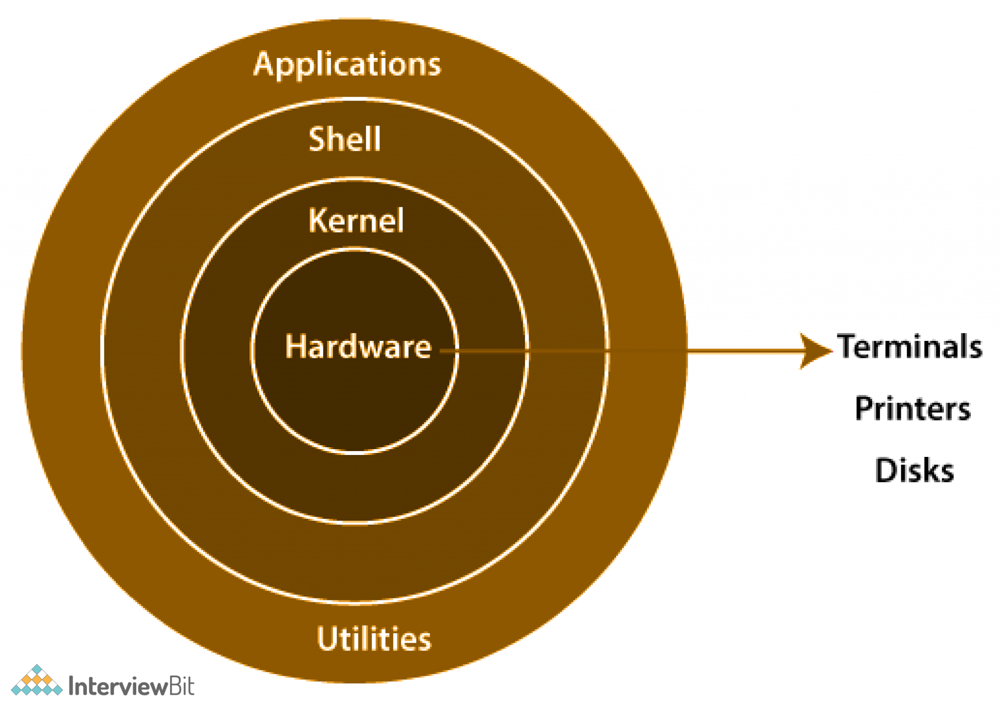
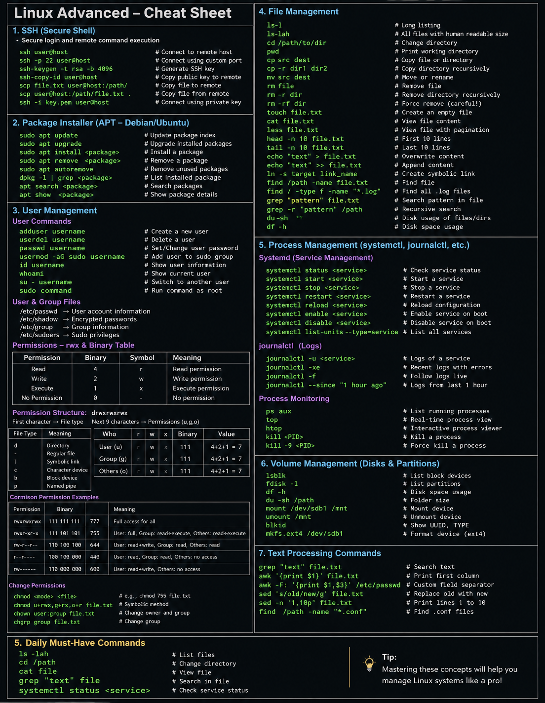

# Day 02 – Linux Architecture, Processes, and systemd

## 🧠 Linux Architecture

- **Kernel (Heart of Linux)**  
  The kernel is the core of the operating system. It acts as a mediator between hardware and user.  
  It takes input from shell/commands and converts them into machine-understandable form (binary/low-level instructions) and manages CPU, memory, and devices.

- **Shell**  
  Interface between user and kernel.  
  Takes commands (like `ls`, `mkdir`) and passes them to kernel for execution.

- **User Space (Applications & Utilities)**  
  Where users interact using applications and tools. These do not directly access hardware.

---

## ⚙️ What is a Process?

- A **process** is any running program or task in Linux  
- Every process has a **PID (Process ID)**  
- Examples: `touch`, `mkdir`, `df -h`, `awk`, `grep`

### 🔄 Process Lifecycle
- Created → Ready → Running → Waiting → Terminated

---

## 🔁 Process States

- **Running** → Process is actively executing  
- **Sleeping** → Waiting for input/output (I/O)  
- **Stopped** → Process is paused (manually or by system)  
- **Zombie** → Process has completed execution but still exists in process table (not cleaned by parent process)

---

## 🛠️ Daily Commands (Process & System Monitoring)

- `ps aux` → Show all running processes  
- `top / htop` → Real-time process monitoring  
- `kill <PID>` → Terminate a process  
- `df -h` → Check disk usage  
- `systemctl status <service>` → Check service status  

---

## 🔥 systemd (Service Manager)

- **systemd** is the default init system in modern Linux  
- It manages:
  - System startup  
  - Background services (daemons)  
  - Service monitoring  

### Common Commands:
- `systemctl start <service>`  
- `systemctl stop <service>`  
- `systemctl status <service>`  
- `systemctl enable <service>`  

---

## 🚀 Why systemd Matters in DevOps

- Helps manage production services  
- Enables auto-start services on boot  
- Useful for debugging failures and logs  

---

## 🧠 Real-Life Troubleshooting Approach

If a service crashes, I will check:

- `systemctl status <service>` → service state  
- `journalctl` → logs  
- `df -h` → storage issues  
- `netstat -tulnp` → port usage  

---

## 📌 Key Learning

- Understood how Linux works internally (Kernel ↔ Shell ↔ User)  
- Learned how processes are created and managed  
- Got hands-on idea of systemd and service control  