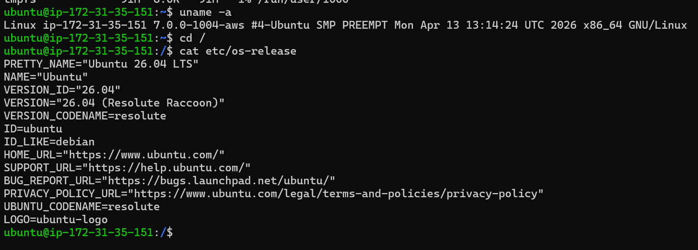
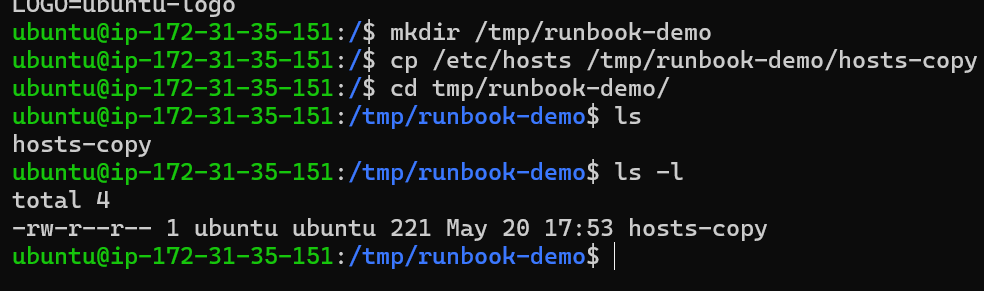
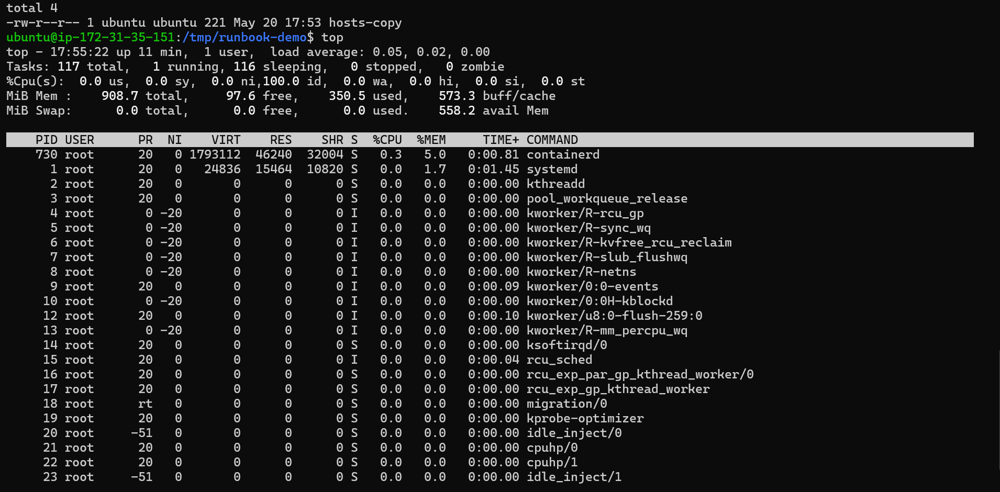
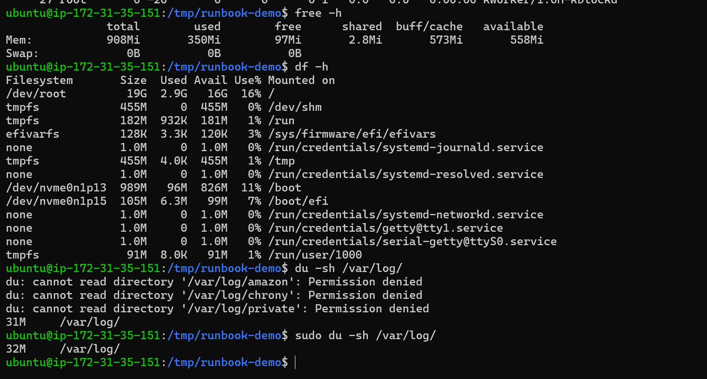
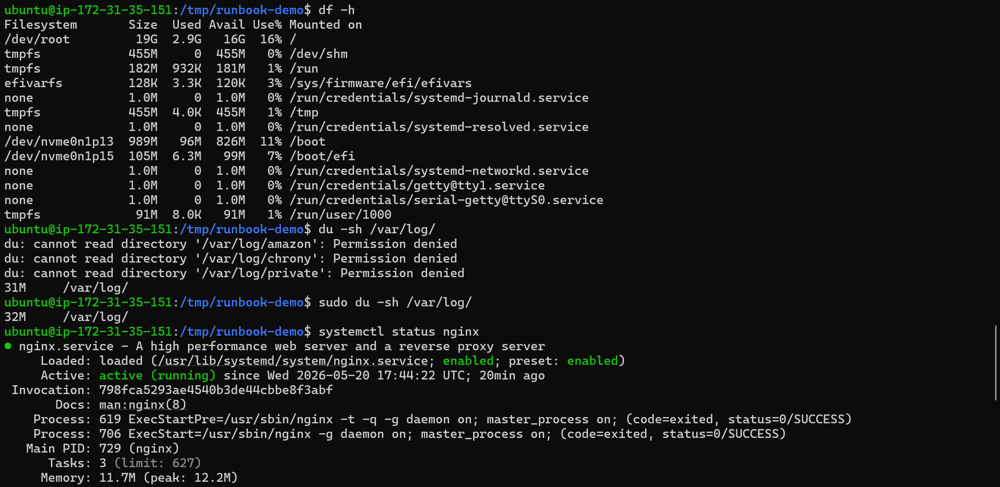
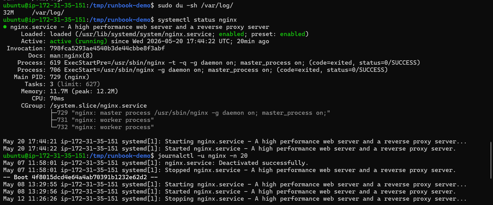

# Day 05 – Linux Troubleshooting Runbook (nginx)

## 🎯 Target Service
nginx
---

## 🧠 Environment

- OS: Ubuntu 26.04 LTS
- Kernel: 7.0.0-1004-aws
- Running on AWS EC2 instance

---

## 📁 Filesystem

- Created test directory and copied /etc/hosts file
- File created successfully with permissions: -rw-r--r--
- No filesystem issues observed

---

## ⚙️ CPU / Memory

- CPU usage is very low, no heavy process observed
- containerd is running with minimal CPU usage

- Total RAM: ~900MB
- Used: ~350MB, Available: ~558MB
- No memory pressure observed

---

## 💽 Disk / IO
- Root partition usage is ~16%, plenty of free space available
- /var/log size is ~31MB (small)
- Permission denied seen for some log folders (expected without sudo)
- No disk issues detected

---

## 🌐 Network

- nginx service is running (checked via systemctl)
- No network connectivity issues observed

---

## 📜 Logs Reviewed

- Checked logs using journalctl
- Logs show nginx start/stop events
- No error or failure messages found

---

## 🔍 Findings
- System is healthy overall
- CPU, memory, and disk usage are within normal limits
- nginx service is running properly
- Logs do not indicate any issues

---

## ⚠️ If This Worsens
- Restart nginx using: systemctl restart nginx
- Validate config using: nginx -t
- Check detailed logs: /var/log/nginx/error.log
- Check ports: ss -tulpn
- Monitor system resources again