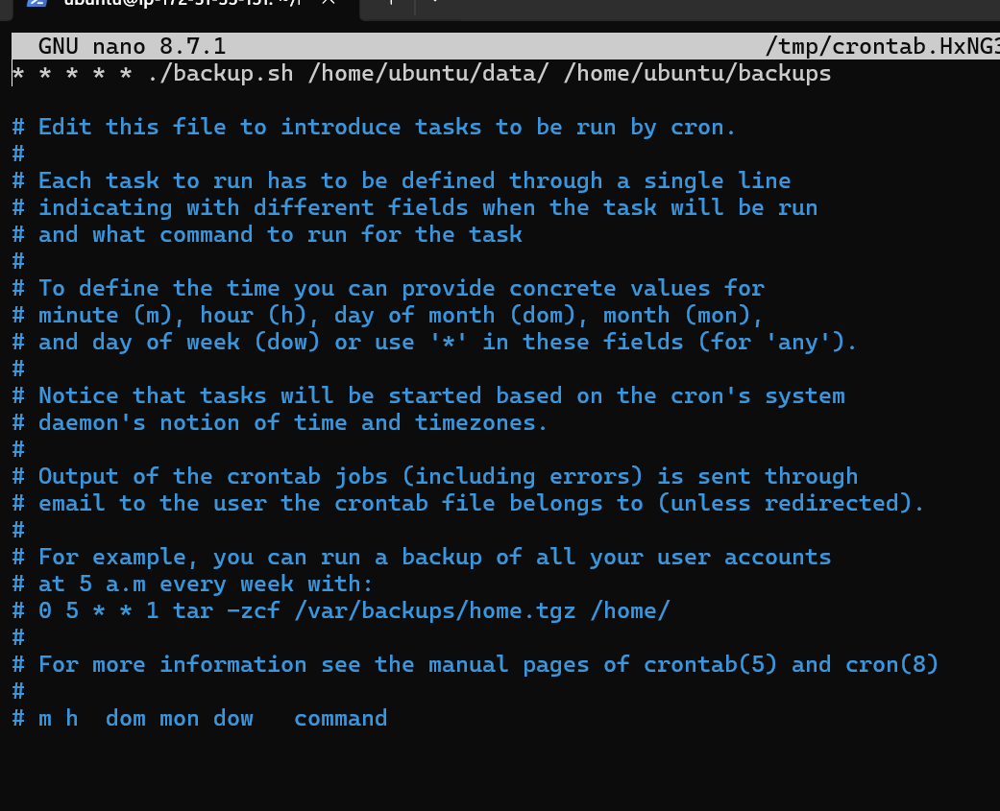
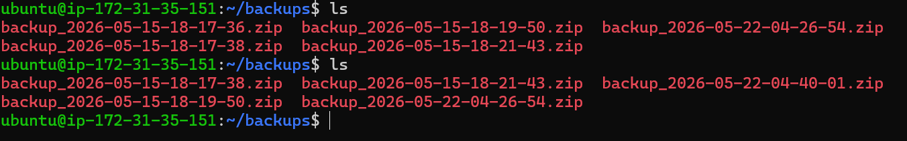
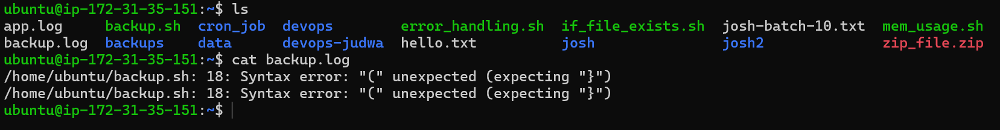
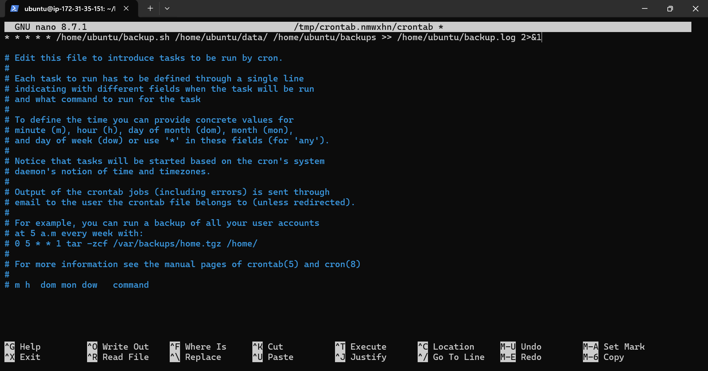
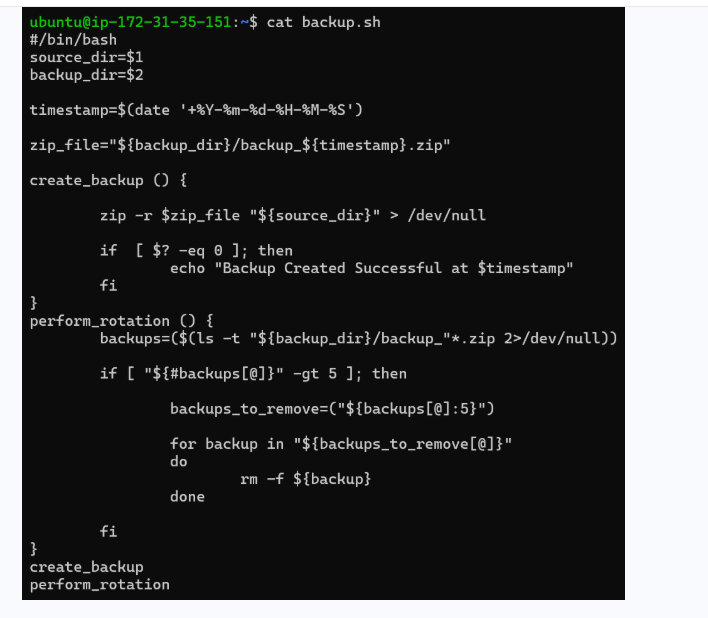

# Day 06 – Linux File Read/Write + Backup Automation

Today I practiced basic file handling in Linux and extended it by building a small backup automation script using shell scripting and cron jobs.

---

## 📁 File Creation

### Command:
`touch notes.txt`

### Observation:
- Created an empty file named `notes.txt`

---

## ✍️ Writing to File

### Commands:
`echo "This is my first line" > notes.txt`  
`echo "Learning file handling in Linux" >> notes.txt`

### Observation:
- `>` overwrites file content  
- `>>` appends new content  

---

## 🔥 Using tee Command

### Command:
`echo "This line is added using tee command" | tee -a notes.txt`

### Observation:
- Output displayed on terminal  
- Also appended to file  

---

## 📖 Reading File Content

### Commands:
`cat notes.txt`  
`head -n 2 notes.txt`  
`tail -n 2 notes.txt`

### Observation:
- `cat` shows full file  
- `head` shows first lines  
- `tail` shows last lines  

---

# 🚀 Mini Project: Backup Automation using Shell Script

## 🧾 Script: `backup.sh`

















```bash
#!/bin/bash

source_dir=$1
backup_dir=$2

timestamp=$(date '+%Y-%m-%d-%H-%M-%S')
zip_file="${backup_dir}/backup_${timestamp}.zip"

create_backup() {
    zip -r $zip_file "$source_dir" > /dev/null

    if [ $? -eq 0 ]; then
        echo "Backup Created Successfully at $timestamp"
    fi
}

perform_rotation() {
    backups=($(ls -t ${backup_dir}/backup_*.zip 2>/dev/null))

    if [ ${#backups[@]} -gt 5 ]; then
        backups_to_remove=("${backups[@]:5}")

        for backup in "${backups_to_remove[@]}"
        do
            rm -f "$backup"
        done
    fi
}

create_backup
perform_rotation
