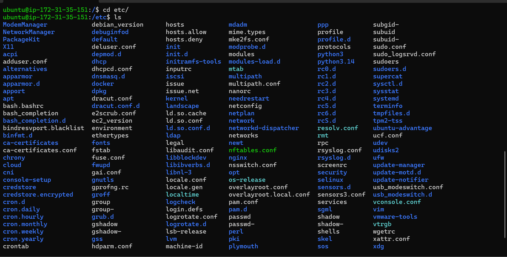
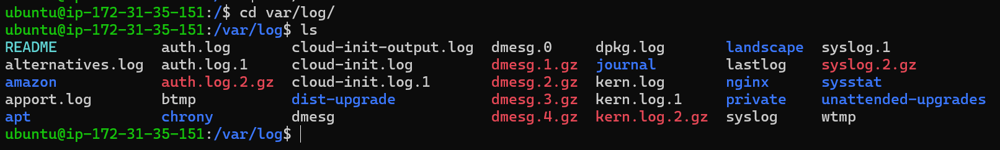
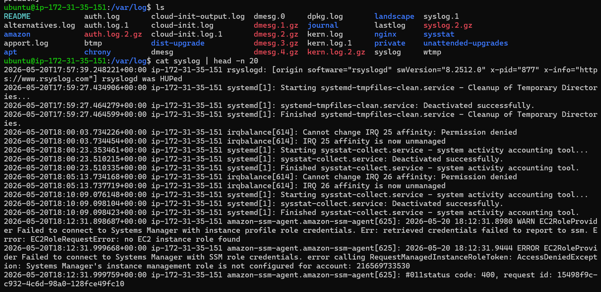
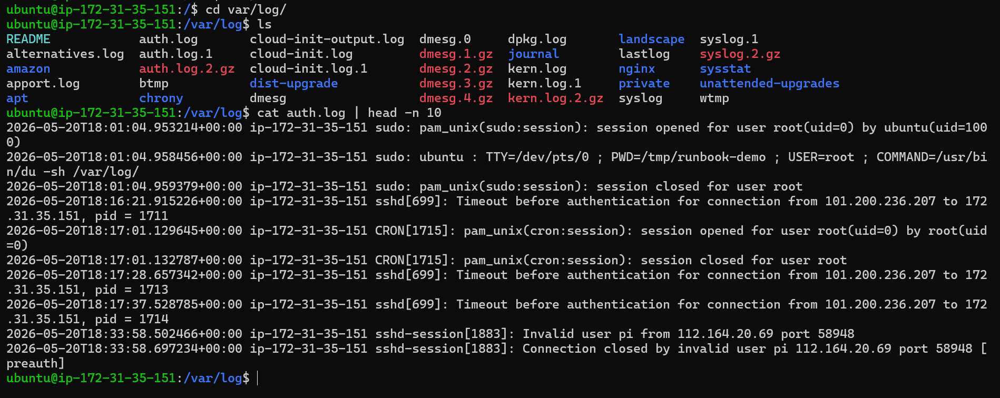
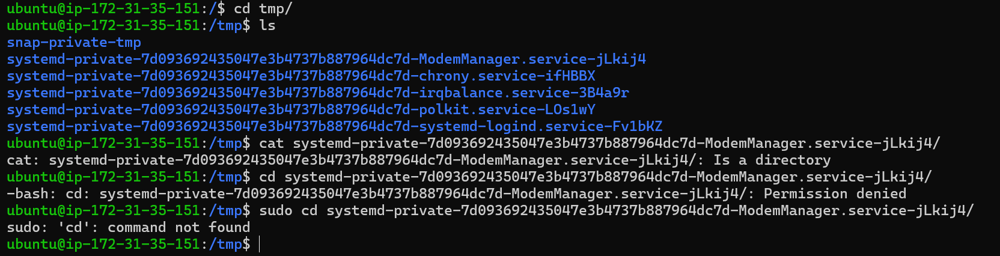
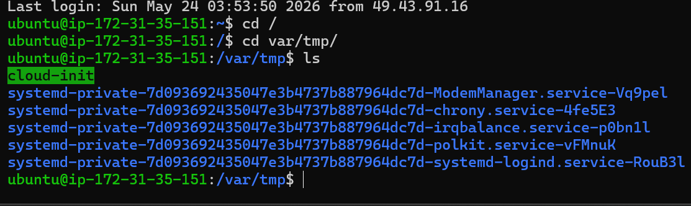
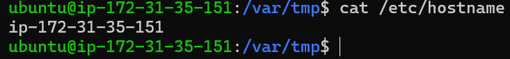
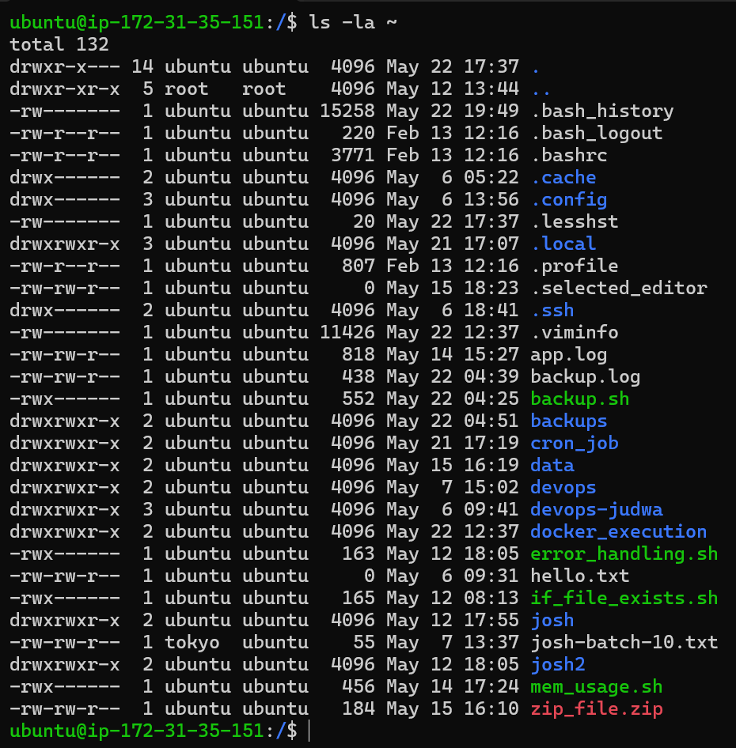
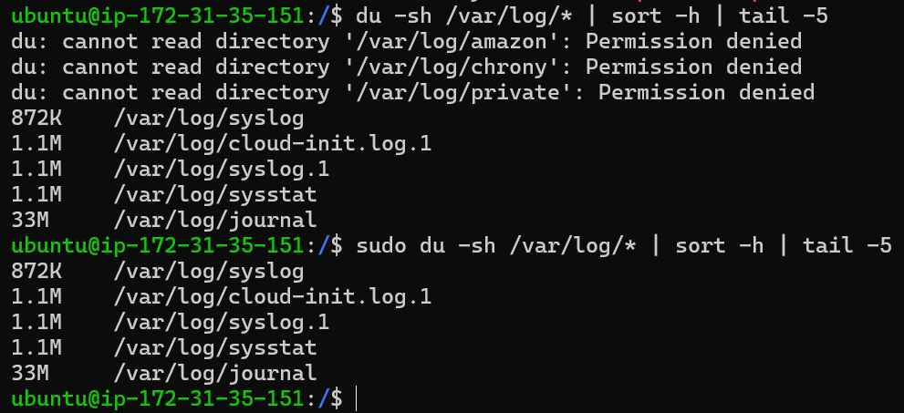
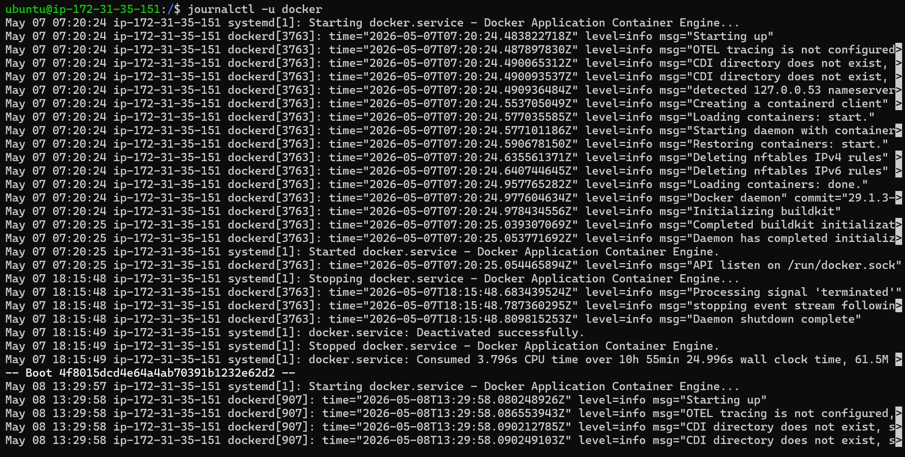

# Day 07 – Linux File System & Scenario-Based Practice

Today I learned about the Linux file system hierarchy and how to approach real-world troubleshooting scenarios like a DevOps engineer.

---

# 📁 Part 1: Linux File System Hierarchy

## 🔹 /
Root directory is the starting point of Linux. All files and directories exist under this.

👉 I would use this when navigating the entire system.

---

## 🔹 /home
Contains home directories of normal users.

👉 I would use this to access user files and personal data.

---

## 🔹 /root
Home directory of the root (admin) user.

👉 I would use this when working as root user.

---

## 🔹 /etc

Contains system configuration files like:
- `/etc/hostname`
- `/etc/passwd`
- `/etc/ssh/sshd_config`

👉 I would use this to check or modify system configurations.

---

## 🔹 /var/log
Stores log files of system and services.

Examples:
- `/var/log/syslog` → system logs 

- `/var/log/auth.log` → login/SSH logs 

👉 I would use this for debugging issues.

---

## 🔹 /tmp
Temporary files stored here. Cleared after reboot.

👉 I would use this for temporary data or scripts.

/tmp vs /var/tmp

---

## 🔹 /bin & /usr/bin
Contains system and user commands.

👉 I would use this to understand where commands are stored.

---

## 🔹 /opt
Used for third-party applications.

👉 I would use this when installing external software.

---

# 🛠️ Hands-on Observations

### Command:
`cat /etc/hostname`

👉 Output:
- Showed system hostname (e.g., ip-172-31-35-151)

---

### Command:
`ls -la ~`

👉 Observed:
- Hidden files like `.bashrc`, `.ssh`
- Script files like `backup.sh`
- Log files like `backup.log`

---

### Command:
`du -sh /var/log/* | sort -h | tail -5`

👉 Observed:
- Found largest log directories
- `/var/log/journal` was consuming most space
- Faced permission issues → fixed using `sudo`

---

# ⚙️ Part 2: Scenario-Based Practice

## 🔧 Scenario 1: Service Not Starting

Step 1:
`systemctl status myapp`  
👉 Check if service is running or failed  

Step 2:
`journalctl -u myapp -n 50`  
👉 Check recent logs  

Step 3:
`systemctl is-enabled myapp`  
👉 Check if enabled on boot  

Step 4:
`systemctl restart myapp`  
👉 Restart service  

---

## 🔥 Scenario 2: High CPU Usage

Step 1:
`top`  
👉 Check live CPU usage  

Step 2:
`ps aux --sort=-%cpu | head -10`  
👉 Identify top CPU-consuming process  

---

## 📜 Scenario 3: Finding Service Logs

Step 1:
`systemctl status docker`  
👉 Check service status  

Step 2:
`journalctl -u docker -n 50`  
👉 View logs  

Step 3:
`journalctl -u docker -f`  
👉 Monitor logs in real-time  

---

## 🔐 Scenario 4: Permission Issue

Step 1:
`ls -l backup.sh`  
👉 Check permissions  

Step 2:
`chmod +x backup.sh`  
👉 Add execute permission  

Step 3:
`./backup.sh`  
👉 Run script  

---

# 📌 What I Learned Today

- Understood where important files and logs are stored in Linux  
- Learned how to locate logs for debugging  
- Practiced real troubleshooting scenarios  
- Understood correct approach: **check → analyze → fix**  

---

# 🚀 Final Thought

Today’s learning helped me understand how DevOps engineers troubleshoot systems in real environments by combining Linux fundamentals with logical thinking.