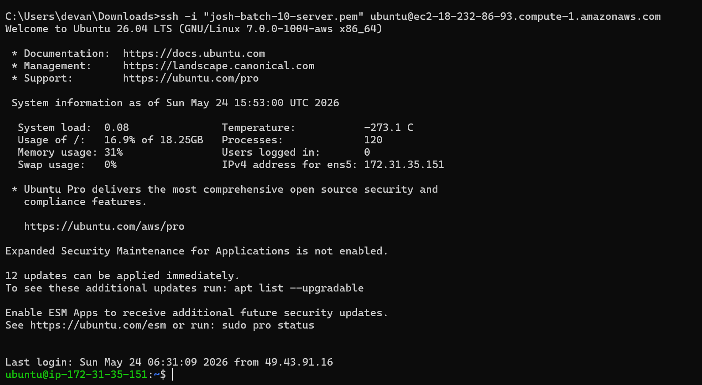
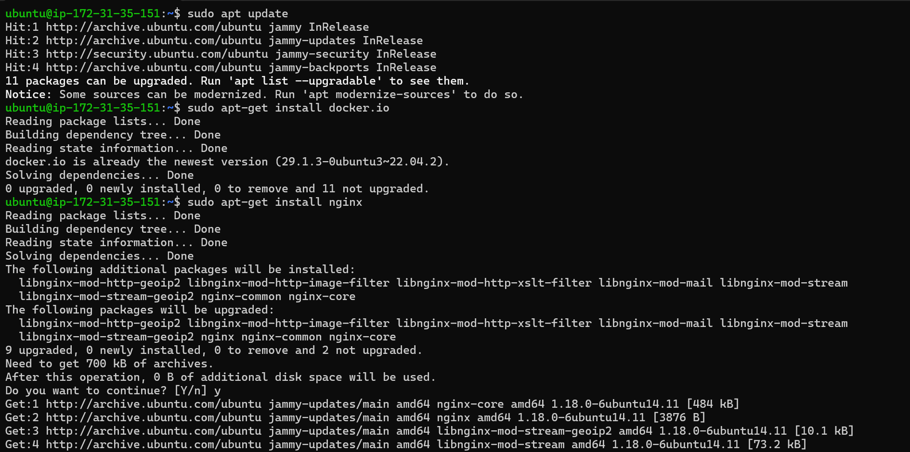
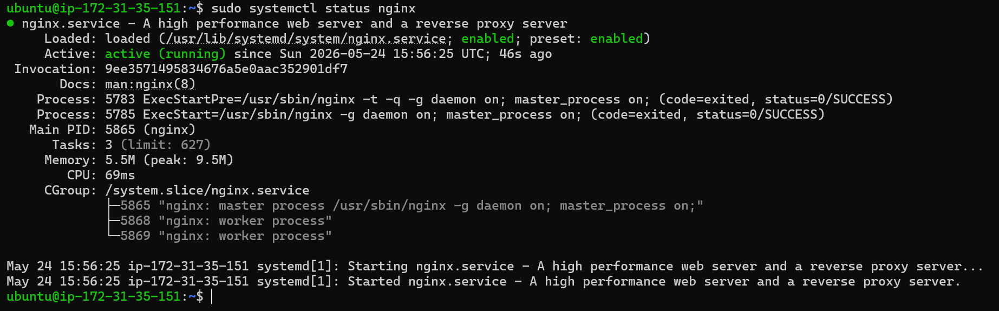
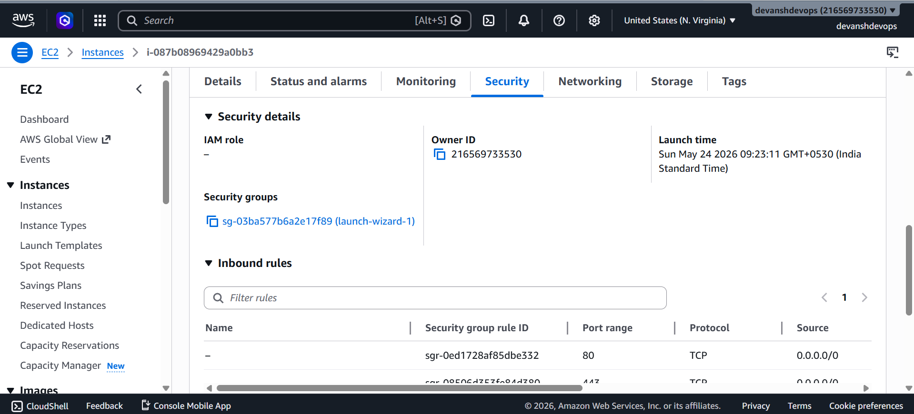
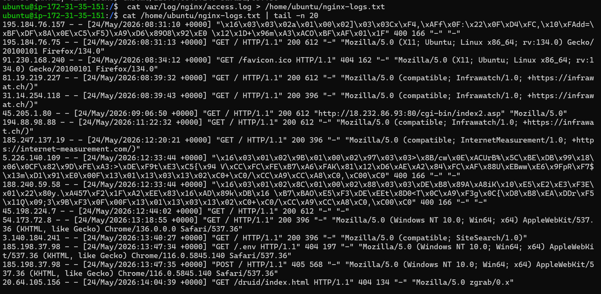
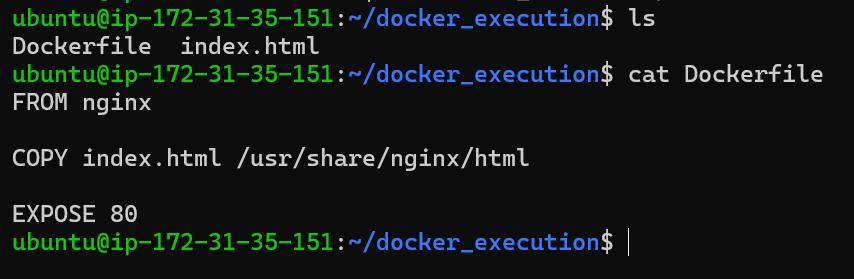
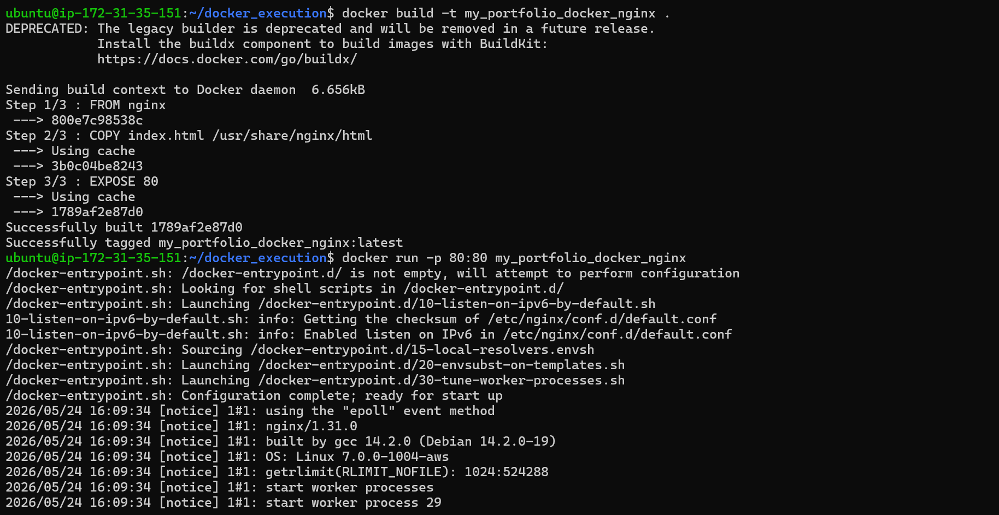
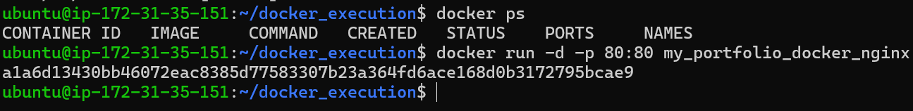
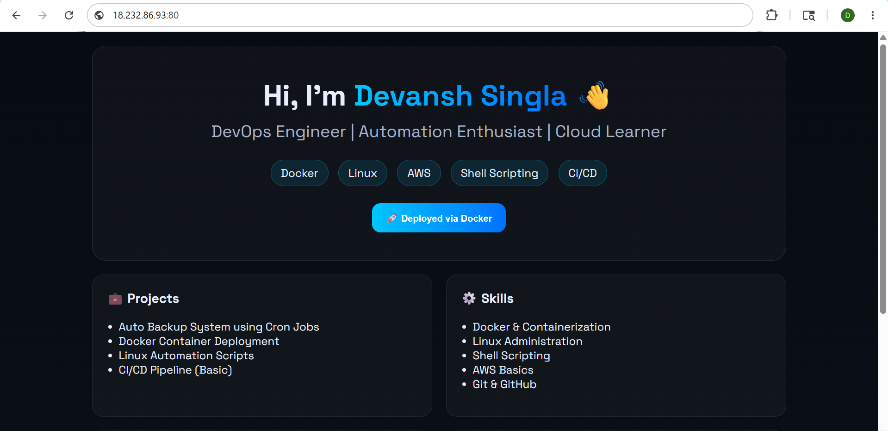
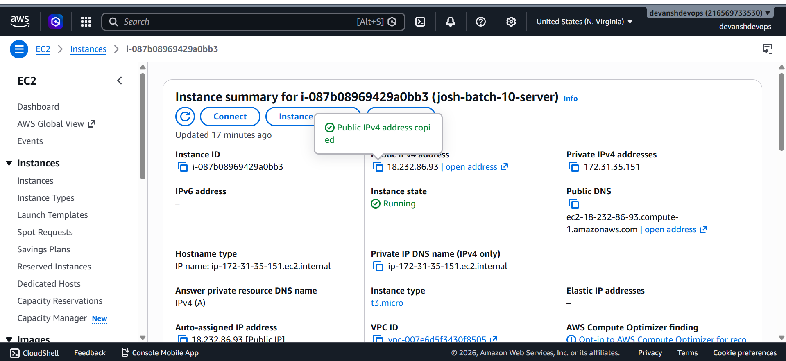

# Day 08 – Cloud Server Setup: Docker, Nginx & Web Deployment

## 🚀 Overview
Today I deployed a real cloud server using AWS EC2, installed Nginx, configured access, and verified the deployment from a browser.

---

## ☁️ Cloud Instance Details

- Cloud Provider: AWS EC2  
- Instance Type: t3.micro  
- OS: Ubuntu 26.04 LTS  
- Public IP: 18.232.86.93  

---

## 🔐 SSH Connection



Connected to the server using:

```bash
ssh -i "josh-batch-10-server.pem" ubuntu@ec2-18-232-86-93.compute-1.amazonaws.com

Successfully logged into the remote machine.

⚙️ Installation Steps
1. Update System
sudo apt update
2. Install Docker
sudo apt install docker.io -y
3. Install Nginx
```


```bash
sudo apt install nginx -y
✅ Verify Nginx
sudo systemctl status nginx
```

```bash

✔ Nginx is active (running)
✔ Service started successfully

🔓 Security Group Configuration

Configured AWS Security Group:

Allowed HTTP (Port 80)
Source: 0.0.0.0/0
🌐 Web Access Verification

```

```bash

Opened in browser:

http://18.232.86.93

✔ Website successfully accessible
✔ Nginx server responding correctly

📊 Nginx Logs
View Logs
sudo cat /var/log/nginx/access.log | tail -n 20
Save Logs to File
sudo cat /var/log/nginx/access.log > ~/nginx-logs.txt

```

```bash


Observations
Multiple incoming requests from different IPs
Status codes observed:
200 → Successful response
404 → Resource not found

Dockerfile ->
```

```bash

Docker Image Build ->
```

```bash

Docker Container Run ->
```

```bash

Some unusual requests (likely bots scanning the server)
🐳 Docker Deployment (Bonus)
docker run -d -p 8080:80 nginx

✔ Docker container deployed successfully
✔ Accessible on port 8080

Final Output on my Instance's Public IP port 80. ->

```

```bash
```

```bash

⚠️ Challenges Faced
Understanding AWS security group configuration
Opening port 80 for public access
Interpreting log entries with unusual characters
📚 What I Learned
How to launch and connect to an EC2 instance
Installing and managing services like Nginx
Importance of firewall rules (Security Groups)
Reading and analyzing real server logs
Running containers using Docker
Real-world exposure to live internet traffic
🔥 Conclusion

This was my first real cloud deployment where I:

Connected to a remote server via SSH
Installed and managed a web server
Made it accessible on the internet
Analyzed real-time logs

This is exactly how real DevOps work begins 🚀