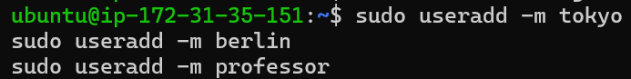
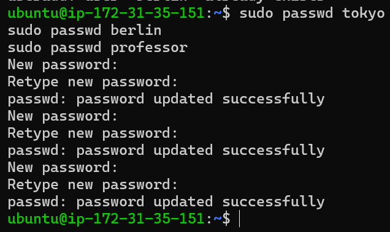
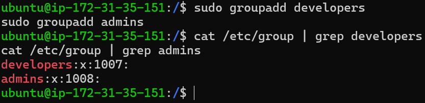
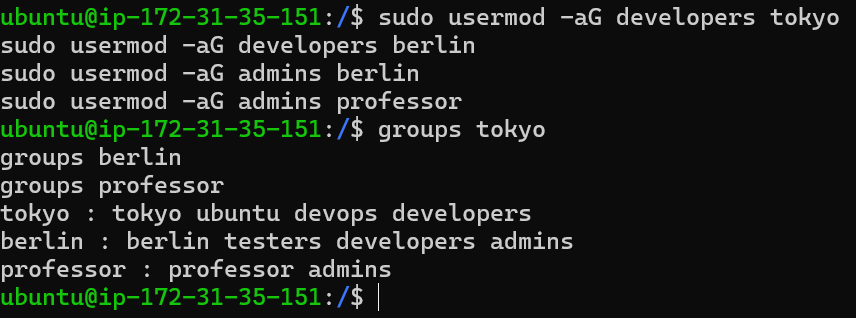
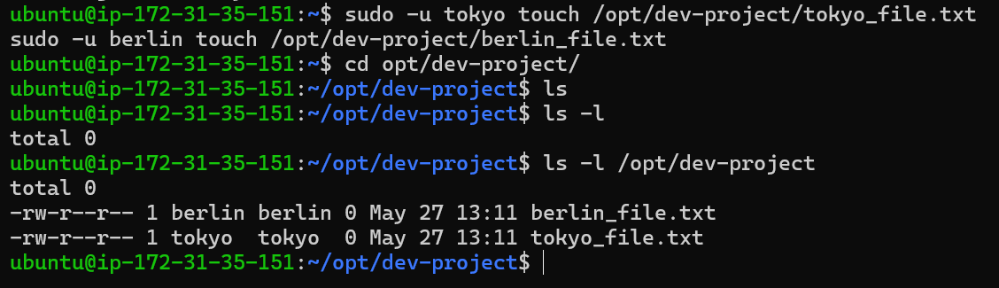
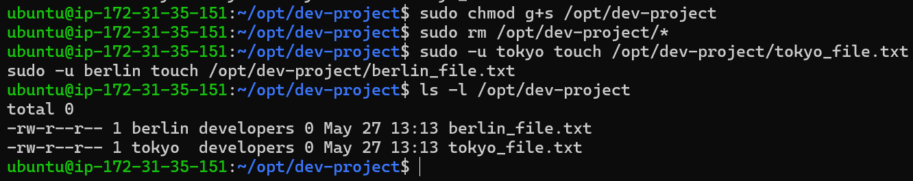
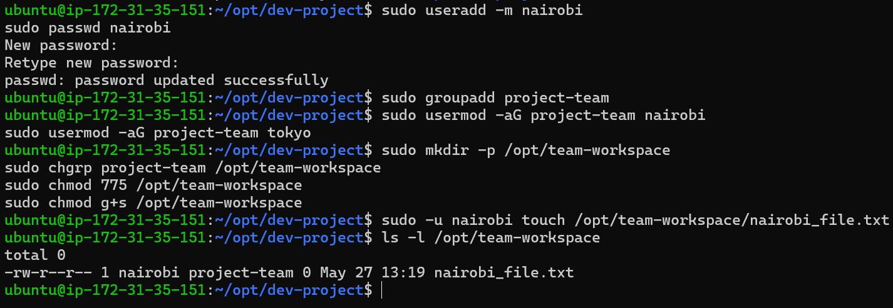

# Day 09 – Linux User & Group Management (Hands-On)

---

## 🔹 Step 1: Creating Users

### Commands:
```bash
sudo useradd -m tokyo
sudo useradd -m berlin
sudo useradd -m professor

sudo passwd tokyo
sudo passwd berlin
sudo passwd professor
Verification:
ls /home
cat /etc/passwd | grep tokyo
Observation:
Users were created successfully
Home directories were created in /home
Verified user entry in /etc/passwd
```

```bash
```

```bash


🔹 Step 2: Creating Groups
Commands:
sudo groupadd developers
sudo groupadd admins
Verification:
cat /etc/group | grep developers
cat /etc/group | grep admins
Observation:
Groups created successfully
No users assigned yet (empty groups)

```

```bash


🔹 Step 3: Assigning Users to Groups
Commands:
sudo usermod -aG developers tokyo
sudo usermod -aG developers berlin
sudo usermod -aG admins berlin
sudo usermod -aG admins professor
Verification:
groups tokyo
groups berlin
groups professor
Observation:
tokyo → developers
berlin → developers, admins
professor → admins

```

```bash


🔹 Step 4: Creating Shared Directory
Commands:
sudo mkdir -p /opt/dev-project
sudo chgrp developers /opt/dev-project
sudo chmod 775 /opt/dev-project
Verification:
ls -ld /opt/dev-project
Observation:
Directory created successfully
Group ownership set to developers
Permissions set to 775


🔹 Step 5: Testing Access (Initial Behavior)
Commands:
sudo -u tokyo touch /opt/dev-project/tokyo_file.txt
sudo -u berlin touch /opt/dev-project/berlin_file.txt
Verification:
ls -l /opt/dev-project
Observation:
Files were created
Group ownership was user-based (tokyo, berlin)
Not ideal for shared team collaboration

```

```bash

🔹 Step 6: Fix Using SGID (Important)
Commands:
sudo chmod g+s /opt/dev-project
sudo rm /opt/dev-project/*

sudo -u tokyo touch /opt/dev-project/tokyo_file.txt
sudo -u berlin touch /opt/dev-project/berlin_file.txt
Verification:
ls -l /opt/dev-project
Observation:
Files now inherit developers group
SGID working correctly
Proper shared directory behavior achieved

```

```bash

🔹 Step 7: Team Workspace Setup
Commands:
sudo useradd -m nairobi
sudo passwd nairobi

sudo groupadd project-team

sudo usermod -aG project-team nairobi
sudo usermod -aG project-team tokyo

sudo mkdir -p /opt/team-workspace
sudo chgrp project-team /opt/team-workspace
sudo chmod 775 /opt/team-workspace
sudo chmod g+s /opt/team-workspace

🔹 Step 8: Testing Team Workspace
Commands:
sudo -u nairobi touch /opt/team-workspace/nairobi_file.txt
Verification:
ls -l /opt/team-workspace
Observation:
File created successfully
Group ownership is project-team
Shared workspace working correctly

```

```bash

🧠 What I Learned
How to create users and assign passwords
How to create and manage groups
How to assign multiple groups to users
How to create shared directories for teams
Importance of permissions (775)
How SGID ensures group inheritance in shared folders
🚀 Real DevOps Insight

In real-world environments:

Teams work on shared servers and directories
Proper group permissions ensure secure collaboration
SGID ensures all files inherit the correct group ownership

This prevents permission conflicts and improves team productivity in production systems.