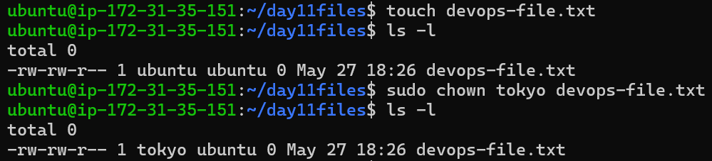
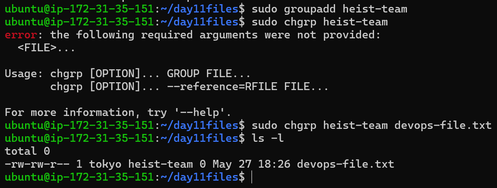
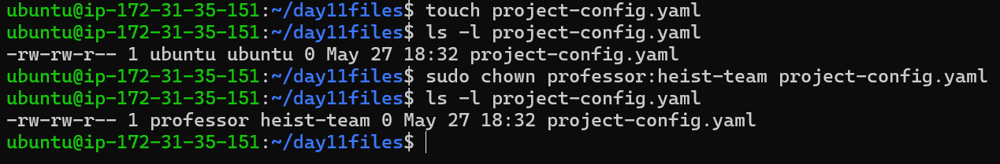
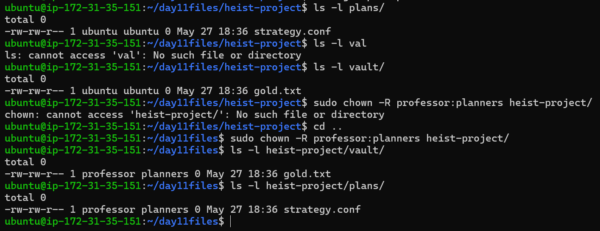
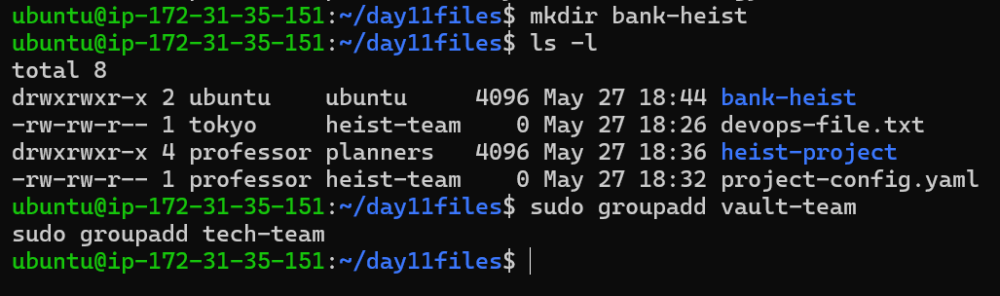
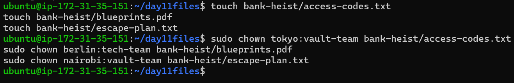
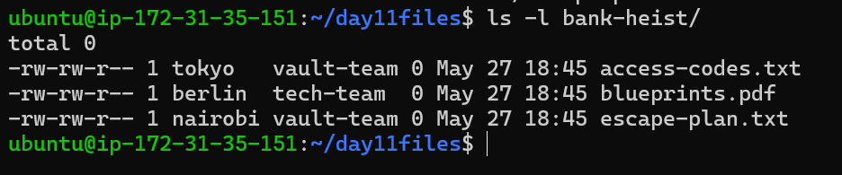

# Day 11 Challenge – File Ownership (chown & chgrp)

## Files & Directories Created

- devops-file.txt  
- team-notes.txt  
- project-config.yaml  
- heist-project/  
  - vault/gold.txt  
  - plans/strategy.conf  
- bank-heist/  
  - access-codes.txt  
  - blueprints.pdf  
  - escape-plan.txt  

---

## Ownership Changes

- devops-file.txt → ubuntu:ubuntu → tokyo:heist-team  
- team-notes.txt → ubuntu:ubuntu → ubuntu:heist-team  
- project-config.yaml → ubuntu:ubuntu → professor:heist-team  

### Recursive Ownership
- heist-project/* → ubuntu:ubuntu → professor:planners  

### Bank Heist Scenario
- access-codes.txt → tokyo:vault-team  
- blueprints.pdf → berlin:tech-team  
- escape-plan.txt → nairobi:vault-team  

---

## Commands Used

```bash
# Create files
touch devops-file.txt
touch team-notes.txt
touch project-config.yaml

```

```bash

# Create groups
sudo groupadd heist-team
sudo groupadd planners
sudo groupadd vault-team
sudo groupadd tech-team

```

```bash

# Change owner
sudo chown tokyo devops-file.txt
sudo chown berlin devops-file.txt

```

```bash

# Change group
sudo chgrp heist-team team-notes.txt

```

```bash

# Change owner + group
sudo chown professor:heist-team project-config.yaml

```

```bash

# Create directories
mkdir -p heist-project/vault
mkdir -p heist-project/plans

touch heist-project/vault/gold.txt
touch heist-project/plans/strategy.conf

# Recursive ownership
sudo chown -R professor:planners heist-project/

```

```bash

# Bank heist scenario
mkdir bank-heist

```

```bash

touch bank-heist/access-codes.txt
touch bank-heist/blueprints.pdf
touch bank-heist/escape-plan.txt

```

```bash

sudo chown tokyo:vault-team bank-heist/access-codes.txt
sudo chown berlin:tech-team bank-heist/blueprints.pdf
sudo chown nairobi:vault-team bank-heist/escape-plan.txt

```

```bash

```

---

## What I Learned

- File ownership in Linux is divided into **user and group**
- `chown` is used to change ownership, and `chgrp` is used to change group
- `chown user:group` can update both in one command
- Recursive ownership (`-R`) is important for directories
- Ownership plays a key role in **security and access control in DevOps environments**

---

## Conclusion

This exercise helped me understand how Linux manages file ownership and permissions.  
These concepts are essential for real-world DevOps tasks like deployments, shared access, and server management.