# Day 13 – Linux Volume Management (LVM)

## 🎯 Goal

Learned how to manage storage using LVM by creating, mounting, and extending volumes dynamically.

---

## 🔧 Commands Used

### 🔹 Step 1: Check Storage

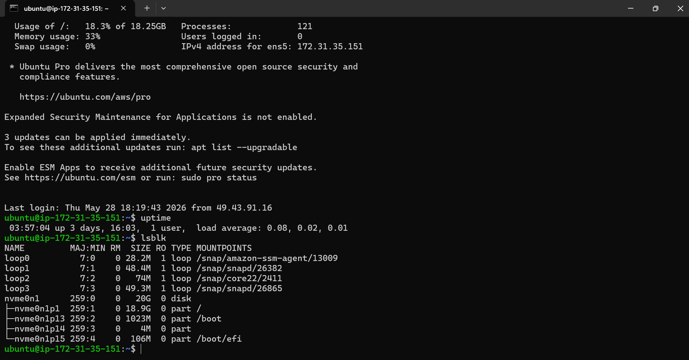

* `lsblk`
* `pvs`
* `vgs`
* `lvs`
* `df -h`

---

USING AWS EC2 EBS for extension of storage.

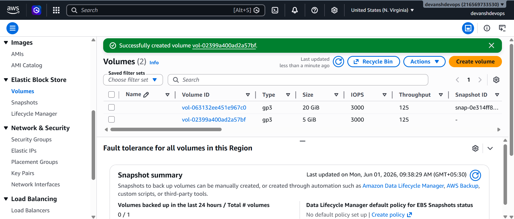

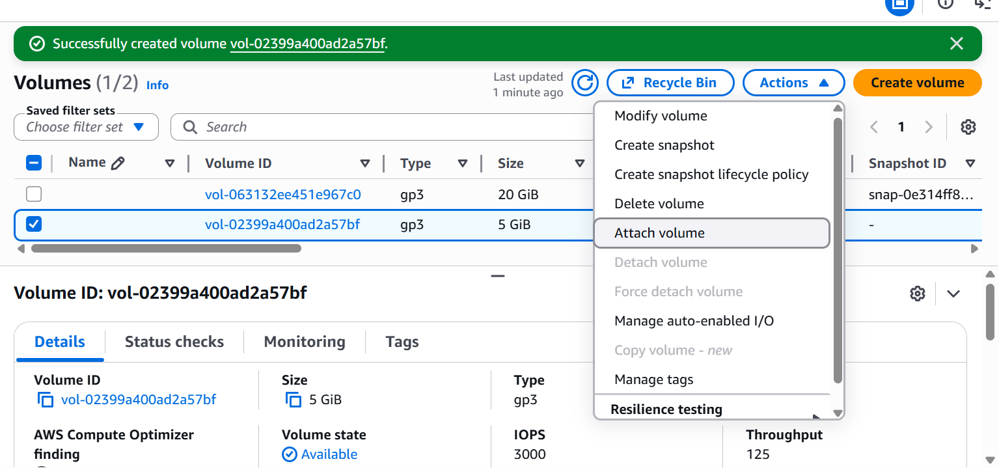

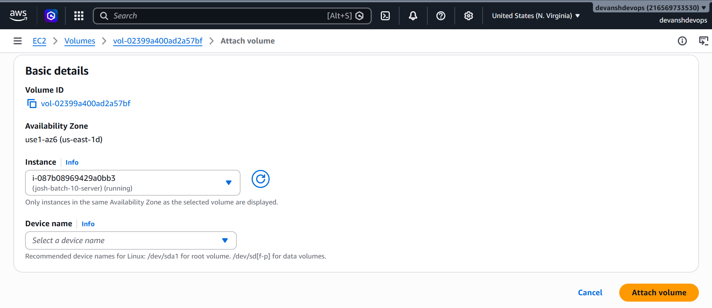


### 🔹 Step 2: Create Physical Volume (PV)

First Mount /dev/nvme1n1

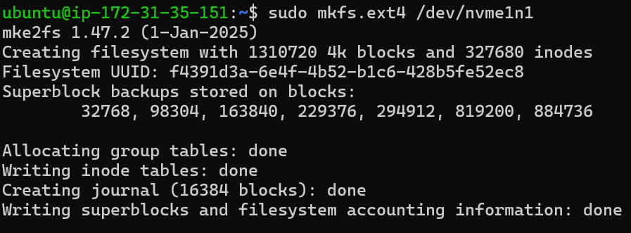

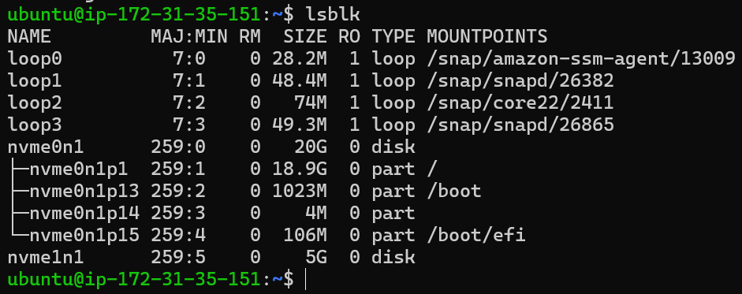

```bash
sudo unmount /mnt/data
sudo pvcreate /dev/nvme1n1
sudo pvs
```

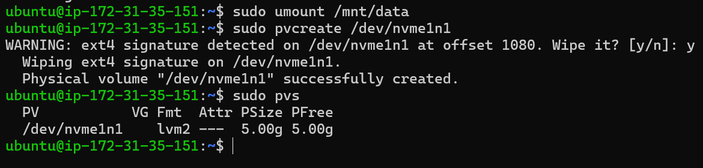

---

### 🔹 Step 3: Create Volume Group (VG)

```bash
sudo vgcreate devops-vg /dev/nvme1n1
sudo vgs
```

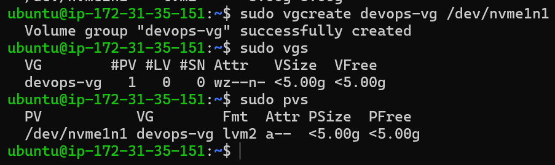


---

### 🔹 Step 4: Create Logical Volume (LV)

```bash
sudo lvcreate -L 500M -n app-data devops-vg |
sudo lvcreate -L 100%FREE add-data devops-pg
sudo lvs
```

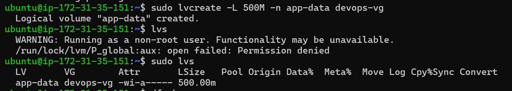


---

### 🔹 Step 5: Format and Mount

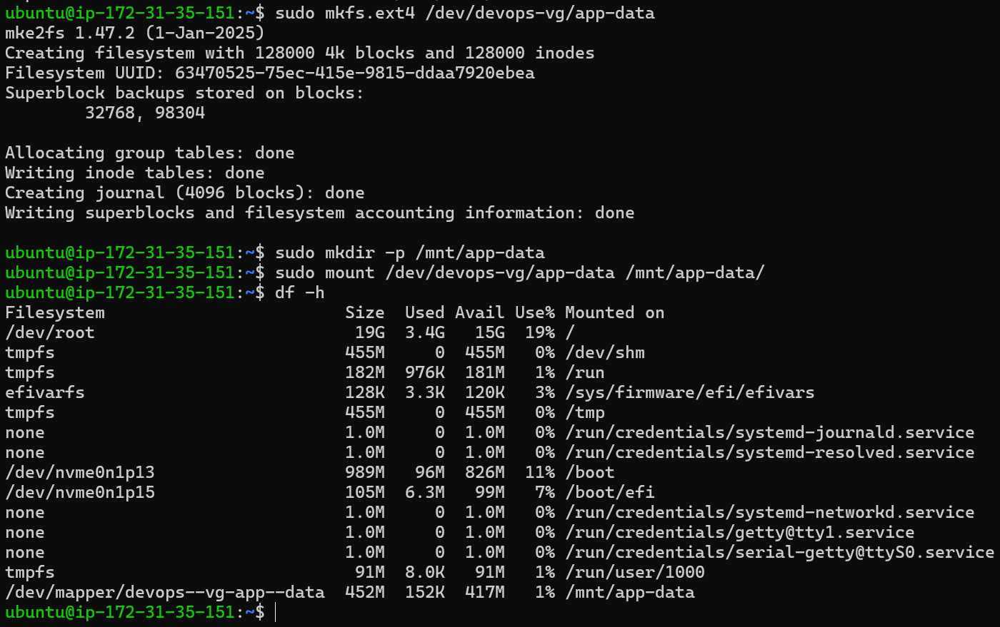

```bash
sudo mkfs.ext4 /dev/devops-vg/app-data
sudo mkdir -p /mnt/app-data
sudo mount /dev/devops-vg/app-data /mnt/app-data
df -h
```

---

### 🔹 Step 6: Extend Volume

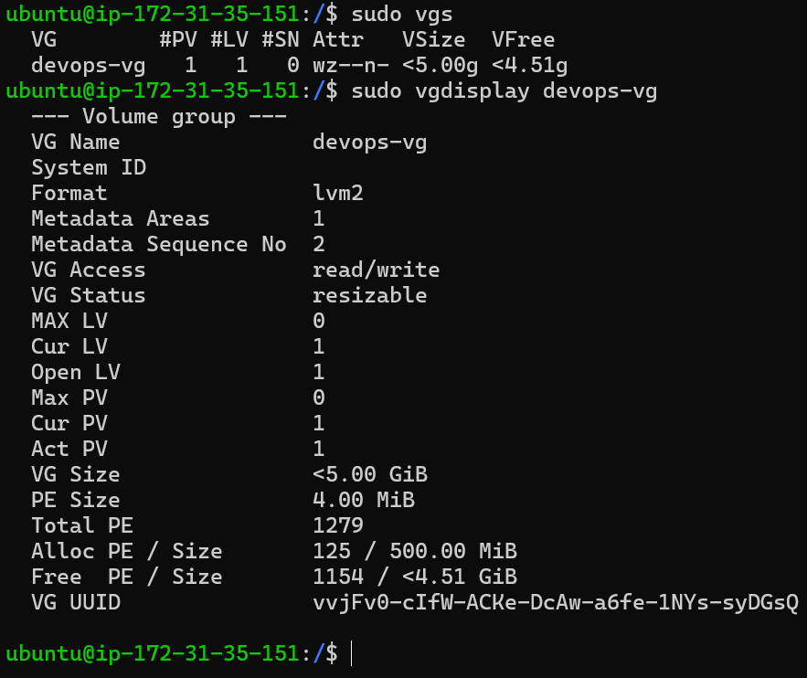


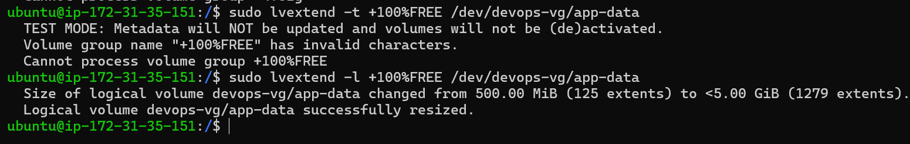


```bash
sudo lvextend -l +100%FREE /dev/devops-vg/app-data
sudo resize2fs /dev/devops-vg/app-data
df -h
```

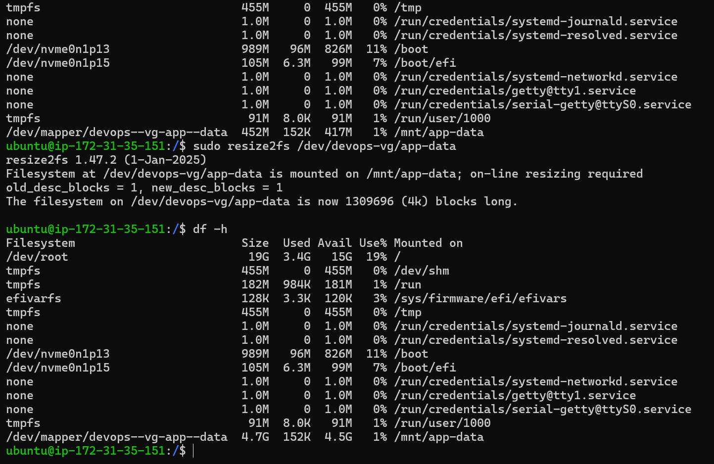


---

## 🧠 Core LVM Concept (MOST IMPORTANT)

```
Disk → PV → VG → LV → Mount
```

* **PV (Physical Volume)** → actual disk
* **VG (Volume Group)** → storage pool
* **LV (Logical Volume)** → usable partition

👉 LV is what we mount and use like a normal directory

---

## ❌ Errors Faced & Solutions

### 🔸 Error 1: Port already in use (earlier Docker learning)

* Cause: nginx already using port 80
* Fix: used different port or stopped nginx

---

### 🔸 Error 2: ext4 signature detected

```
WARNING: ext4 signature detected... wipe it?
```

✔ Cause: Disk was already formatted earlier
✔ Fix: Selected **yes (y)** to overwrite

---

### 🔸 Error 3: Permission denied in `lvs`

```
Running as non-root user
```

✔ Fix:

```bash
sudo lvs
```

---

### 🔸 Error 4: lvextend wrong syntax

```
Volume group "+100%FREE" has invalid characters
```

✔ Cause:

* Missing `-L` or `-l`
* Used `-t` (test mode)

✔ Fix:

```bash
sudo lvextend -l +100%FREE /dev/devops-vg/app-data
```

---

## 🔥 Key Learnings

1. **LVM gives flexibility**

   * Extend storage without downtime
   * No need to recreate partitions

2. **Difference between raw disk vs LVM**

   * Raw disk → fixed
   * LVM → scalable & flexible

3. **Important commands flow**

```
pvcreate → vgcreate → lvcreate → mount → extend
```

4. **Always resize filesystem**

```bash
resize2fs
```

---

## 🚀 Real DevOps Use Case

* Logs getting full → extend volume
* Database needs space → extend LV
* No downtime → production safe

---

## 💡 Final Takeaway

LVM allows dynamic storage management, making it a critical skill for DevOps engineers working with real-world systems.

---
