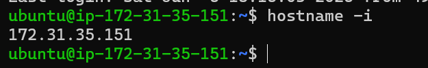
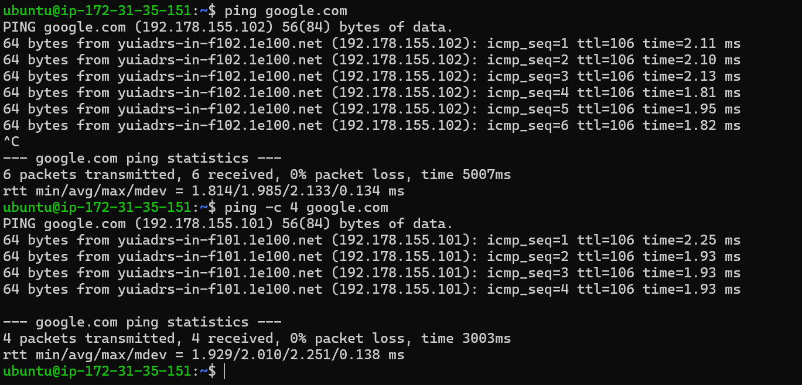
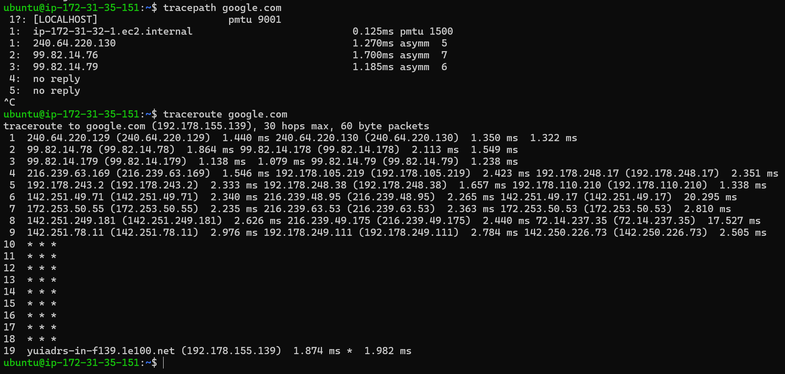
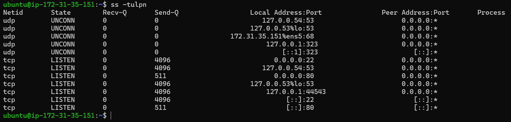
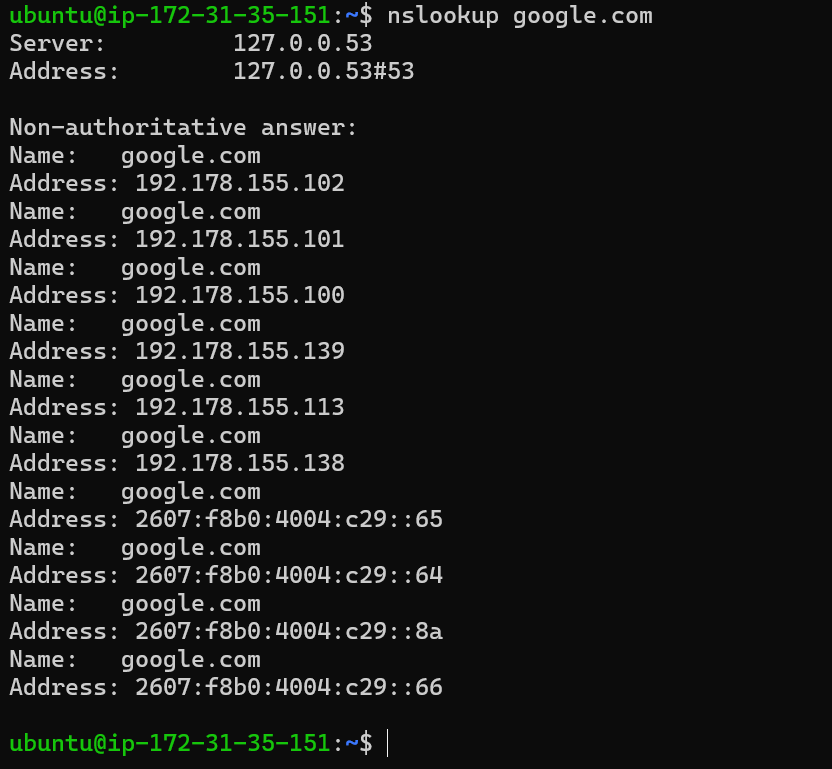
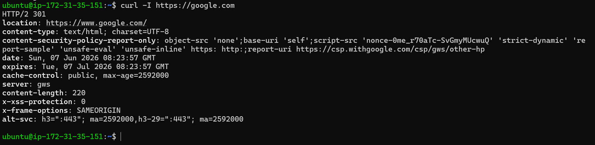
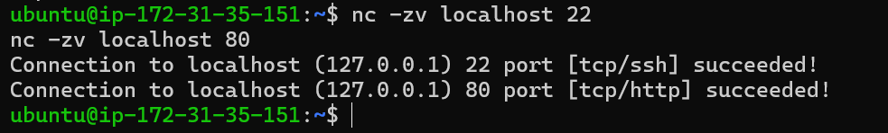

# Day 14 – Networking Fundamentals & Hands-on Checks

## 🎯 Goal

Understand networking basics and practice real-world troubleshooting commands.

---

## 🧠 Quick Concepts

### 🔹 OSI vs TCP/IP

* OSI has 7 layers (Physical → Application)
* TCP/IP has 4 layers (Link → Application)
* TCP/IP is used in real systems

---

### 🔹 Protocol Placement

* **IP** → Internet Layer
* **TCP/UDP** → Transport Layer
* **HTTP/HTTPS** → Application Layer
* **DNS** → Application Layer

---

### 🔹 Example

```text
curl https://google.com
= HTTP (Application)
→ TCP (Transport)
→ IP (Internet)
```

---

## ⚙️ Hands-on Observations

### 🔹 Identity

```bash
hostname -I
```




👉 IP: 172.31.35.151 (Private EC2 IP)

---

### 🔹 Reachability

```bash
ping -c 4 google.com
```




👉 Latency ~2ms, 0% packet loss → network healthy

---

### 🔹 Path

```bash
traceroute google.com
```




👉 Multiple hops (~8–10), some timeouts (*), which is normal

---

### 🔹 Ports

```bash
ss -tulpn
```




👉 Found:

* SSH → port 22
* HTTP → port 80

---

### 🔹 DNS Resolution

```bash
nslookup google.com
```




👉 Domain resolved to multiple IPs (load balancing)

---

### 🔹 HTTP Check

```bash
curl -I https://google.com
```




👉 Status: **301 Redirect** → redirected to `www.google.com`

---

### 🔹 Port Testing

```bash
nc -zv localhost 22
nc -zv localhost 80
```




👉 Both ports reachable (open)

---

## 🔍 Mini Task: Port Probe

* Port tested: **22 (SSH), 80 (HTTP)**
* Result: reachable

👉 If failed:

* Check service → `systemctl status`
* Check firewall / security groups

---

## 🧠 Reflection

### 🔹 Fastest Debug Command

👉 `ping` — quickest way to check connectivity

---

### 🔹 If DNS fails

👉 Check **Application Layer (DNS config)**

---

### 🔹 If HTTP 500 error

👉 Check:

* Application logs
* Server configuration

---

### 🔹 Real Incident Checks

1. Check service status (`systemctl status`)
2. Check logs (`journalctl`, `/var/log`)

---

## 🔥 Key Learnings

* Networking issues can be debugged step-by-step
* `ss`, `ping`, `curl`, `nc` are core DevOps tools
* Difference:

  * LISTEN → service running
  * OPEN → port reachable

---

## 🚀 Final Takeaway

Networking troubleshooting is about checking:

```text
Network → DNS → Service → Port
```

Understanding this flow helps solve real production issues quickly.

---
