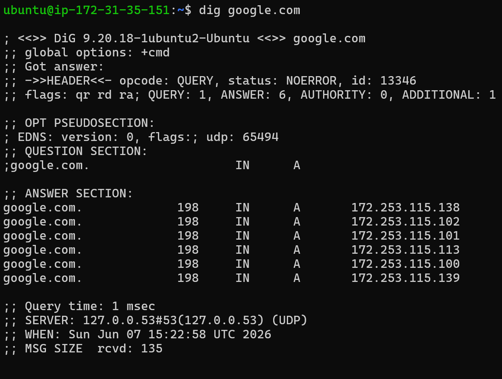
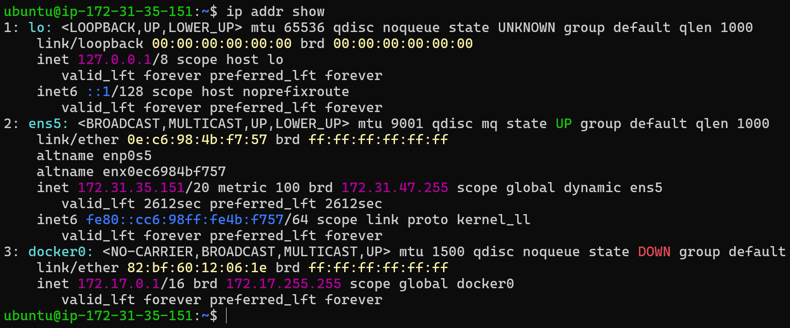

# Day 15 – Networking Concepts: DNS, IP, Subnets & Ports

---

## Task 1: DNS – How Names Become IPs

### 1. What happens when we type `google.com` in browser?

When we type a domain name like `google.com`, DNS (Domain Name System) resolves it into an IP address. The browser sends a request to a DNS server, which returns the corresponding IP. Then the request is sent to that IP to load the website.

---

### 2. DNS Record Types

- **A** → Maps domain to IPv4 address  
- **AAAA** → Maps domain to IPv6 address  
- **CNAME** → Maps one domain to another domain  
- **MX** → Mail server records (used for email)  
- **NS** → Name server records (DNS authority)

---

### 3. `dig google.com` Output

- **A Record Example:** `172.253.115.138`
- **TTL:** `198 seconds`

👉 Multiple IPs indicate load balancing.

---

## Task 2: IP Addressing

### 1. What is IPv4?

IPv4 is a 32-bit address written in dotted decimal format like `192.168.1.10`.

---

### 2. Public vs Private IP

- **Public IP:** Accessible over internet (e.g., `18.x.x.x`)
- **Private IP:** Used inside internal networks (e.g., `172.31.35.151`)

---

### 3. Private IP Ranges

- `10.0.0.0 – 10.255.255.255`
- `172.16.0.0 – 172.31.255.255`
- `192.168.0.0 – 192.168.255.255`

---

### 4. My System IPs

- `172.31.35.151` → Private IP (AWS EC2)
- `172.17.0.1` → Docker network
- `127.0.0.1` → Loopback

---

## Task 3: CIDR & Subnetting

### 1. What does `/24` mean?

`/24` means 24 bits are used for network and remaining 8 bits are for hosts.

---

### 2. CIDR Table

| CIDR | Subnet Mask     | Total IPs | Usable Hosts |
|------|----------------|-----------|--------------|
| /24  | 255.255.255.0  | 256       | 254          |
| /16  | 255.255.0.0    | 65,536    | 65,534       |
| /28  | 255.255.255.240| 16        | 14           |

---

### 3. Why do we subnet?

Subnetting helps divide networks into smaller parts for better security, management, and efficient IP usage.

---

## Task 4: Ports – The Doors to Services

### 1. What is a port?

Ports are logical entry points that allow different services to communicate over a network.

---

### 2. Common Ports

| Port | Service |
|------|---------|
| 22   | SSH |
| 80   | HTTP (Web) |
| 443  | HTTPS |
| 53   | DNS |
| 3306 | MySQL |
| 6379 | Redis |
| 27017| MongoDB |

---

## Task 5: Putting It Together

### 1. `curl http://myapp.com:8080`

- DNS resolves domain to IP  
- Request goes to server IP  
- Port 8080 identifies service  
- HTTP protocol is used  

---

### 2. Cannot connect to `10.0.1.50:3306`

- Check if MySQL is running  
- Check if port 3306 is open  
- Verify network connectivity  
- Check firewall/security groups  

---

## What I Learned

- How DNS converts domain names into IP addresses  
- Difference between public and private IPs in real cloud setup  
- CIDR notation and subnetting basics  
- Importance of ports in identifying services  
- Real-world troubleshooting of network issues  

---