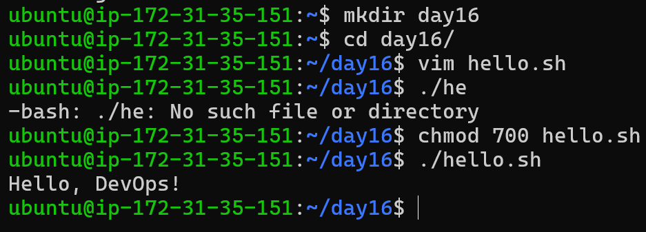
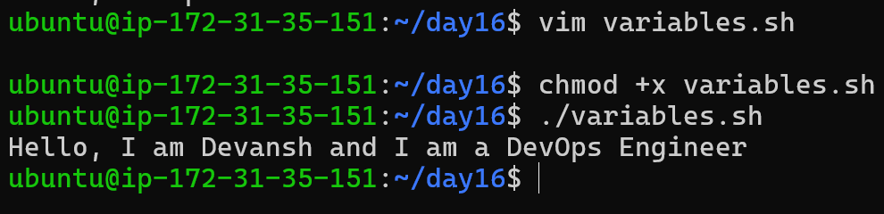
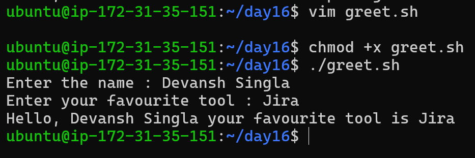
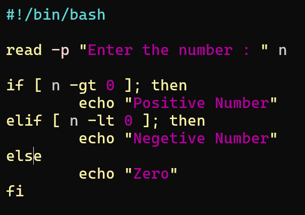
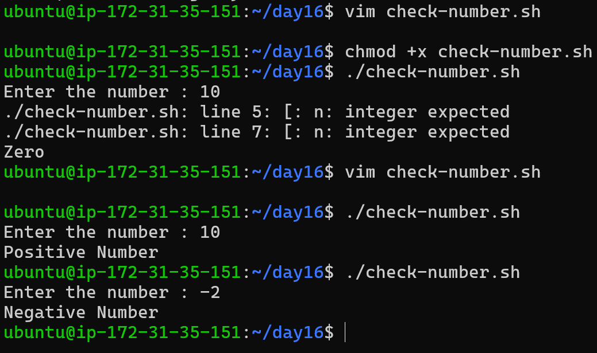
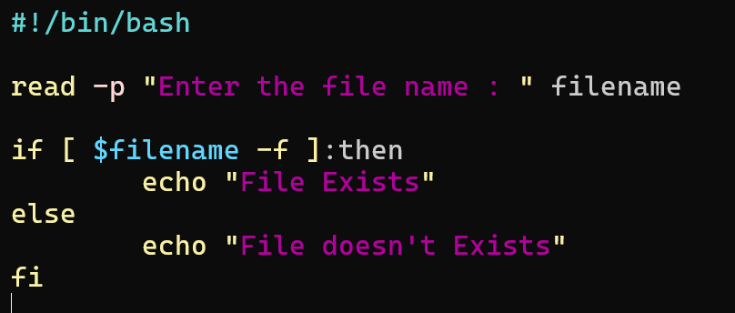
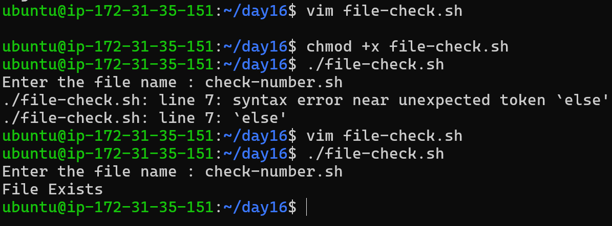
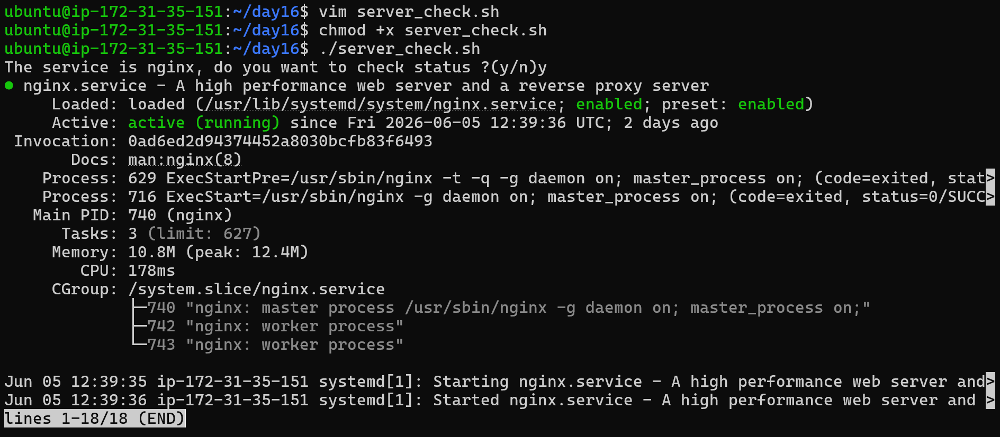
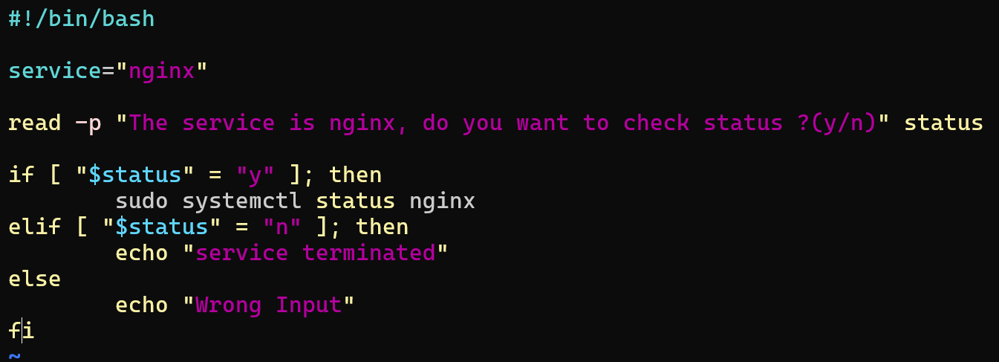

# Day 16 Challenge – Shell Scripting Basics

## Scripts Created

* hello.sh
* variables.sh
* greet.sh
* check-number.sh
* file-check.sh
* server_check.sh

---

## Script 1: hello.sh



```bash
#!/bin/bash

echo "Hello, DevOps!"
```

### Output

```
Hello, DevOps!
```

### Observation

If we remove the shebang (`#!/bin/bash`), the script may still run in some cases, but it depends on the default shell. The shebang ensures the script runs with Bash specifically.

---



## Script 2: variables.sh

```bash
#!/bin/bash

NAME="Devansh"
ROLE="DevOps Engineer"

echo "Hello, I am $NAME and I am a $ROLE"
```

### Output

```
Hello, I am Devansh and I am a DevOps Engineer
```

### Observation

* Double quotes (`" "`) allow variable expansion
* Single quotes (`' '`) treat variables as plain text

---


## Script 3: greet.sh



```bash
#!/bin/bash

read -p "Enter the name: " name
read -p "Enter your favourite tool: " tool

echo "Hello, $name your favourite tool is $tool"
```

### Output (Example)

```
Enter the name: Devansh Singla
Enter your favourite tool: Jira
Hello, Devansh Singla your favourite tool is Jira
```

---

## Script 4: check-number.sh






```bash
#!/bin/bash

read -p "Enter the number: " n

if [ $n -gt 0 ]; then
    echo "Positive Number"
elif [ $n -lt 0 ]; then
    echo "Negative Number"
else
    echo "Zero"
fi
```

### Output (Example)

```
Enter the number: 10
Positive Number

Enter the number: -2
Negative Number
```

---

## Script 5: file-check.sh






```bash
#!/bin/bash

read -p "Enter the file name: " filename

if [ -f "$filename" ]; then
    echo "File Exists"
else
    echo "File doesn't Exist"
fi
```

### Output (Example)

```
Enter the file name: check-number.sh
File Exists
```

---

## Script 6: server_check.sh





```bash
#!/bin/bash

service="nginx"

read -p "The service is $service, do you want to check status? (y/n): " status

if [ "$status" = "y" ]; then
    if systemctl is-active --quiet $service; then
        echo "$service is RUNNING ✅"
    else
        echo "$service is NOT RUNNING ❌"
    fi
elif [ "$status" = "n" ]; then
    echo "Service check skipped"
else
    echo "Wrong Input"
fi
```

### Output (Example)

```
The service is nginx, do you want to check status? (y/n): y
nginx is RUNNING ✅
```

---

## Commands Used

```bash
chmod +x filename.sh
./filename.sh
vim filename.sh
read -p "message" variable
if [ condition ]; then
```

---

## What I Learned

1. Shebang (`#!/bin/bash`) defines the interpreter for scripts
2. Variables and user input make scripts dynamic
3. If-else conditions help automate decision-making in real DevOps scenarios

---

## Real-World Relevance

* Automating system checks
* Monitoring services
* Writing reusable scripts for deployments
* Used in CI/CD pipelines and server management

---
