# Day 18 Challenge – Shell Scripting: Functions & Intermediate Concepts

---

## Scripts Created

* functions.sh
* disk_check.sh
* strict_demo.sh
* local_demo.sh
* system_info.sh

---

## Script 1: functions.sh

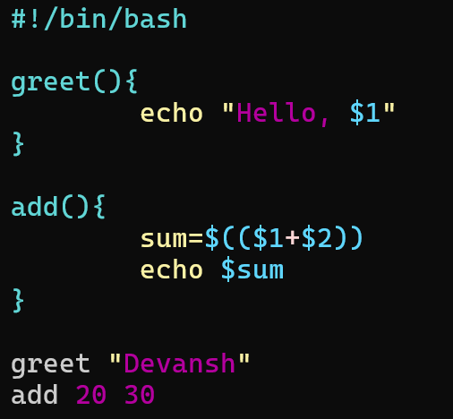

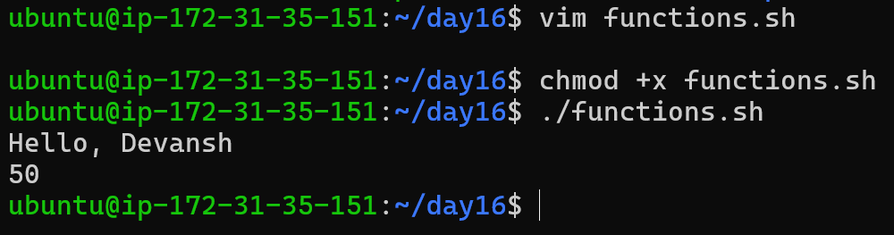


```bash
#!/bin/bash

greet() {
    echo "Hello, $1!"
}

add() {
    local sum=$(( $1 + $2 ))
    echo "Sum is: $sum"
}

greet "Devansh"
add 20 30
```

---

## Script 2: disk_check.sh

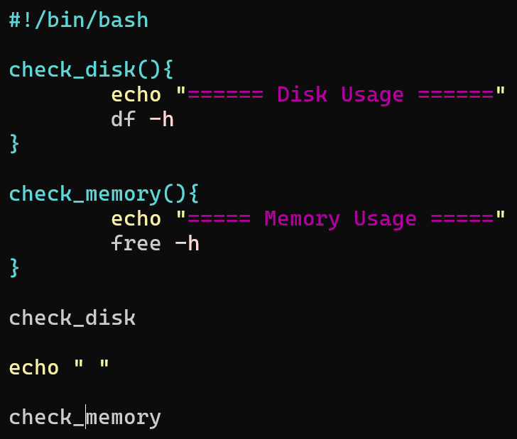

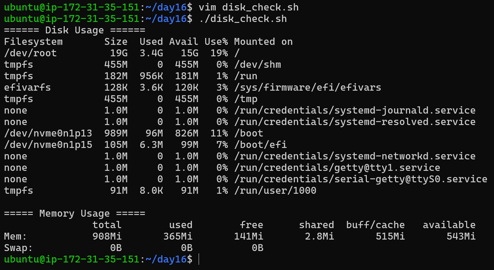


```bash
#!/bin/bash

check_disk() {
    echo "===== Disk Usage ====="
    df -h
}

check_memory() {
    echo "===== Memory Usage ====="
    free -h
}

check_disk
echo ""
check_memory
```

---

## Script 3: strict_demo.sh

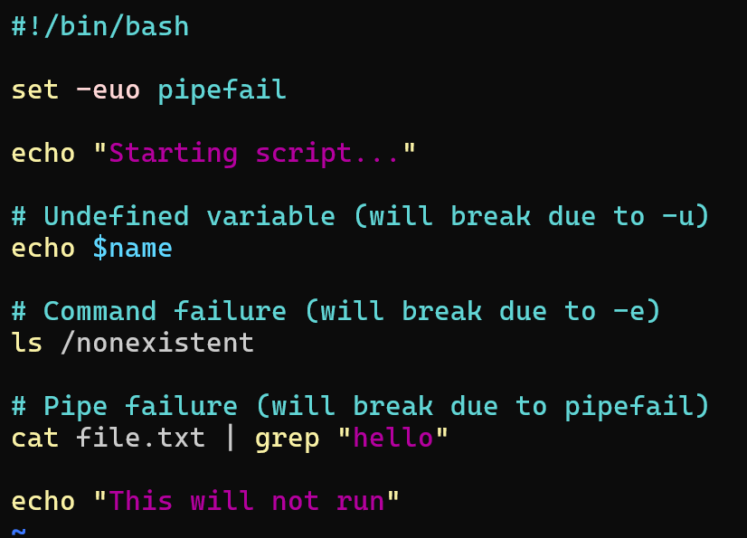

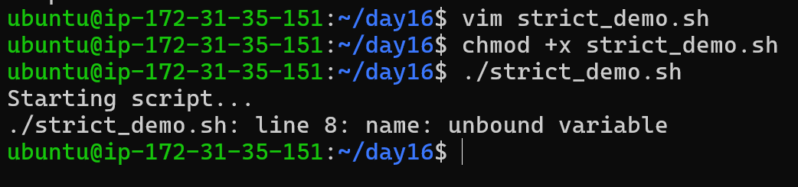


```bash
#!/bin/bash

set -euo pipefail

echo "Starting script..."

echo $name
ls /nonexistent
cat file.txt | grep "hello"
```

---

## Script 4: local_demo.sh

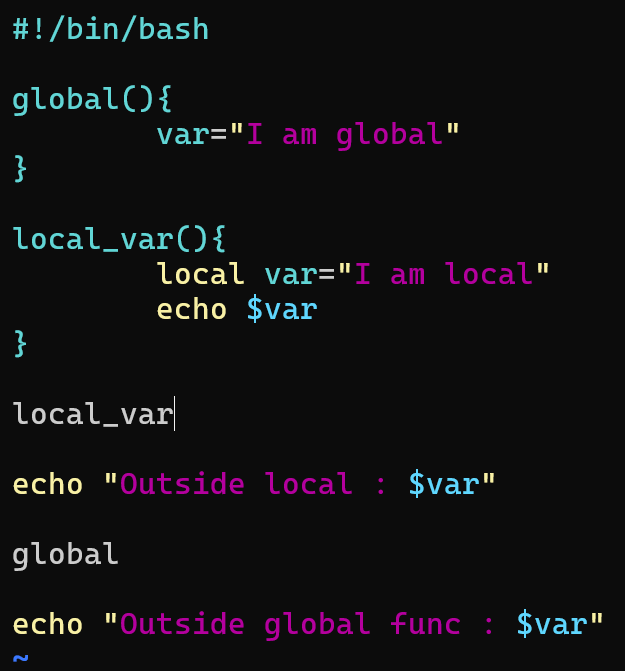

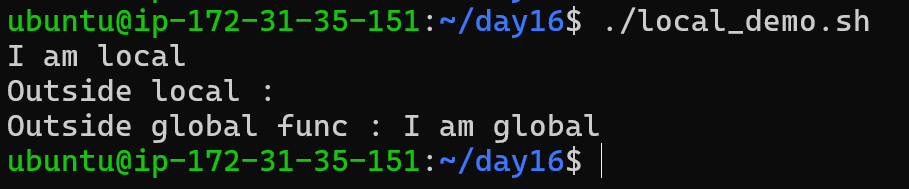


```bash
#!/bin/bash

global() {
    var="I am global"
}

local_var() {
    local var="I am local"
    echo $var
}

local_var
echo "Outside local : $var"

global
echo "Outside global func : $var"
```

---

## Script 5: system_info.sh

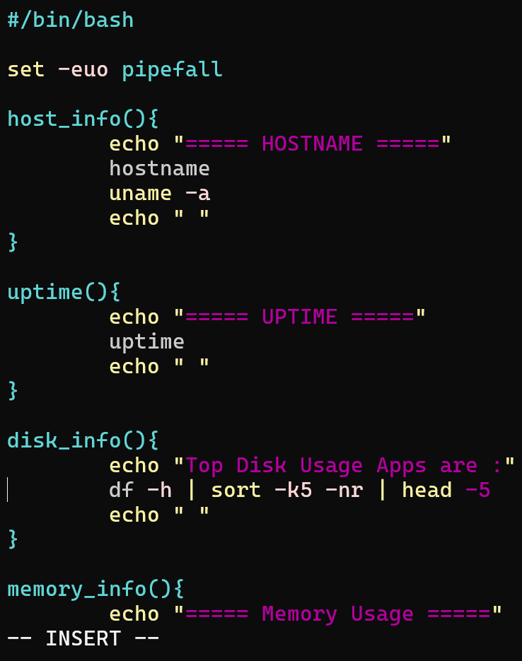

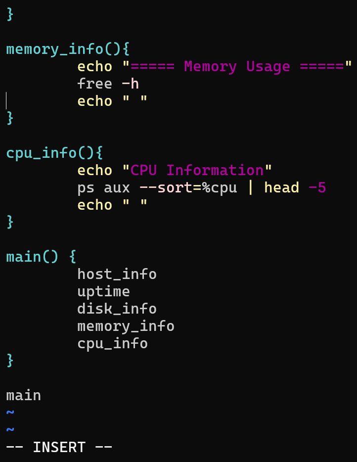

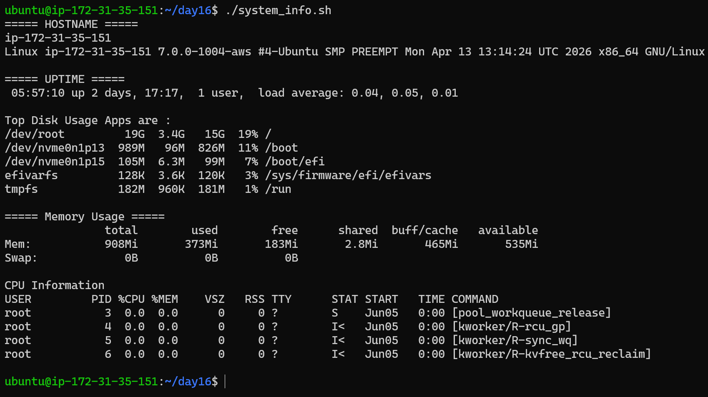


```bash
#!/bin/bash

set -euo pipefail

host_info() {
    echo "===== HOSTNAME ====="
    hostname
    uname -a
}

uptime_info() {
    echo "===== UPTIME ====="
    uptime
}

disk_info() {
    echo "===== Top Disk Usage ====="
    df -h | sort -k5 -nr | head -5
}

memory_info() {
    echo "===== Memory Usage ====="
    free -h
}

cpu_info() {
    echo "===== Top CPU Processes ====="
    ps aux --sort=-%cpu | head -5
}

main() {
    host_info
    echo ""
    uptime_info
    echo ""
    disk_info
    echo ""
    memory_info
    echo ""
    cpu_info
}

main
```

---

## Explanation: `set -euo pipefail`

* `set -e` → Exit script if any command fails
* `set -u` → Error on undefined variables
* `set -o pipefail` → Fail if any command in pipeline fails

---

## What I Learned

1. Functions make scripts modular and reusable
2. `set -euo pipefail` makes scripts safe and production-ready
3. Local variables prevent unexpected bugs in larger scripts

---

## Real-World Use

* System monitoring scripts
* Automation tools
* DevOps health checks
* Production debugging scripts
