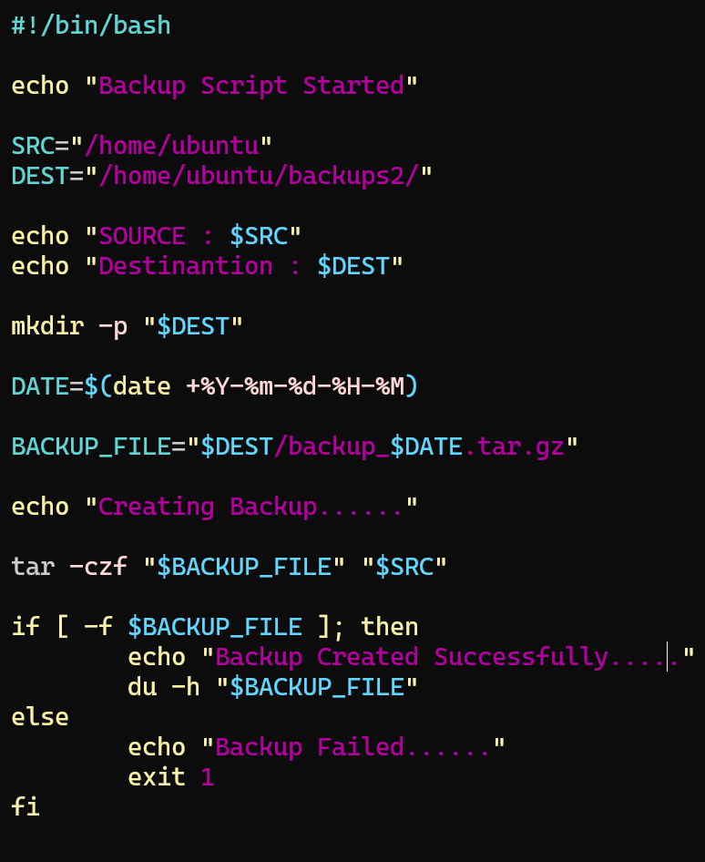
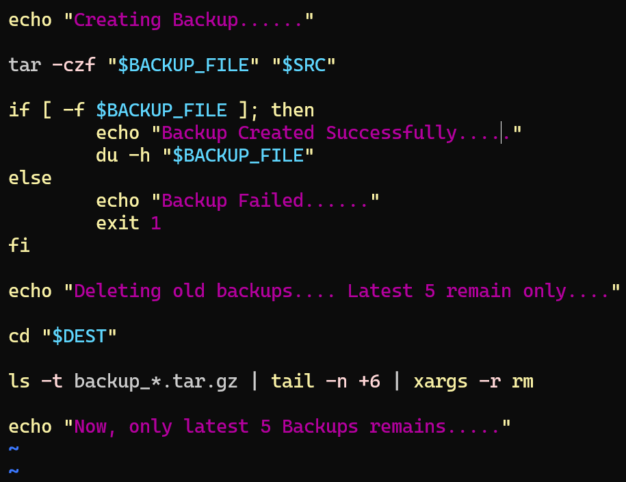
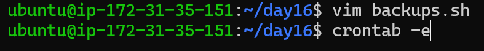
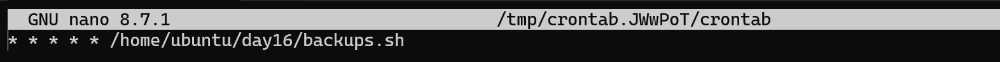
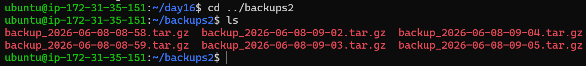

# Day 19 Challenge – Shell Scripting Project: Backup, Log Rotation & Crontab

---

## 🎯 Objective

Apply shell scripting concepts to build a real-world DevOps mini project:

* Automated system backup
* Backup rotation (keep only latest 5)
* Scheduling using cron jobs

---

## 📁 Script Created

* `backup.sh`

---

## 📜 Script: backup.sh






```bash
#!/bin/bash

LOGFILE="/home/ubuntu/backup.log"

echo "$(date) : Backup Script Started" >> $LOGFILE

SRC="/home/ubuntu"
DEST="/home/ubuntu/backups2/"

mkdir -p "$DEST"

DATE=$(date +%Y-%m-%d-%H-%M)
BACKUP_FILE="$DEST/backup-$DATE.tar.gz"

echo "$(date) : Creating backup..." >> $LOGFILE

# Create backup (exclude backup folder to avoid recursion)
tar --exclude="$DEST" -czf "$BACKUP_FILE" "$SRC"

# Verify backup
if [ -f "$BACKUP_FILE" ]; then
    echo "$(date) : Backup created successfully -> $BACKUP_FILE" >> $LOGFILE
    du -h "$BACKUP_FILE" >> $LOGFILE
else
    echo "$(date) : Backup failed" >> $LOGFILE
    exit 1
fi

# Cleanup old backups (keep only latest 5)
cd "$DEST"

ls -t backup-*.tar.gz 2>/dev/null | tail -n +6 | xargs -r rm

echo "$(date) : Old backups cleaned, only latest 5 kept" >> $LOGFILE

echo "" >> $LOGFILE
```

---

## ⚙️ Cron Job Setup

### Check existing cron jobs:

```bash
crontab -l
```

### Edit cron:




```bash
crontab -e
```

### Add:

```bash
* * * * * /home/ubuntu/day19/backup.sh
```




👉 Runs backup every minute (for testing)



---

## ⏱️ Cron Syntax

```
* * * * *  command
│ │ │ │ │
│ │ │ │ └── Day of week
│ │ │ └──── Month
│ │ └────── Day of month
│ └──────── Hour
└────────── Minute
```

---

## 🧠 How Backup Rotation Works

```bash
ls -t backup-*.tar.gz | tail -n +6 | xargs -r rm
```

* `ls -t` → sort newest first
* `tail -n +6` → select files after first 5
* `rm` → delete old backups

👉 Ensures only latest 5 backups are kept

---

## 📌 Sample Output

```bash
backup-2026-06-08-08-53.tar.gz
backup-2026-06-08-08-54.tar.gz
backup-2026-06-08-08-55.tar.gz
backup-2026-06-08-08-56.tar.gz
backup-2026-06-08-08-57.tar.gz
```

---

## 📊 Log File Example

```bash
Sun Jun 08 08:57:01 UTC 2026 : Backup Script Started
Sun Jun 08 08:57:01 UTC 2026 : Creating backup...
Sun Jun 08 08:57:10 UTC 2026 : Backup created successfully
52M backup file
Sun Jun 08 08:57:10 UTC 2026 : Old backups cleaned, only latest 5 kept
```

---

## 🔥 What I Learned

1. How to automate backups using shell scripting
2. How to schedule jobs using cron
3. How to implement log rotation / retention logic

---

## 🚀 Real-World Use Cases

* Server backup automation
* Log rotation systems
* CI/CD artifact cleanup
* Disk space management

---

## 🎯 Final Takeaway

This project simulates real DevOps workflows where:

* Tasks are automated
* Data is managed efficiently
* Systems run without manual intervention

---

#90DaysOfDevOps #DevOpsKaJosh #TrainWithShubham
