# Day 23 – Git Branching & Working with GitHub

---

## 🧠 Task 1: Understanding Branches

### 1. What is a branch in Git?

A branch is a separate line of development in Git. It allows you to work on features or fixes without affecting the main code.

---

### 2. Why do we use branches instead of committing everything to main?

Branches help in safe development. You can test and build features without breaking the main branch.

---

### 3. What is HEAD in Git?

HEAD is a pointer that points to the current branch or latest commit you are working on.

---

### 4. What happens to your files when you switch branches?

When you switch branches, Git updates your working directory to match that branch's files and commits.

---

## ⚙️ Task 2: Branching Commands (Hands-On)

### Commands Used

```bash
git branch                     # list all branches
```
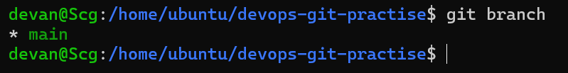
```bash
git branch feature-1           # create new branch
```
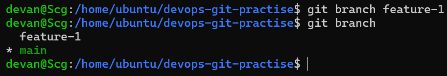
```bash
git switch feature-1           # switch to branch
```
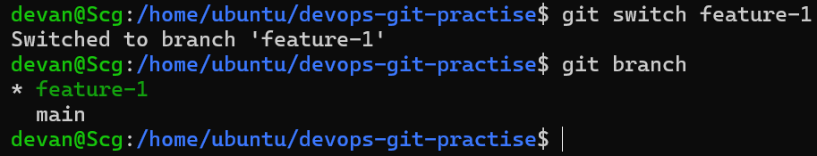
```bash
git switch -c feature-2        # create + switch branch
```
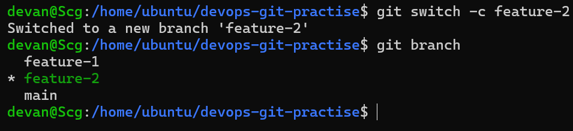
```bash
git switch main                # switch back to main
```
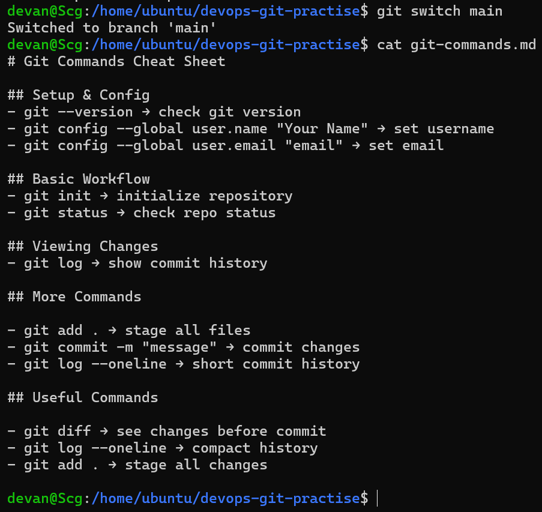
```bash
```
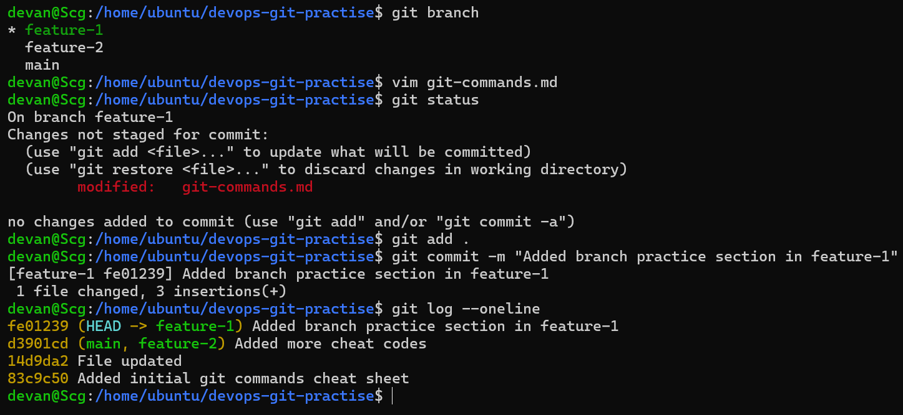
```bash
git branch -d feature-2        # delete branch
```
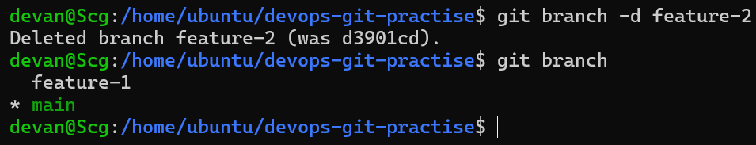
```bash
git branch -d feature-1        # delete branch after merge
```

---

### 📌 Key Learnings

* Each branch has its own commit history
* Changes in one branch do not affect others until merged
* `git switch` is modern and cleaner than `git checkout`

---

## 🌐 Task 3: Push to GitHub

### Commands Used

```bash
git remote add origin git@github.com:devanshsinglaaa/devops-git-practice.git
git push -u origin main
git push -u origin feature-1
```

---

### ❓ What is origin vs upstream?

* **origin** → your GitHub repository (default remote)
* **upstream** → original repository (used when you fork someone else's repo)

---

## 🔄 Task 4: Pull from GitHub

### Command Used


```bash
git pull origin main
```

---

### 🔍 Difference between git fetch and git pull

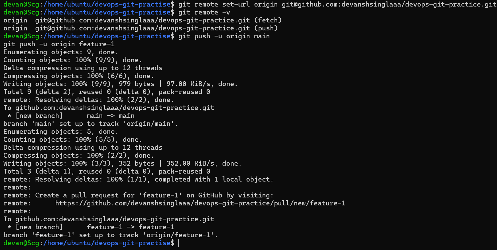


* `git fetch` → downloads changes but does NOT merge
* `git pull` → downloads + merges changes

---

## 🔁 Task 5: Clone vs Fork

### 🔹 Clone

```bash
git clone <repo-url>
```

* Creates a local copy of a repository

---

### 🔹 Fork

* Creates a copy of a repository on your GitHub account

---

### 📊 Difference

| Clone       | Fork                  |
| ----------- | --------------------- |
| Local copy  | GitHub copy           |
| Direct work | Used for contributing |

---

### 📌 When to use?

* Clone → when you own the repo or want local copy
* Fork → when contributing to someone else's project

---

### 🔄 How to keep fork updated?

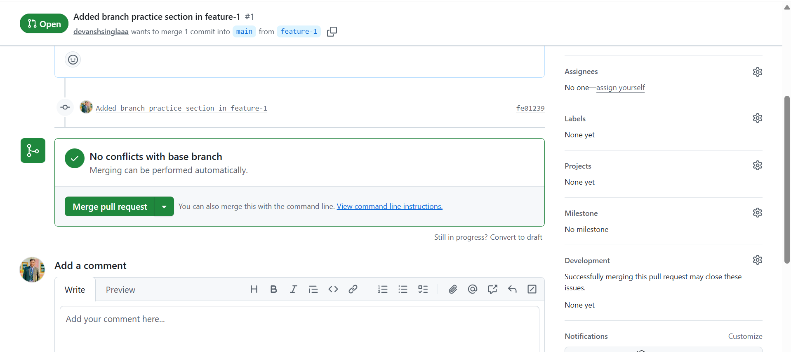

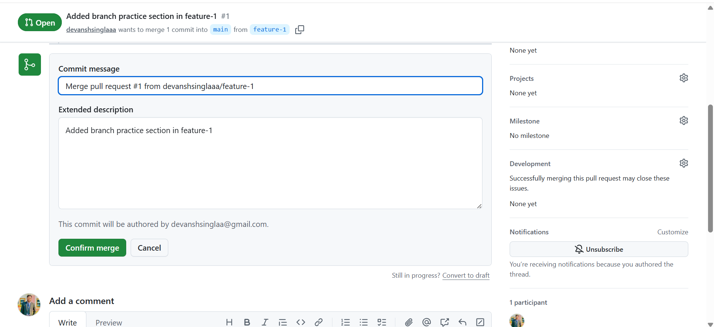

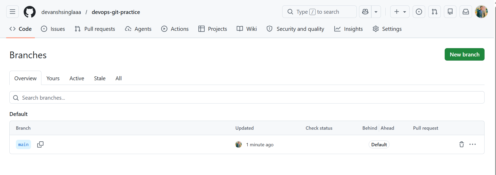

```bash
git remote add upstream <original-repo-url>
git fetch upstream
git merge upstream/main
```

---

## 🔥 Final Workflow Summary

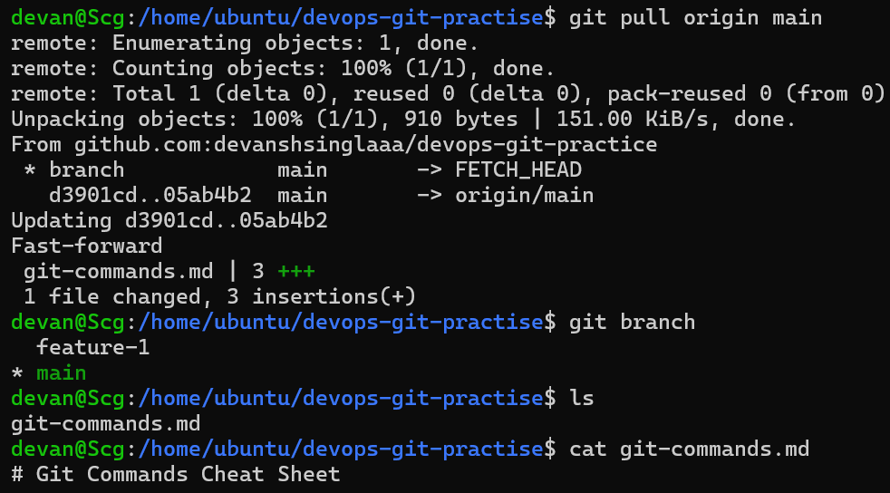

```text
Create branch → Make changes → Commit → Push → Pull Request → Merge → Pull
```

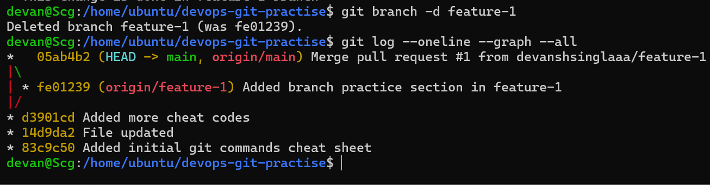

---

## 🧠 Key Learnings

* Branching allows isolated development
* Pull Requests are used for collaboration
* Fetch vs Pull difference is important
* SSH authentication is better than password-based login

---
