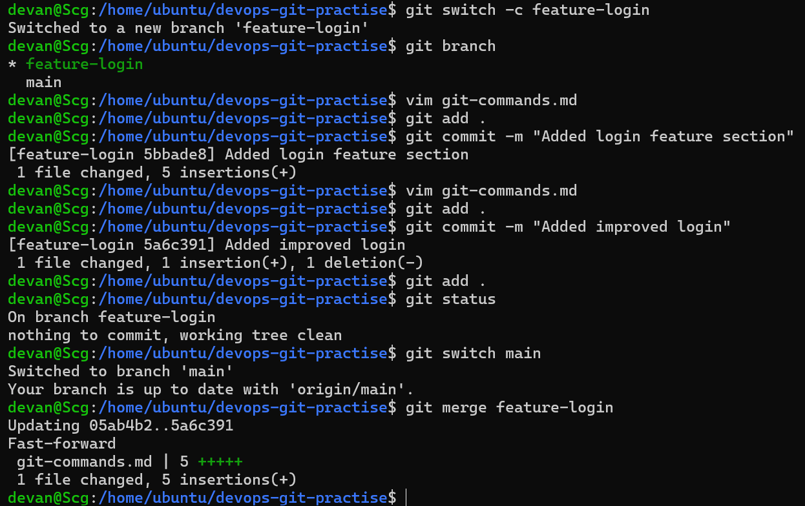
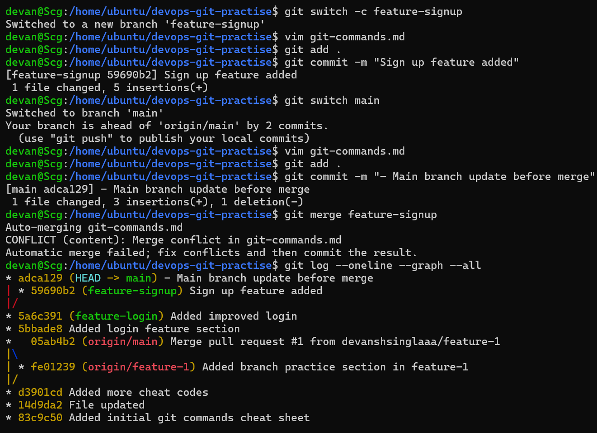
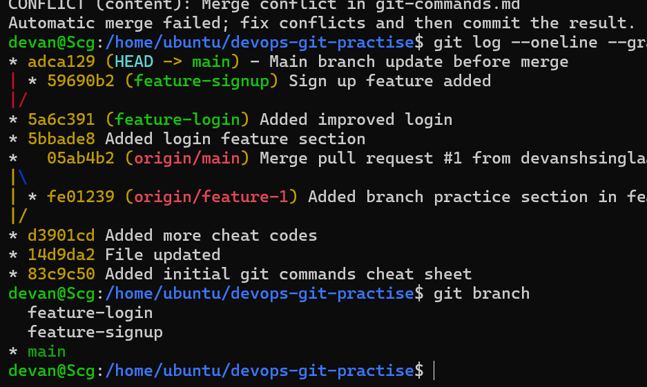
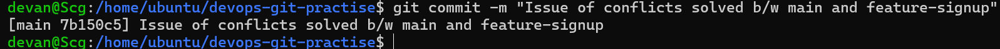
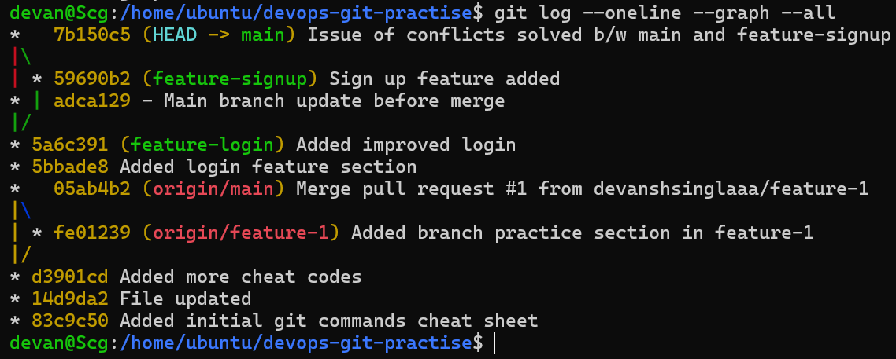
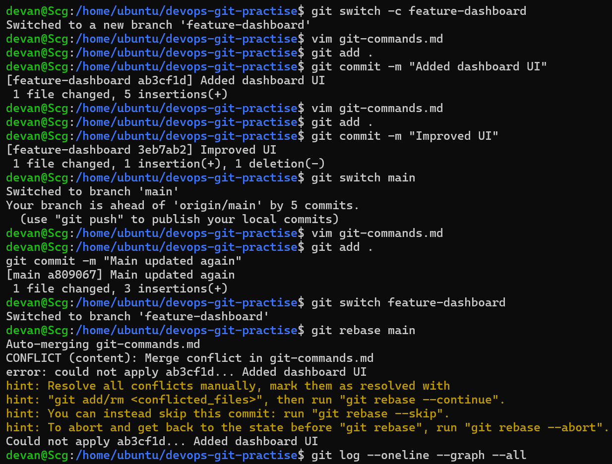
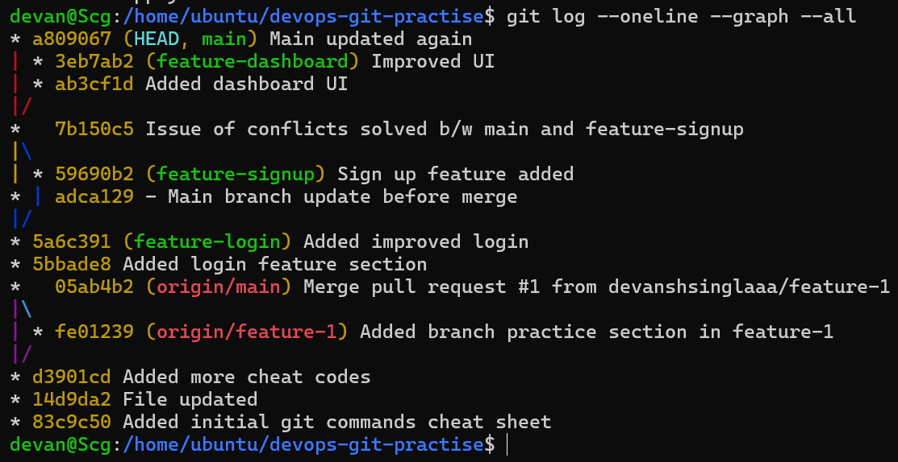
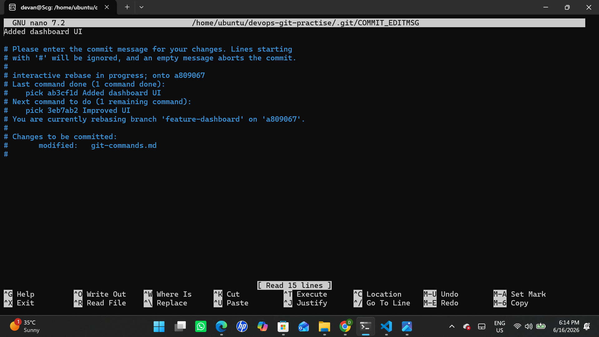
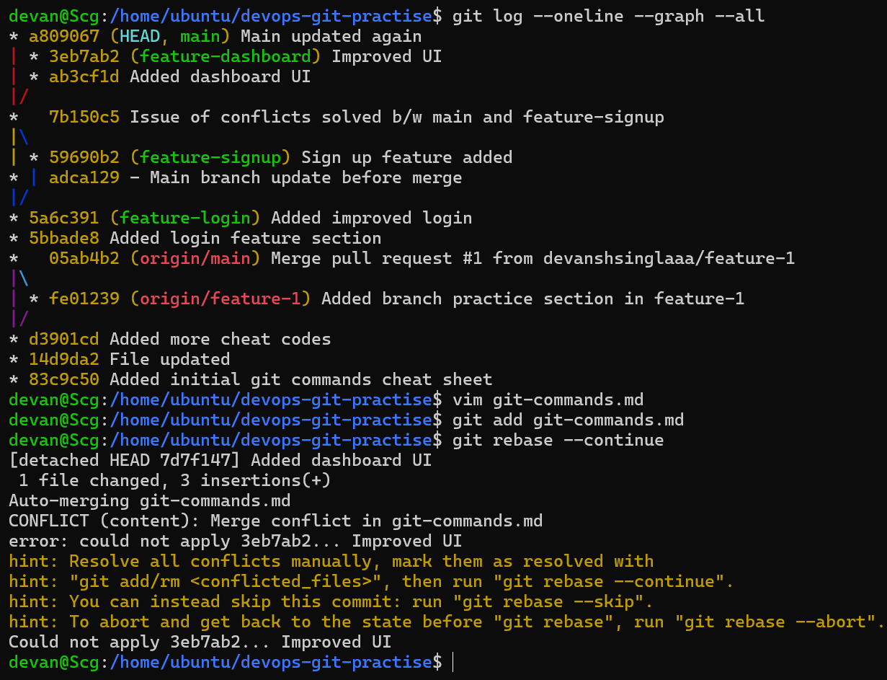

# Day 24 – Advanced Git: Merge, Rebase, Stash & Cherry Pick

---

## 🧠 Task 1: Git Merge

### What is a Fast-Forward Merge?
A fast-forward merge happens when there are no new commits on the main branch. Git simply moves the branch pointer forward.

### When does Git create a Merge Commit?
When both branches have new commits, Git creates a merge commit to combine their histories.

### What is a Merge Conflict?
A merge conflict occurs when the same file or line is modified in both branches and Git cannot resolve it automatically.

---

## 🔁 Task 2: Git Rebase

### What does rebase do?
Rebase moves your branch commits on top of another branch, rewriting commit history.

### How is it different from merge?
- **Merge** → keeps history and creates a merge commit  
- **Rebase** → creates a clean, linear history  

### Why should you not rebase shared branches?
Because it rewrites commit history and can cause conflicts for other collaborators.

### When to use rebase vs merge?
- **Rebase** → for local, clean history  
- **Merge** → for shared branches and collaboration  

---

## 🧩 Merge vs Rebase (Visual)

### Merge

- A---B---M
- \ /
- C---D


### Rebase

A---B---C'---D'


---

## 🧱 Task 3: Squash vs Merge Commit

### What does squash merge do?
Squash merge combines multiple commits into a single commit before merging.

### When to use squash?
When you want a clean and minimal commit history.

### Trade-off
- Clean history ✅  
- Lose detailed commit history ❌  

---

## 📦 Task 4: Git Stash

### What is stash?
Stash temporarily saves uncommitted changes so you can switch branches safely.

### Commands
```bash
git stash
git stash list
git stash pop
git stash apply
Difference between pop vs apply
git stash pop → apply changes and remove stash
git stash apply → apply changes but keep stash
Real-world usage

Used when switching tasks without committing incomplete work.

🍒 Task 5: Cherry Pick
What is cherry-pick?

Cherry-pick applies a specific commit from one branch to another.

Example
git cherry-pick <commit-hash>
When to use?
Applying hotfixes
Selecting specific commits
Risks
Duplicate commits
Conflicts
⚔️ Rebase Conflict Handling (Hands-on)
Steps followed:
git rebase main
# conflict occurs

# resolve manually
vim git-commands.md

git add git-commands.md
git rebase --continue
Key Learning
Rebase applies commits one by one
Conflicts may occur multiple times
Each conflict must be resolved manually
```

### 🔥 Key Learnings

- Merge vs Rebase is a core Git concept
- Rebase creates a clean history but rewrites commits
- Conflicts are normal and solvable
- Stash helps in task switching
- Cherry-pick is useful for selective commits

```bash

Images ->

```


















```bash

#90DaysOfDevOps #DevOpsKaJosh #TrainWithShubham