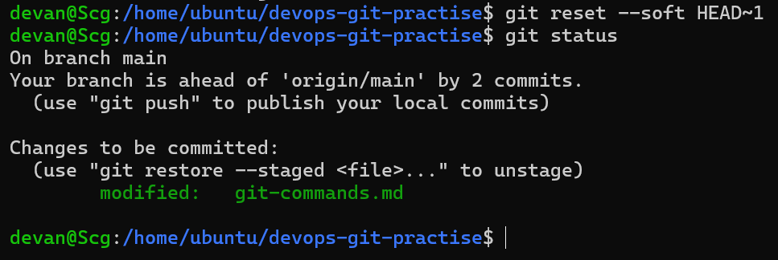
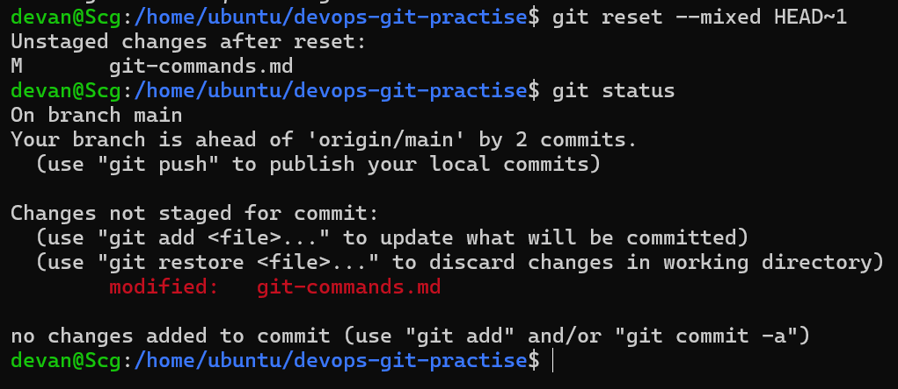
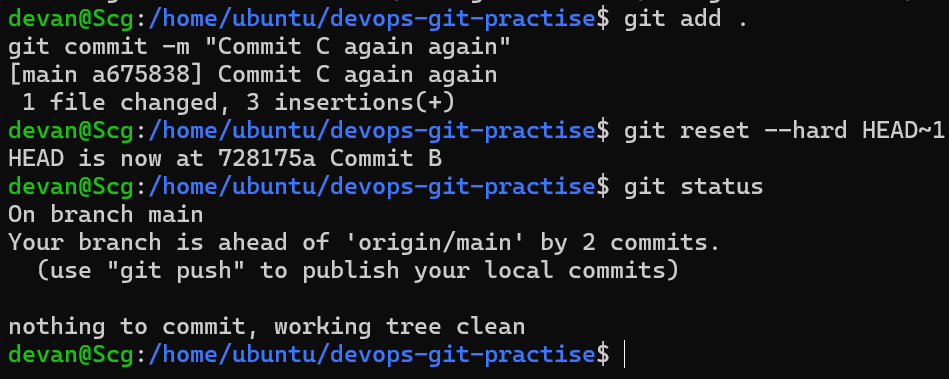
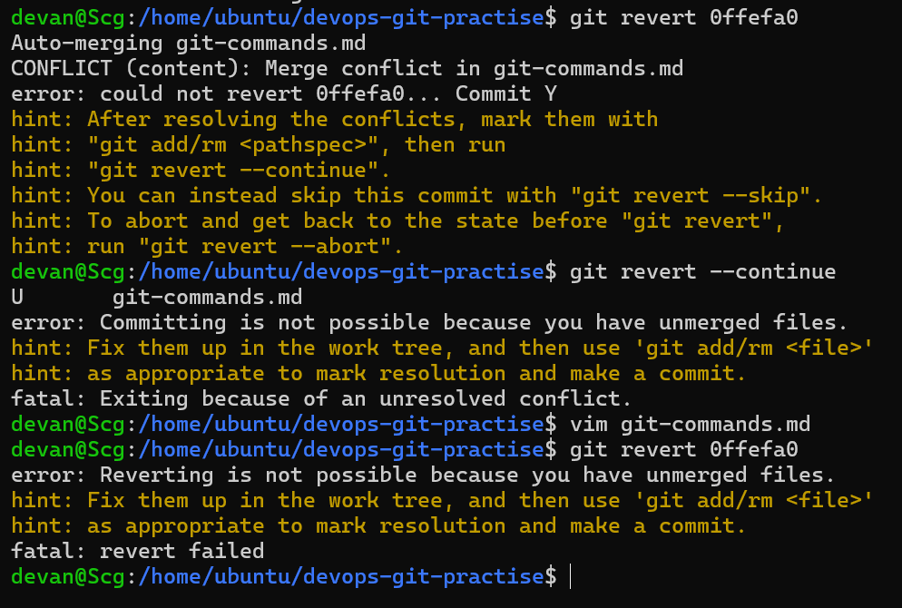
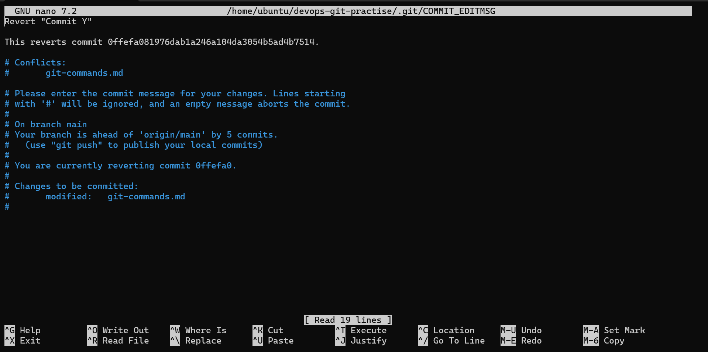
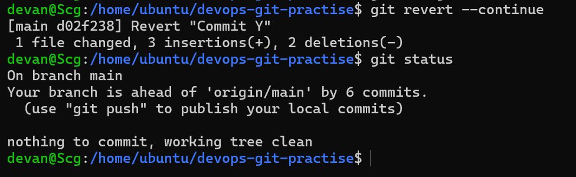
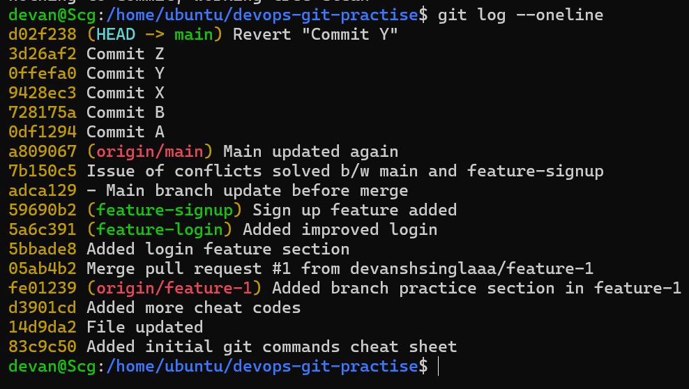

# 📘 Day 25 – Git Reset vs Revert & Branching Strategies

---

## 🧠 Task 1: Git Reset

### 🔹 What is `git reset`?

`git reset` moves the **HEAD pointer** to a previous commit and optionally updates the **staging area** and **working directory**.

---

### 🔸 Types of Reset

#### 1. 🟢 Soft Reset

```bash
git reset --soft HEAD~1
```



* Keeps changes in **staging area**
* Only removes the **last commit**

---

#### 2. 🟡 Mixed Reset (Default)

```bash
git reset --mixed HEAD~1
```


* Keeps changes in **working directory**
* **Unstages** changes

---

#### 3. 🔴 Hard Reset

```bash
git reset --hard HEAD~1
```


* Deletes the **commit**
* Deletes changes **permanently**

---

### ✅ Key Learnings

* `--soft` → keeps staged changes
* `--mixed` → keeps only file changes
* `--hard` → deletes everything
* ⚠️ Hard reset is **dangerous**
* 🚫 Avoid reset on **pushed commits**

---

## 🔄 Task 2: Git Revert

### 🔹 What is `git revert`?

Creates a **new commit** that undoes changes from a previous commit.

---

### 🔸 Command

```bash
git revert <commit-hash>
```








---

### 🔍 What Happened in Practice?

* Reverted a **middle commit (Y)**
* ⚠️ Conflict occurred → required manual resolution
* Created new commit:
  `Revert "Commit Y"`

---

### ✅ Key Learnings

* Does **NOT delete history**
* ✅ Safe for **shared repositories**
* ⚠️ Can cause conflicts (like merge)

---

## ⚖️ Task 3: Reset vs Revert

| Feature                  | `git reset`         | `git revert`        |
| ------------------------ | ------------------- | ------------------- |
| What it does             | Moves HEAD backward | Creates undo commit |
| Removes commit history   | Yes ❌               | No ✅                |
| Safe for shared branches | No ❌                | Yes ✅               |
| Best use case            | Local cleanup       | Production fixes    |

---

## 🌿 Task 4: Branching Strategies

### 1. GitFlow

* Uses multiple branches:

  * `main`, `develop`, `feature`, `release`, `hotfix`
* Best for **structured releases**

**Pros:**

* Organized workflow
* Great for large teams

**Cons:**

* Complex

---

### 2. GitHub Flow

* Single `main` branch + feature branches

**Flow:**

```
main → feature → PR → merge
```

**Pros:**

* Simple
* Fast deployment

**Cons:**

* Less control

---

### 3. Trunk-Based Development

* Everyone commits to `main`
* Uses **short-lived branches**

**Pros:**

* Fast integration
* Continuous delivery

**Cons:**

* Requires discipline

---

## 🧩 Recommended Usage

* 🚀 Startup → GitHub Flow / Trunk-Based
* 🏢 Large teams → GitFlow
* 🌍 Open-source → GitHub Flow

---

## 🔥 Final Learnings

* `git reset` rewrites history (**dangerous**)
* `git revert` is **safe and traceable**
* Conflicts can occur even in revert
* Prefer revert for **shared branches**
* 🛠️ `git reflog` can recover lost commits

---
