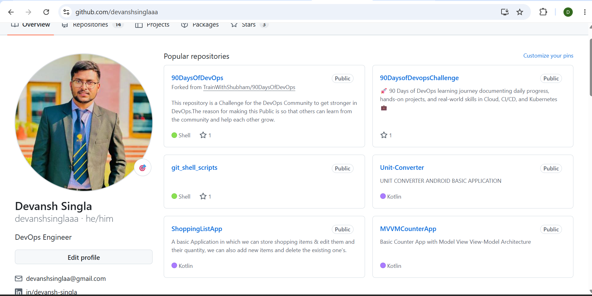
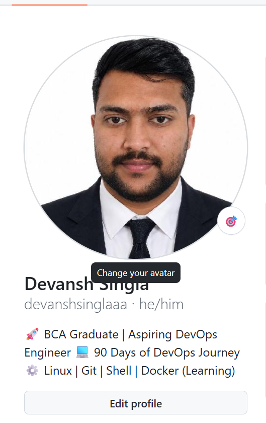
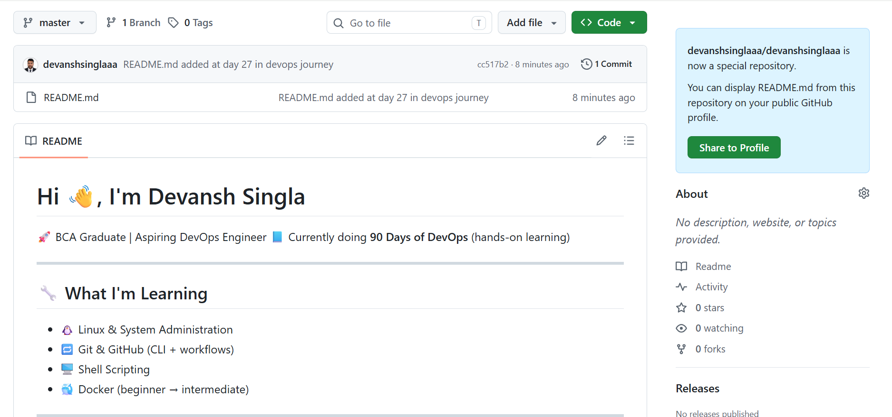

# Day 27 – GitHub Profile Makeover (Building My Developer Identity)

## 🚀 What I Did Today

Today was not about coding — it was about improving how I present myself as a developer on GitHub.

I:

* Audited my GitHub profile from a recruiter’s perspective
* Updated my profile picture to a more professional one
* Improved my bio to clearly reflect my current journey
* Created my **Profile README** to introduce myself properly

This felt like shifting from just “uploading code” to actually **presenting my work and identity**.

---

## 🧠 Profile Audit (Honest Review)

When I looked at my profile as a stranger, I realized:

### ❌ Before:

* Bio was too generic (“DevOps Engineer”)
* No clear indication of what I’m currently doing
* No introduction section on profile
* Profile didn’t tell any story

👉 It looked like a basic account, not a serious learner.

---

## 🛠️ Improvements I Made

### 🔹 1. Updated Profile Picture

* Changed to a clean, professional photo
* First impression is now much stronger

---

### 🔹 2. Improved Bio

### Before:

DevOps Engineer

### After:

🚀 BCA Graduate | Aspiring DevOps Engineer
📘 90 Days of DevOps Journey
⚙️ Linux | Git | Shell | Docker (Learning)

👉 Now it clearly shows:

* My background
* What I’m doing
* What I’m learning

---

### 🔹 3. Created Profile README (Biggest Change)

I created a special repository with my username and added a `README.md`.

👉 This now appears at the top of my GitHub profile and includes:

* Introduction (who I am)
* My DevOps learning journey
* Skills I am working on
* Projects and focus areas
* Contact details

---

## 🔥 Key Learnings

### ⚡ 1. GitHub is NOT just for code

It is actually a **developer portfolio**.

---

### 🧩 2. Clarity matters more than complexity

A simple and clear profile is better than a fancy but confusing one.

---

### 🎯 3. First impression is very important

A recruiter should understand in seconds:

* Who I am
* What I’m doing

---

### 🧠 4. Honesty builds trust

Instead of claiming “DevOps Engineer”, I used:
👉 “Aspiring DevOps Engineer”

---

### 📈 5. Show progress, not perfection

Right now my profile shows:

* Learning journey
* Consistency
* Direction

---

## ⚠️ What I Did NOT Do (Intentionally)

* Did not over-design my profile
* Did not add unnecessary badges
* Did not fake skills

👉 Focused on being **real and clean**

---

## 💡 Final Takeaway

Before today:

> My GitHub was just a place to push code

After today:

> My GitHub represents who I am as a developer

---

## 🚀 What’s Next

* Add more projects (Docker, CI/CD, etc.)
* Improve repository structure
* Upgrade profile further after gaining more skills

---

## 🏁 Conclusion

Today made me realize:

> Building skills is important,
> but presenting them properly is equally important.
