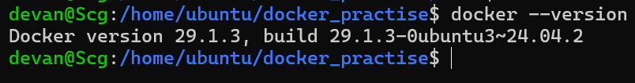
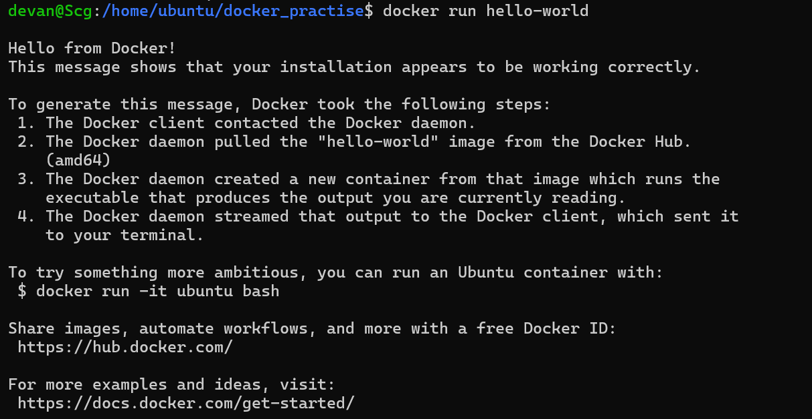
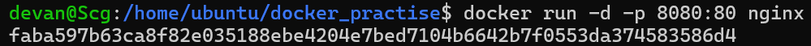
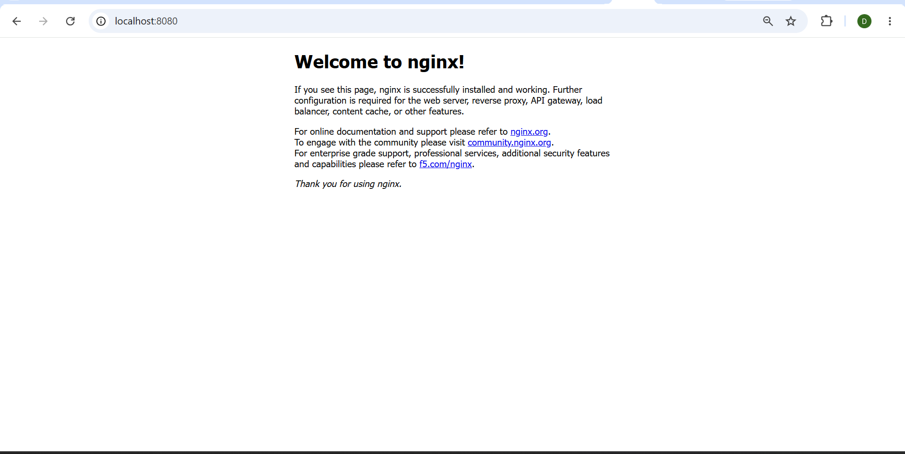
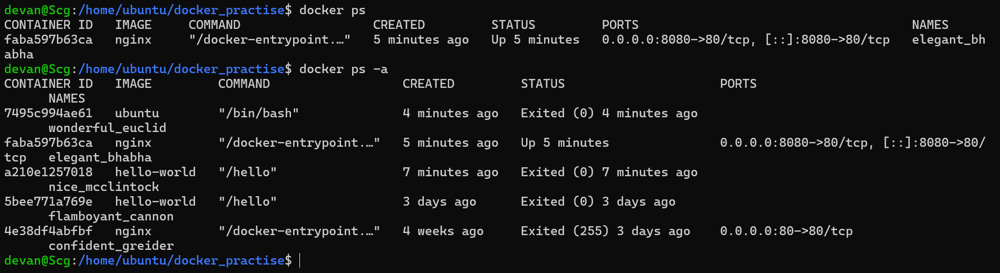
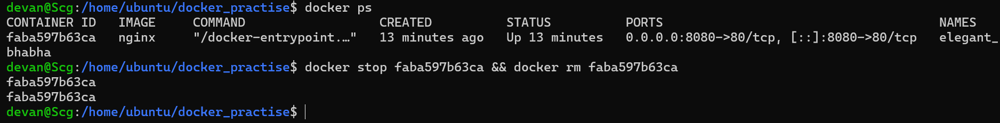
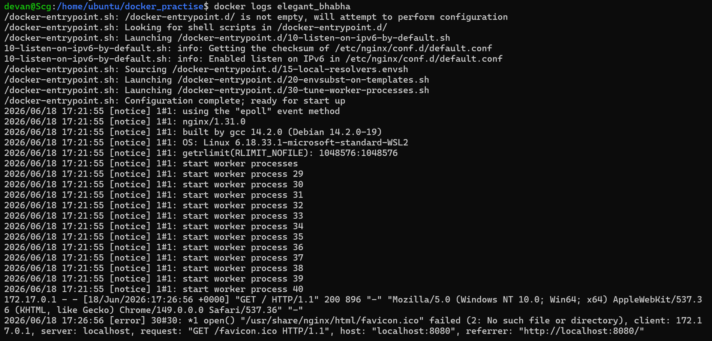

# Day 29 – Introduction to Docker

## 🚀 What I Did Today

Today I took my first step into Docker and containerization — one of the core concepts in DevOps.

I:

* Understood what Docker and containers are
* Learned how containers differ from virtual machines
* Installed and verified Docker
* Ran my first container (`hello-world`)
* Deployed a real web server using Nginx
* Explored containers using different Docker commands
* Practiced container lifecycle (run → stop → remove → cleanup)

This felt like moving from running apps normally to running them in **controlled, isolated environments**.

---

## 🧠 What is Docker?

Docker is a platform that allows us to run applications inside **containers**.

A container is:

> A lightweight, isolated environment that includes everything needed to run an application.

---

## 🤔 Why Containers?

Before containers:

* Applications worked on one machine but failed on another
* Dependency issues were very common

Containers solve this by:

* Packaging code + dependencies together
* Making applications portable and consistent

👉 “It works on my machine” problem is solved.

---

## ⚖️ Containers vs Virtual Machines

| Feature      | Containers     | Virtual Machines |
| ------------ | -------------- | ---------------- |
| Size         | Lightweight    | Heavy            |
| Startup Time | Seconds        | Minutes          |
| OS           | Shares host OS | Full OS required |
| Performance  | Faster         | Slower           |

👉 Containers are more efficient and widely used in modern systems.

---

## 🏗️ Docker Architecture (Simple)

Docker works using:

* **Docker Client** → where we run commands
* **Docker Daemon** → executes commands
* **Images** → blueprint of applications
* **Containers** → running instances
* **Docker Hub** → registry to download images

👉 Flow:
Client → Daemon → Pull Image → Run Container

---

## ⚙️ Installation & First Container

### Verify Docker:



```bash
docker --version
```

### Run first container:



```bash
docker run hello-world
```

👉 This:

* Pulled image from Docker Hub
* Created a container
* Executed it
* Displayed output

---

## 🌐 Running Real Container (Nginx)




```bash
docker run -d -p 8080:80 nginx
```

👉 Accessed via browser:

```
http://localhost:8080
```




👉 Learned:

* Port mapping (`host:container`)
* Running services inside containers

---

## 📋 Basic Commands Used

### List running containers:

```bash
docker ps
```




### List all containers:

```bash
docker ps -a
```


### Stop container:




```bash
docker stop <container_id>
```

### Remove container:

```bash
docker rm <container_id>
```

---

## 🔍 Exploration

### Detached mode:

```bash
docker run -d nginx
```

### Custom name:

```bash
docker run -d --name my-nginx nginx
```

### Logs:

```bash
docker logs my-nginx
```




### Execute inside container:

```bash
docker exec -it my-nginx sh
```

---

## 🔄 Container Lifecycle (What I Practiced)

```bash
Run → Use → Stop → Remove → Cleanup
```

---

## 🧹 Cleanup (Important)

```bash
docker container prune
```

👉 Removed all stopped containers and cleaned system

---

## 🔥 Key Learnings

### ⚡ Containers are lightweight environments

They make applications portable and consistent.

---

### 🔁 Image vs Container

* Image = blueprint
* Container = running instance

---

### 🌐 Port Mapping

```bash
host_port : container_port
```

Example:

```bash
8080 : 80
```

---

### 🧩 Docker is foundation of DevOps

Used in:

* CI/CD pipelines
* Kubernetes
* Cloud deployments

---

### 🧹 Clean environment matters

Removing unused containers is part of real DevOps workflow.

---

## ⚠️ Challenges Faced

* Understanding port mapping
* Difference between image and container
* Remembering Docker flags (`-it`, `-d`, `-p`)

---

## 💡 Final Takeaway

Before today:

> Applications ran directly on my system

After today:

> Applications run inside controlled, isolated containers

---

## 🏁 Conclusion

Docker introduced me to a new way of running applications.

> Applications don’t just run —
> they run inside environments.

And managing those environments is what DevOps is all about.
