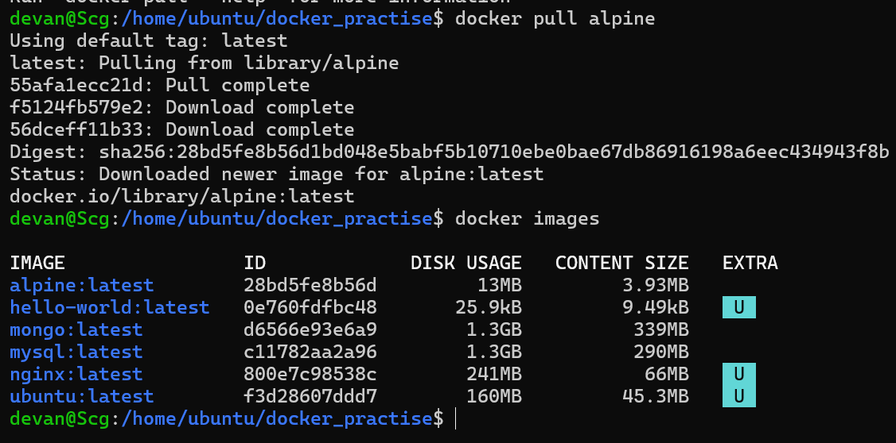
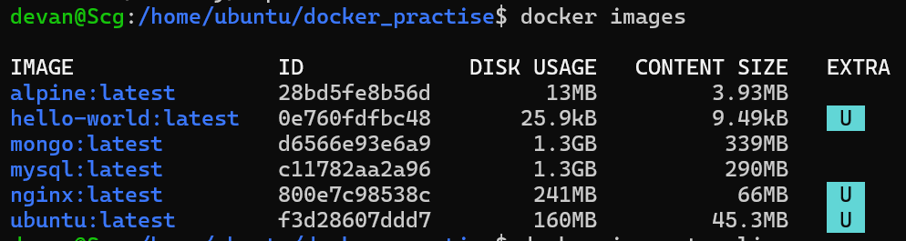
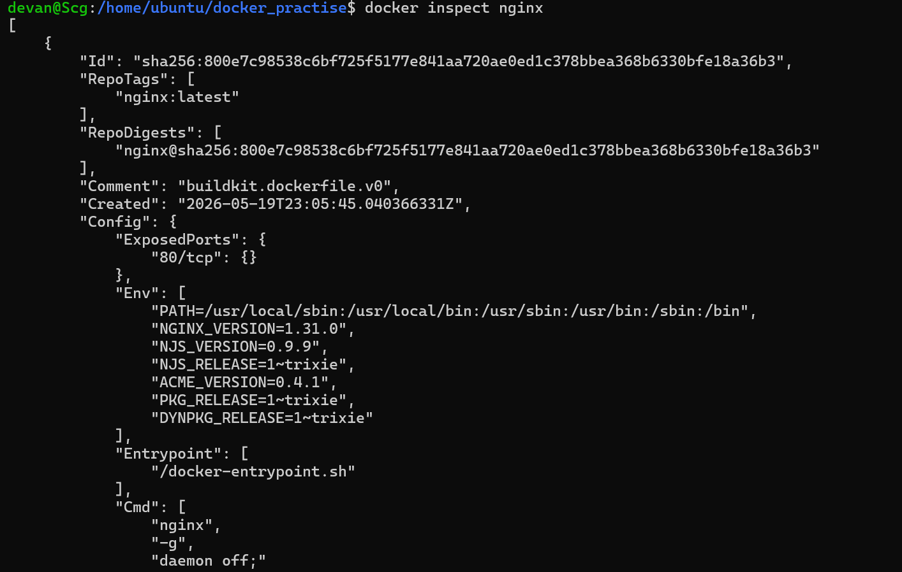
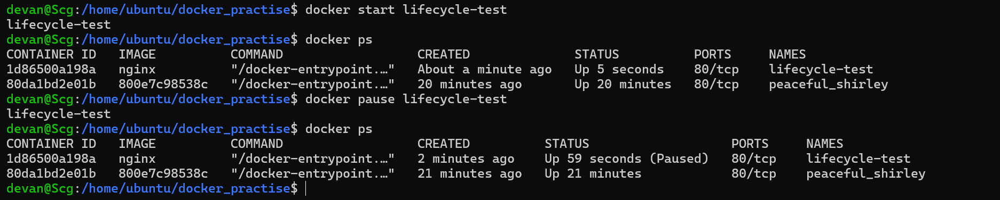

# Day 30 – Docker Images & Container Lifecycle

## 🚀 What I Did Today

Today I went deeper into Docker by understanding how **images, layers, and container lifecycle actually work**.

I:

* Pulled and compared multiple Docker images
* Explored image sizes and understood why they differ
* Learned about Docker image layers and caching
* Practiced the complete container lifecycle
* Worked with running containers using logs, exec, and inspect
* Performed cleanup to manage Docker resources

This day helped me move from just *using Docker* to actually **understanding how it works internally**.

---

## 🧠 Docker Images

Docker images are:

> Read-only templates used to create containers.

---

### 🔹 Images I Used

```bash
docker pull nginx
docker pull ubuntu
docker pull alpine
```



---

### 🔹 Listing Images

```bash
docker images
```




---

### 📊 Observations

* `alpine` → very small (~13MB)
* `ubuntu` → medium (~160MB)
* `nginx` → larger (~200MB+)
* `mongo/mysql` → very large (~1GB+)

---

### 🤔 Ubuntu vs Alpine

* **Ubuntu**

  * Full Linux OS
  * Larger size
  * More tools

* **Alpine**

  * Minimal OS
  * Lightweight
  * Faster and efficient

👉 Insight:

> Smaller images are preferred in production.

---

### 🔍 Inspect Image




```bash
docker inspect nginx
```

👉 Observed:

* Image metadata
* Environment variables
* Default commands
* Configuration details

---

## 🧩 Docker Image Layers


```bash
docker image history nginx
```

---

### 🧠 What are Layers?

* Each step in image creation forms a **layer**
* Layers are stacked to form the final image

---

### 🔍 Observations

* Multiple layers present
* Some layers show size
* Some layers show `0B`

---

### 🤔 Why 0B Layers?

* They only store metadata/config
* No actual file changes

---

### 🔥 Why Layers Matter

* Faster builds (caching)
* Efficient storage (shared layers)
* Reusability across images

---

## 🔄 Container Lifecycle

I practiced the full lifecycle of a container:

---

### 🔹 Create (without running)

```bash
docker create --name lifecycle-test nginx
```

---




### 🔹 Start

```bash
docker start lifecycle-test
```

---

### 🔹 Pause

```bash
docker pause lifecycle-test
```

---

### 🔹 Unpause

```bash
docker unpause lifecycle-test
```

---

### 🔹 Stop

```bash
docker stop lifecycle-test
```

---

### 🔹 Restart

```bash
docker restart lifecycle-test
```

---

### 🔹 Kill (force stop)

```bash
docker kill lifecycle-test
```

---

### 🔹 Remove

```bash
docker rm lifecycle-test
```

---

### 📊 Lifecycle Flow

```
Created → Running → Paused → Running → Exited → Restarted → Killed → Removed
```

---

## 🔍 Working with Running Containers

### Run container

```bash
docker run -d --name inspect-test -p 8090:80 nginx
```

---

### View logs

```bash
docker logs inspect-test
```

---

### Real-time logs

```bash
docker logs -f inspect-test
```

---

### Exec into container

```bash
docker exec -it inspect-test sh
```

---

### Run command inside container

```bash
docker exec inspect-test ls
```

---

### Inspect container

```bash
docker inspect inspect-test
```

👉 Found:

* Container IP
* Port mappings
* Configuration details

---

## 🧹 Cleanup

### Stop all containers

```bash
docker stop $(docker ps -q)
```

---

### Remove stopped containers

```bash
docker container prune
```

---

### Remove unused images

```bash
docker image prune
```

---

### Check disk usage

```bash
docker system df
```

---

## 🔥 Key Learnings

### ⚡ Images vs Containers

* Image = blueprint
* Container = running instance

---

### 🧩 Layers improve efficiency

Docker uses layers for:

* Faster builds
* Storage optimization
* Reusability

---

### 🔄 Lifecycle is important

Containers go through multiple states:

* Created
* Running
* Paused
* Stopped
* Removed

---

### 🔍 Logs & Inspect are powerful

Used for debugging and understanding container behavior

---

### 🧹 Cleanup is essential

Unused containers and images consume space

---

## ⚠️ Challenges Faced

* Understanding image layers
* Interpreting large JSON output from inspect
* Remembering lifecycle commands

---

## 💡 Final Takeaway

Before today:

> I was just running containers

After today:

> I understand how Docker images, layers, and lifecycle work internally

---

## 🏁 Conclusion

Today gave me a deeper understanding of Docker internals.

> Containers are not just processes —
> they are built from layers and managed through a lifecycle.
