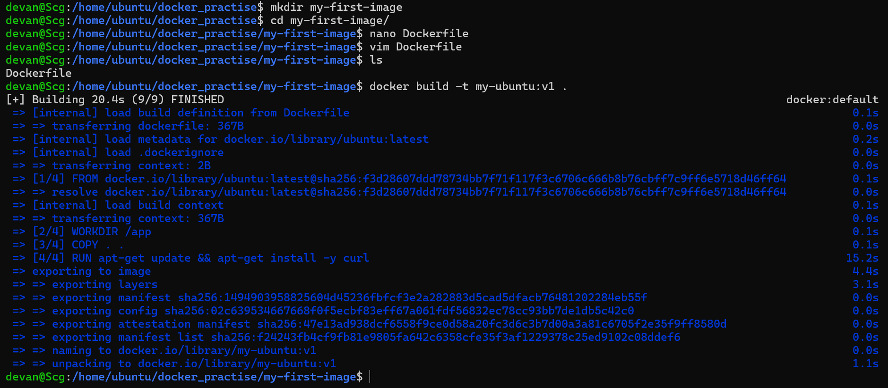
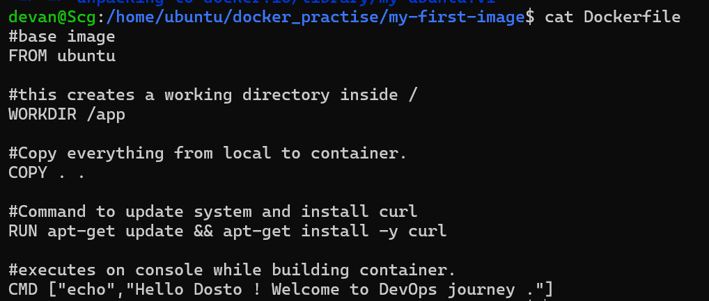
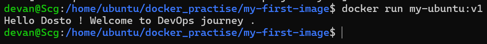
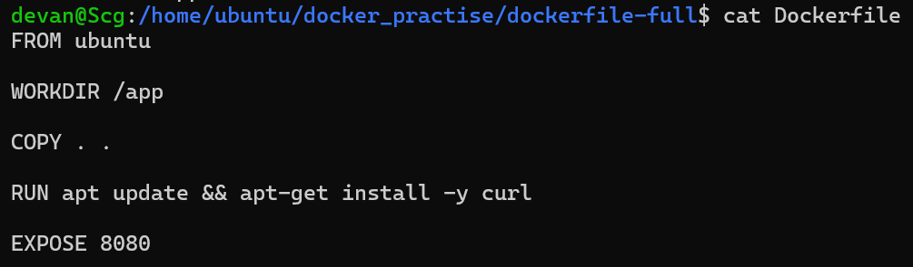
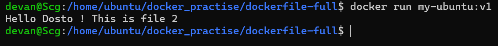
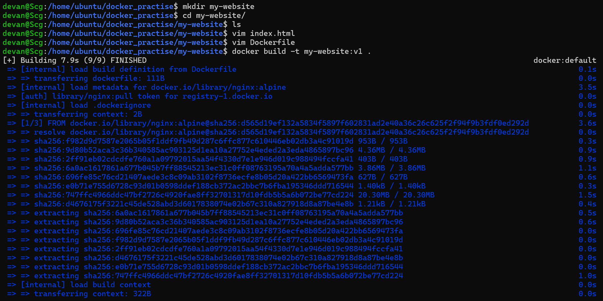
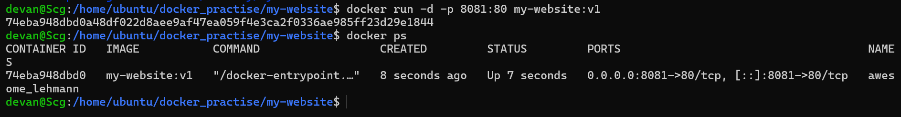
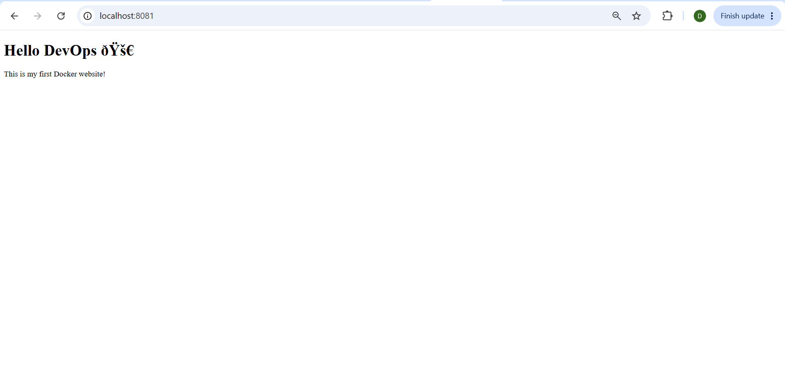

# Day 31 – Dockerfile: Build Your Own Images

## 🚀 What I Did Today

Today I moved from just using Docker to actually **building my own Docker images** using Dockerfiles.

I:

* Created my first custom Docker image
* Learned and used core Dockerfile instructions
* Understood the difference between CMD and ENTRYPOINT
* Built and deployed my own static website using Nginx
* Learned about `.dockerignore` and build optimization

This is the day where Docker started to feel like a real DevOps tool.

---

## 🧠 What is a Dockerfile?

A Dockerfile is:

> A script that contains instructions to build a Docker image.

---

## 🧱 Task 1: My First Dockerfile




### 🔹 Dockerfile




```dockerfile
FROM ubuntu

RUN apt update && apt install -y curl

CMD ["echo", "Hello Dosto ! Welcome to DevOps journey ."]
```

---

### 🔹 Build Image

```bash
docker build -t my-ubuntu:v1 .
```

---

### 🔹 Run Container

```bash
docker run my-ubuntu:v1
```




---

### 🎯 Output

```
Hello Dosto ! Welcome to DevOps journey .
```

---

## 🧠 Key Learning

* `FROM` → base image
* `RUN` → executes commands during build
* `CMD` → default command when container runs

---

## 🧱 Task 2: Dockerfile Instructions




### 🔹 Dockerfile

```dockerfile
FROM ubuntu

RUN apt update && apt install -y curl

WORKDIR /app

COPY app.txt /app

EXPOSE 8080

CMD ["cat", "app.txt"]
```

---

### 🔹 Output




```
This is my Dockerfile test app
```

---

## 🧠 Instruction Breakdown

* `FROM` → base OS
* `RUN` → install dependencies
* `WORKDIR` → sets working directory
* `COPY` → copy files from host to image
* `EXPOSE` → document port
* `CMD` → default command

---

## ⚔️ Task 3: CMD vs ENTRYPOINT

### 🔹 CMD Example

```dockerfile
FROM ubuntu
CMD ["echo", "Hello from CMD"]
```

👉 Override:

```bash
docker run cmd-image echo "Custom message"
```

✔️ Output:

```
Custom message
```

---

### 🔹 ENTRYPOINT Example

```dockerfile
FROM ubuntu
ENTRYPOINT ["echo"]
```

👉 Run:

```bash
docker run entrypoint-image Hello DevOps
```

✔️ Output:

```
Hello DevOps
```

---

## 🧠 Difference

| Feature  | CMD             | ENTRYPOINT         |
| -------- | --------------- | ------------------ |
| Override | Yes             | No                 |
| Behavior | Replaced        | Arguments appended |
| Use case | Default command | Fixed execution    |

---

## 🧱 Task 4: Build My Own Website

### 🔹 index.html

```html
<!DOCTYPE html>
<html>
<head>
    <title>My DevOps Site</title>
</head>
<body>
    <h1>Hello DevOps 🚀</h1>
    <p>This is my first Docker website!</p>
</body>
</html>
```

---

### 🔹 Dockerfile

```dockerfile
FROM nginx:alpine

COPY index.html /usr/share/nginx/html/

EXPOSE 80
```

---

### 🔹 Run






```bash
docker build -t my-website:v1 .
docker run -d -p 8081:80 my-website:v1
```

---

### 🎯 Result

Opened in browser:

```
http://localhost:8081
```




✔️ My custom website was live

---

## 🧠 Real Learning

👉 I deployed my own app using Docker
👉 This is exactly how real-world deployments work

---

## 🧱 Task 5: `.dockerignore`

### 🔹 File

```
node_modules
.git
*.md
.env
```

---

## 🧠 Why Important?

* Reduces image size
* Improves build speed
* Prevents unnecessary files

---

## ⚡ Task 6: Build Optimization

### 🔹 Concept

Docker uses **layer caching**

---

### 🔥 Rule

> Place frequently changing instructions at the bottom

---

### ❌ Bad

```dockerfile
COPY . .
RUN apt install curl
```

---

### ✅ Good

```dockerfile
RUN apt install curl
COPY . .
```

---

## 🧠 Why?

* Docker rebuilds only changed layers
* Faster builds
* Efficient CI/CD pipelines

---

## 🔥 Key Learnings

* Dockerfile = blueprint for images
* CMD vs ENTRYPOINT difference
* Build → Run → Deploy workflow
* Layer caching improves performance
* `.dockerignore` keeps images clean

---

## ⚠️ Challenges Faced

* Understanding CMD vs ENTRYPOINT
* Writing correct Dockerfile syntax
* Understanding build caching

---

## 💡 Final Takeaway

Before today:

> I was only running containers

After today:

> I can build, customize, and deploy my own Docker images

---

## 🏁 Conclusion

Today was a major milestone.

> I didn’t just use Docker —
> I built with Docker.
