# Day 32 – Docker Volumes & Networking

## 🚀 What I Did Today

Today I solved two major real-world problems in Docker:

* Data persistence (containers losing data)
* Communication between containers

I:

* Observed data loss in containers
* Fixed it using Docker volumes
* Used bind mounts for real-time file sync
* Explored Docker networking
* Enabled container-to-container communication
* Built a mini setup with app + database

This day felt like working on a real production system.

---

## 🧠 Task 1: The Problem (Data Loss)

I ran a MySQL container and created a table with data.

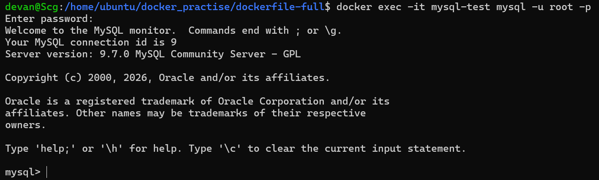

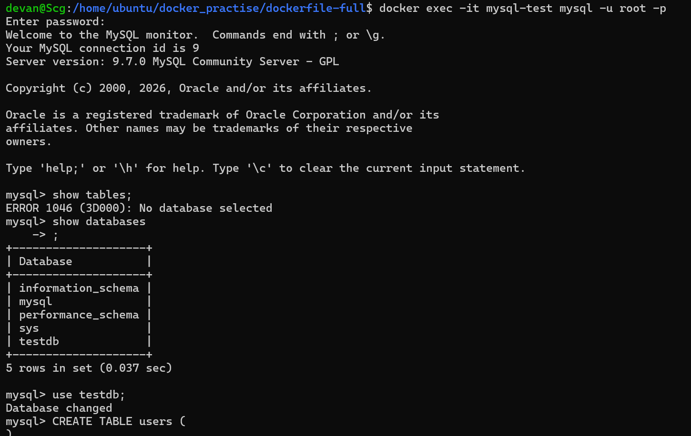

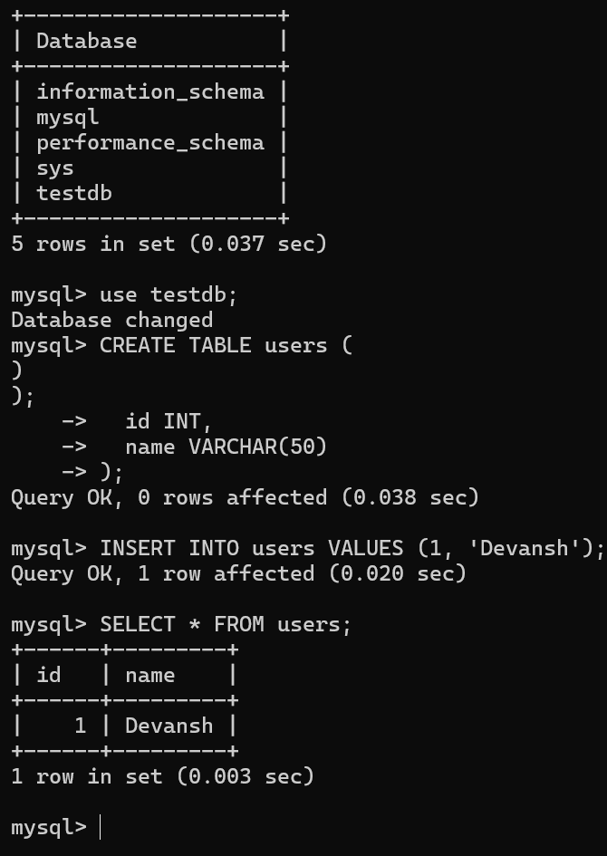

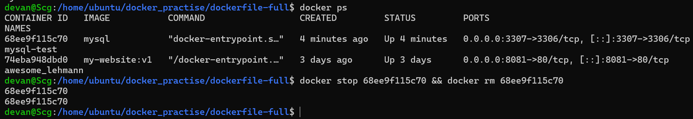

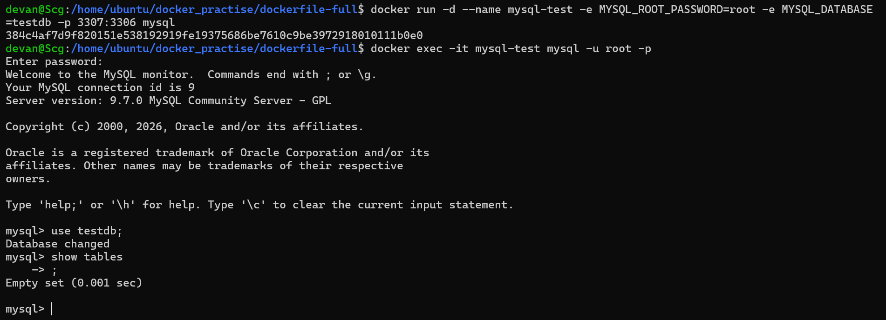


Then:

* Stopped the container
* Removed it
* Created a new container

👉 Result:
❌ Data was lost

---

### 🔍 Why?

> Containers are ephemeral — data inside them is temporary

When a container is deleted:
👉 All internal data is lost

---

## 💾 Task 2: Named Volumes (Solution)

### 🔹 Created volume

```bash
docker volume create mysql-data
```

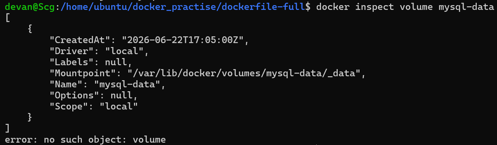


---

### 🔹 Attached volume

```bash
-v mysql-data:/var/lib/mysql
```

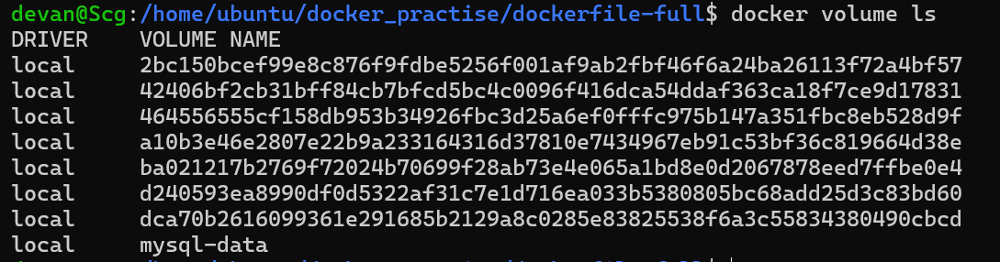

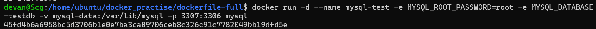

---

### 🔹 Result

* Created data again
* Removed container
* Recreated container with same volume

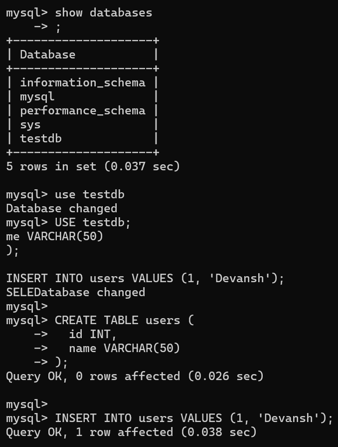

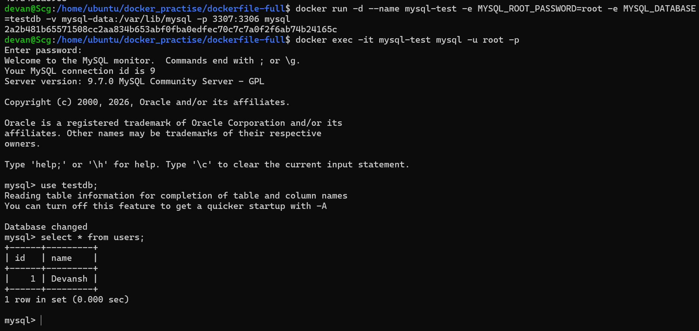

👉 ✅ Data persisted

---

## 🧠 Key Learning

> Volumes store data outside the container

---

## 📁 Task 3: Bind Mounts

### 🔹 Setup

* Created `index.html` on host
* Mounted it into Nginx container

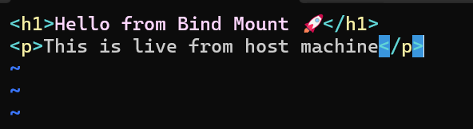

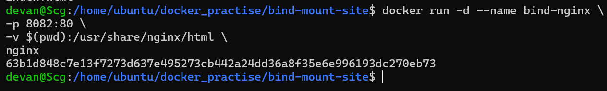

```bash
-v $(pwd):/usr/share/nginx/html
```

---

### 🔹 Result

* Website loaded in browser
* Edited file on host
* Changes reflected instantly

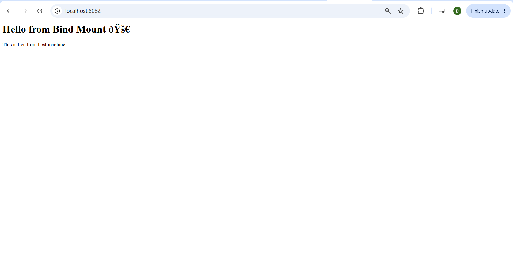

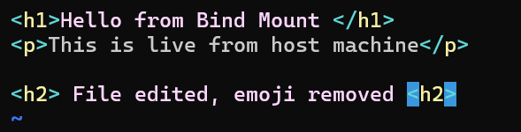

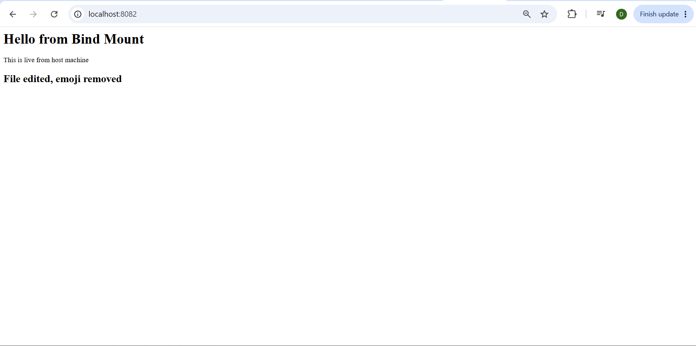


👉 No rebuild needed

---

## ⚔️ Volume vs Bind Mount

| Feature      | Volume         | Bind Mount   |
| ------------ | -------------- | ------------ |
| Location     | Docker-managed | Host machine |
| Access       | Indirect       | Direct       |
| Use case     | Databases      | Development  |
| Live updates | No             | Yes          |

---

## 🌐 Task 4: Default Networking

* Ran 2 containers on default bridge

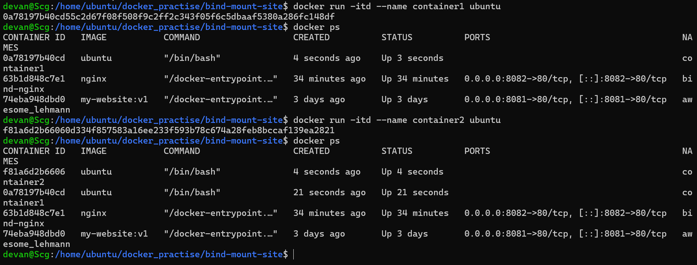


### 🔹 Observations

* ❌ Cannot ping by name

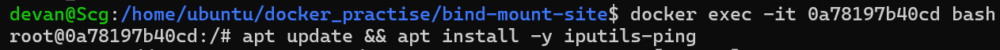

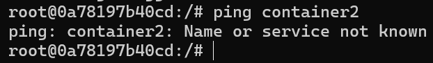


* ✅ Can ping by IP

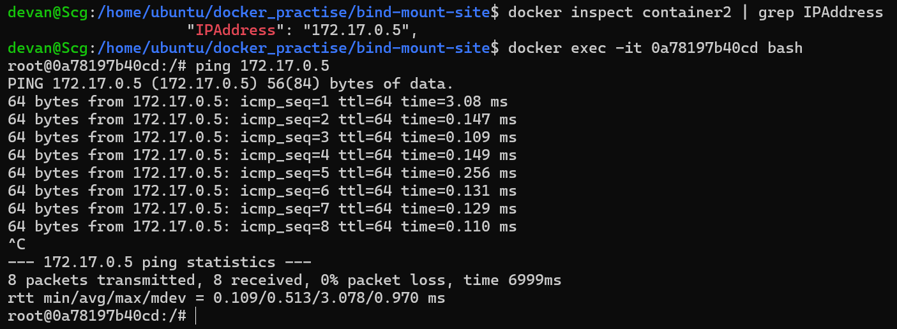


---

## 🧠 Insight

> Default bridge network does not support name resolution

---

## 🌐 Task 5: Custom Network

### 🔹 Created network

```bash
docker network create my-app-net
```

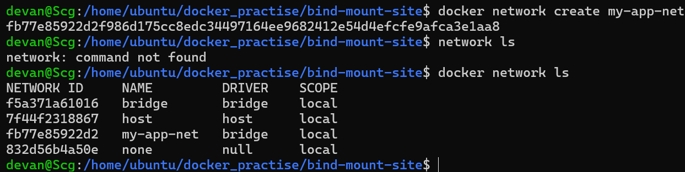


---

### 🔹 Ran containers on it

👉 Result:

* ✅ Ping by name worked

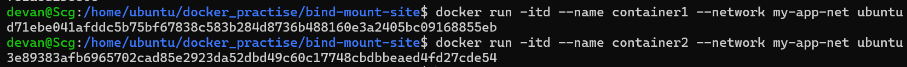

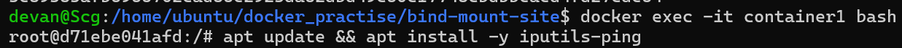

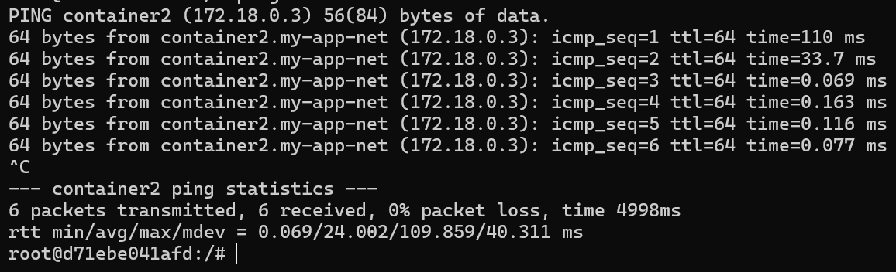

---

## 🧠 Why?

> Custom networks provide built-in DNS

---

## 🔗 Task 6: App + Database Setup

### 🔹 Setup

* Created custom network
* Ran MySQL with volume
* Ran app container on same network

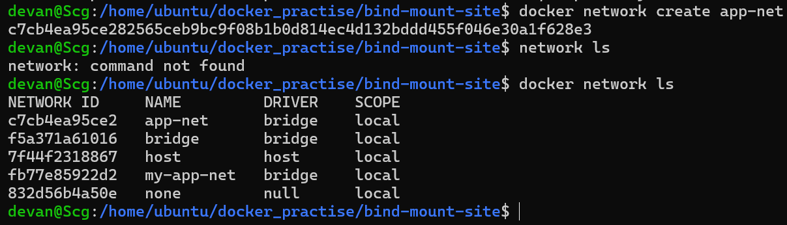

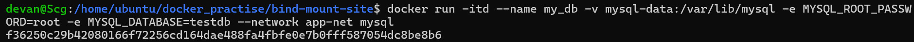

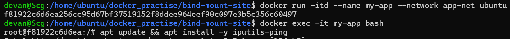


---

### 🔹 Result

```bash
ping my-db
```

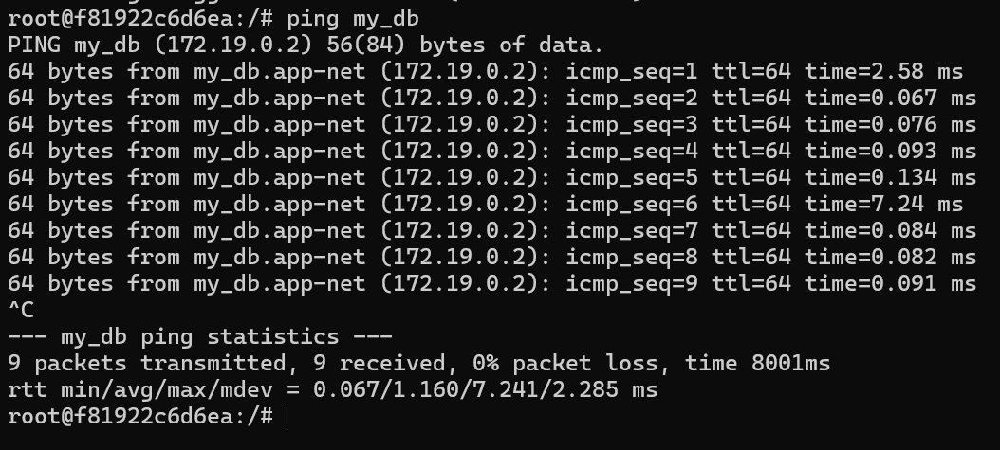


👉 ✅ Success

---

## 🧠 Real Learning

> Containers communicate using names, not IPs

---

## 🔥 Key Learnings

### 💾 Data Persistence

* Containers lose data
* Volumes solve it

---

### 🔗 Communication

* Default network is limited
* Custom network enables DNS

---

### ⚙️ Real Architecture

```text
App Container → Database Container
       ↓
   via container name
```

---

### 🧠 DevOps Insight

* Volumes = persistent storage
* Networks = service communication
* Together = real application setup

---

## ⚠️ Challenges Faced

* Understanding where data is stored
* Difference between volume and bind mount
* Networking behavior confusion

---

## 💡 Final Takeaway

Before today:

> Containers were isolated and temporary

After today:

> Containers can store data and communicate like real systems

---

## 🏁 Conclusion

Today was a big step toward real-world DevOps.

> Containers are not just isolated units —
> they can work together to form complete systems.
