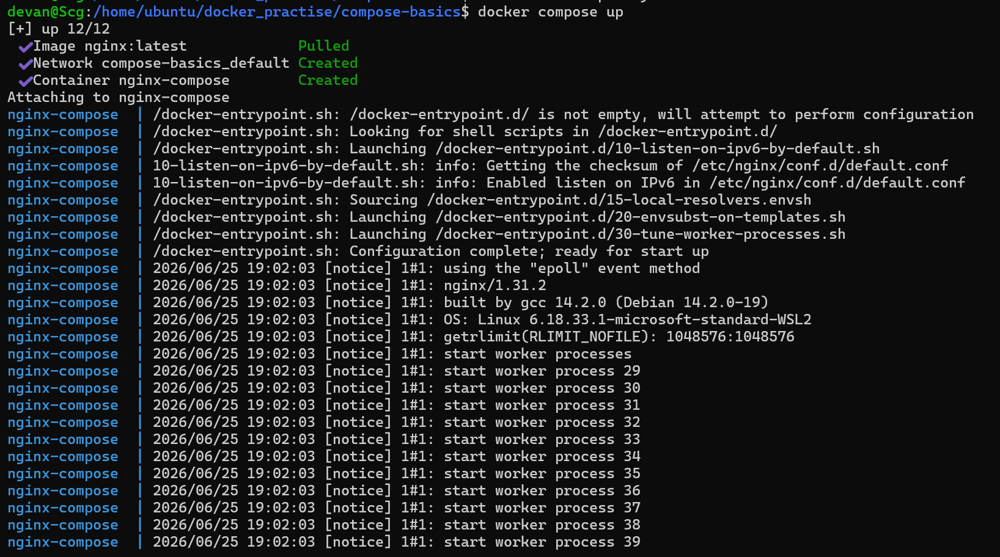
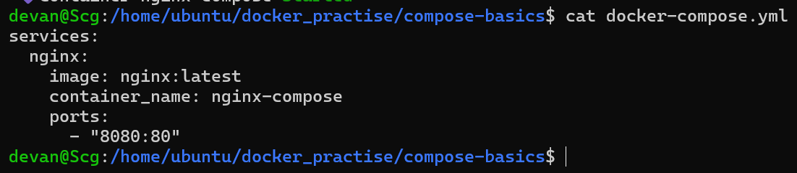
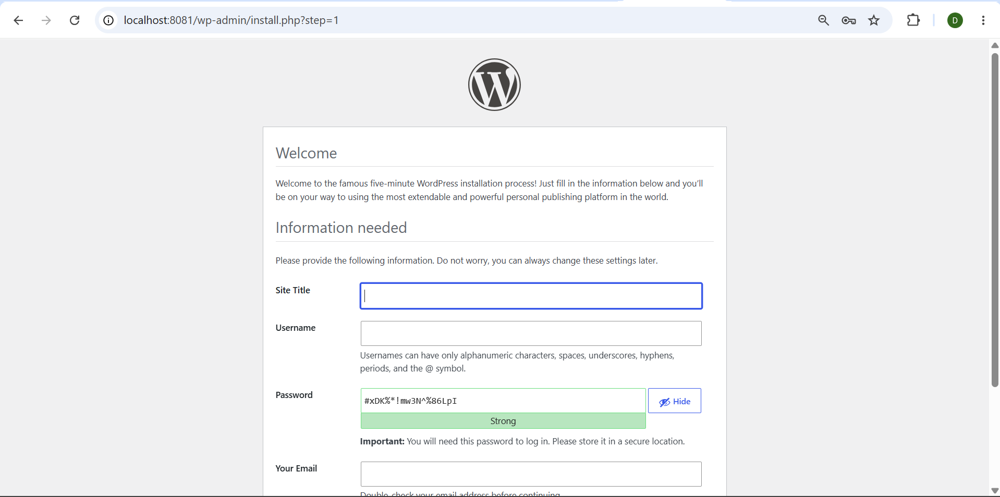
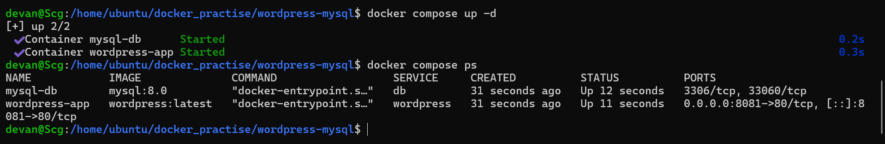
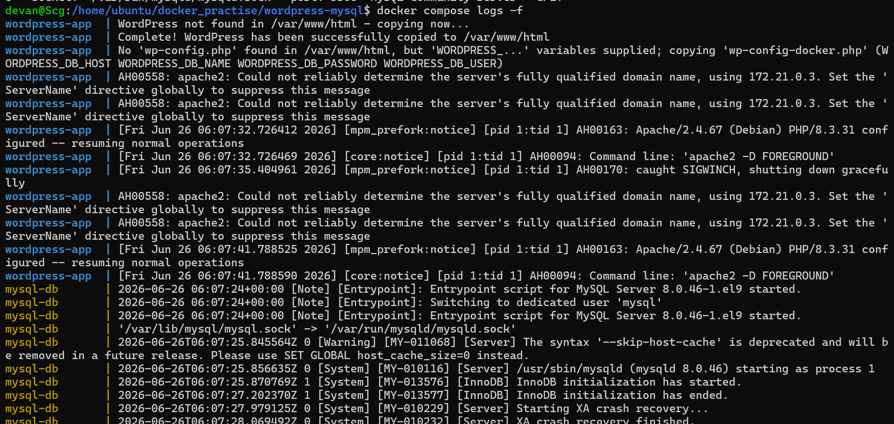
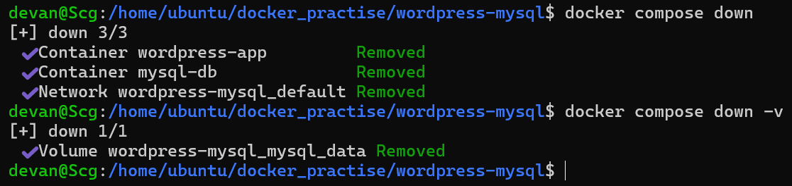
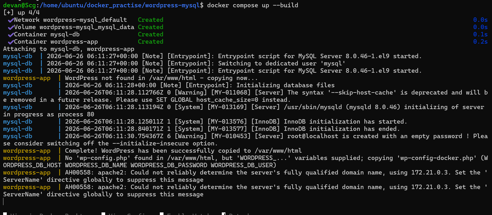

# Day 33 – Docker Compose

## Objective
Learn how to manage multi-container Docker applications using Docker Compose.

## Tasks Completed

- Verified Docker Compose installation.
- Created a single-container Nginx application using Compose.
- Deployed WordPress and MySQL using Compose.
- Used named volumes for MySQL data persistence.
- Connected WordPress to MySQL using the service name (`db`).
- Practiced Compose commands:
  - `docker compose up`

  

  

  

  

  - `docker compose up -d`

    

  - `docker compose ps`

    

  - `docker compose logs`
  - `docker compose logs <service>`
  
    

    

  - `docker compose stop`
  - `docker compose start`
  - `docker compose down`
  - `docker compose down -v`
  - `docker compose build`
  - `docker compose up --build`

    

- Configured environment variables using both inline values and a `.env` file.
- Verified variable substitution using `docker compose config`.

## Key Learnings

- Docker Compose manages multiple containers from a single YAML file.
- Services communicate using service names as DNS hostnames.
- Named volumes preserve database data across container recreation.
- Compose automatically creates and manages networks.
- Environment variables improve portability and security by separating configuration from code.

## Outcome

Successfully deployed and managed multi-container applications using Docker Compose with persistent storage and environment-based configuration.