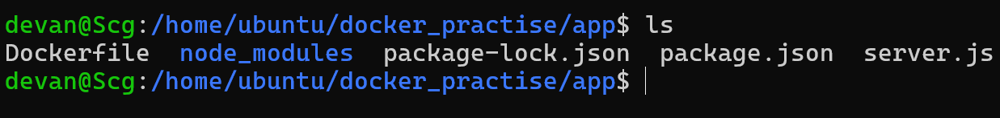
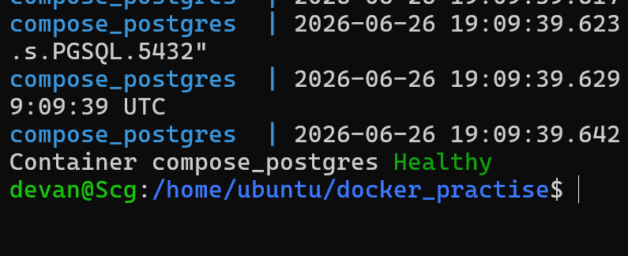
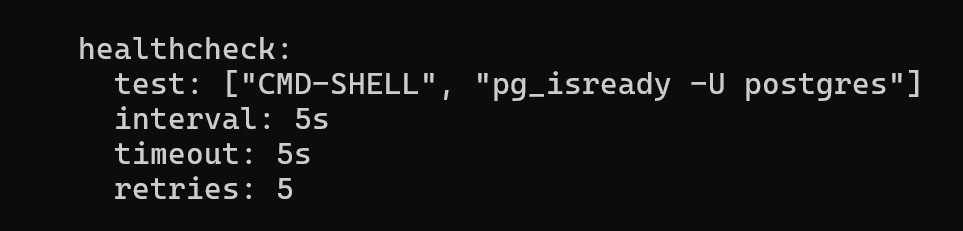
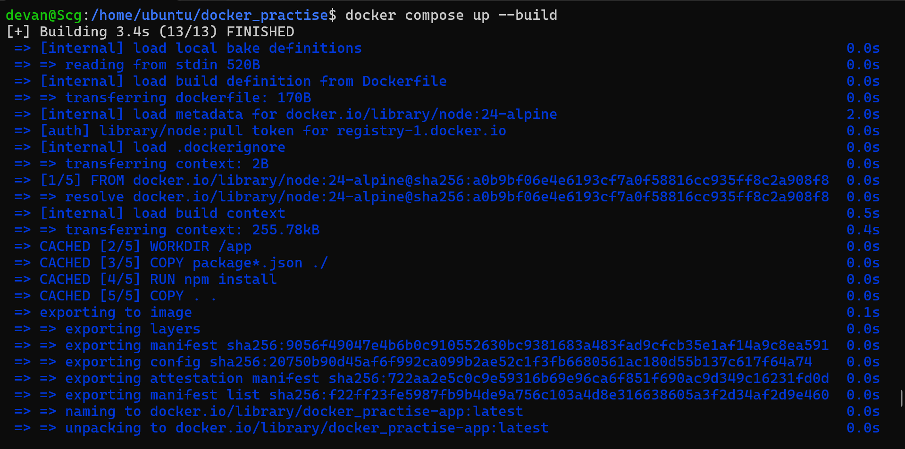

# Day 34 – Docker Compose: Real-World Multi-Container Apps

## Objective

The goal of Day 34 was to build a production-like multi-container application using Docker Compose. The stack consists of:

* Node.js (Express) Web Application
* PostgreSQL Database
* Redis Cache

The application was built using a custom Dockerfile and orchestrated completely through Docker Compose.

---

# Project Architecture

```
                Browser
                    │
      http://localhost:3002
                    │
                    ▼
          Node.js (Express App)
                    │
      ┌─────────────┴─────────────┐
      ▼                           ▼
 PostgreSQL                    Redis
      │                           │
 Named Volume                In-Memory Cache
```

---

# Project Structure



```
docker_practise/
│
├── app/
│   ├── Dockerfile
│   ├── package.json
│   ├── package-lock.json
│   └── server.js
│
├── docker-compose.yml
│
└── .env (optional)
```

---

# Task 1 – Build a 3-Service Stack


Created a Docker Compose project consisting of:

* Node.js Express application
* PostgreSQL database
* Redis cache server

The application successfully connected to PostgreSQL using the service name as the database host.

Verified by executing:

```sql
SELECT NOW();
```

Output:

```json
{
  "message": "Database Connected!",
  "time": "2026-06-26T18:49:10.753Z"
}
```

---

# Task 2 – depends_on & Healthcheck

Implemented:

```yaml
depends_on:
  postgres:
    condition: service_healthy
```

Added PostgreSQL healthcheck:






```yaml
healthcheck:
  test: ["CMD-SHELL", "pg_isready -U postgres"]
  interval: 5s
  timeout: 5s
  retries: 5
```

## Understanding

`depends_on` only controls the container startup order.

It does **not** guarantee that PostgreSQL is ready to accept connections.

The healthcheck continuously executes:

```
pg_isready -U postgres
```

Once PostgreSQL reports Healthy, Docker starts the Node.js application.

---

# Task 3 – Restart Policies

Configured:

```yaml
restart: always
```

Tested by manually killing the PostgreSQL container.

```
docker kill compose_postgres
```

Docker automatically recreated the database container.

### Difference

### restart: always

* Restarts after crashes.
* Restarts after Docker daemon restart.
* Suitable for production databases.

### restart: on-failure

* Restarts only when the application exits with a non-zero exit code.
* Does not restart if the container is intentionally stopped.
* Suitable for batch jobs or scripts.

---

# Task 4 – Custom Dockerfile

Created a Dockerfile for the Node.js application.

Built using:



```bash
docker compose up --build
```

Learned that any changes to:

* server.js
* package.json
* Dockerfile

require rebuilding the Docker image.

---

# Task 5 – Named Volumes

Configured:

```yaml
volumes:
  - postgres_data:/var/lib/postgresql/data
```

Created named volume:

```yaml
volumes:
  postgres_data:
```

Purpose:

* Persistent PostgreSQL data
* Data survives container recreation
* Removed only using:

```bash
docker compose down -v
```

---

# Task 6 – Named Networks

Created explicit network:

```yaml
networks:
  backend:
```

Attached all services to the backend network.

Benefits:

* Better organization
* Explicit communication
* Easier debugging
* Production-ready structure

---

# Task 7 – Labels

Added labels to every service.

Example:

```yaml
labels:
  app: compose-demo
  tier: backend
```

Labels help with:

* Monitoring
* Logging
* Service discovery
* Reverse proxies
* Infrastructure management

---

# Task 8 – Environment Variables

Configured database connection using environment variables.

```
DB_HOST=postgres
DB_PORT=5432
DB_USER=postgres
DB_PASSWORD=postgres
DB_NAME=compose_db
```

Instead of hardcoding values in the application.

---

# Task 9 – Redis

Added Redis service.

Purpose:

* High-speed in-memory cache
* Frequently accessed data
* Session storage
* Reduced database load

Redis communicates internally using:

```
REDIS_HOST=redis
```

---

# Task 10 – Scaling

Executed:

```bash
docker compose up --scale app=3
```

Observed two issues.

## Issue 1

Using:

```yaml
container_name:
```

prevents scaling because container names must be unique.

Compose requires automatic container naming.

---

## Issue 2

Port mapping:

```yaml
3002:3000
```

prevents multiple replicas because only one container can bind to a host port.

---

## Production Solution

Instead of exposing every application container:

```
Internet
    │
    ▼
Nginx
│  │  │
▼  ▼  ▼
App1 App2 App3
```

Only Nginx exposes ports 80 and 443.

Application containers communicate internally over the Docker network.

---

# Docker Compose Commands Practiced

Build and start

```bash
docker compose up --build
```

Detached mode

```bash
docker compose up -d
```

Stop

```bash
docker compose stop
```

Start existing containers

```bash
docker compose start
```

Remove containers

```bash
docker compose down
```

Remove containers with volumes

```bash
docker compose down -v
```

View running services

```bash
docker compose ps
```

View logs

```bash
docker compose logs
```

Follow logs

```bash
docker compose logs -f
```

Rebuild images

```bash
docker compose up --build
```

Scale services

```bash
docker compose up --scale app=3
```

Validate Compose file

```bash
docker compose config
```

---

# Key Learnings

* Difference between Dockerfile, Image and Container
* Docker Compose automates docker build and docker run
* Multi-container application development
* Docker Compose service discovery using service names
* Automatic Docker DNS
* PostgreSQL healthchecks
* depends_on with service_healthy
* Restart policies
* Named volumes
* Custom networks
* Environment variables
* Redis integration
* Docker Compose scaling limitations
* Importance of reverse proxies such as Nginx for production deployments

---

# Conclusion

Successfully built a production-style Docker Compose project consisting of Node.js, PostgreSQL and Redis.

Implemented service dependencies, health checks, restart policies, persistent storage, custom networking, labels, environment variables and scaling concepts. Gained practical understanding of how Docker Compose orchestrates multiple containers and how real-world applications are structured for production deployments.
