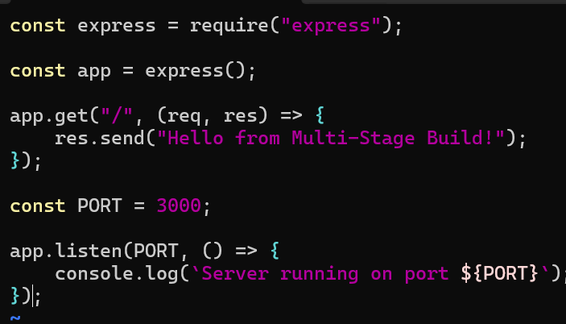
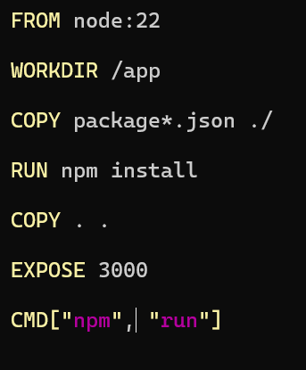
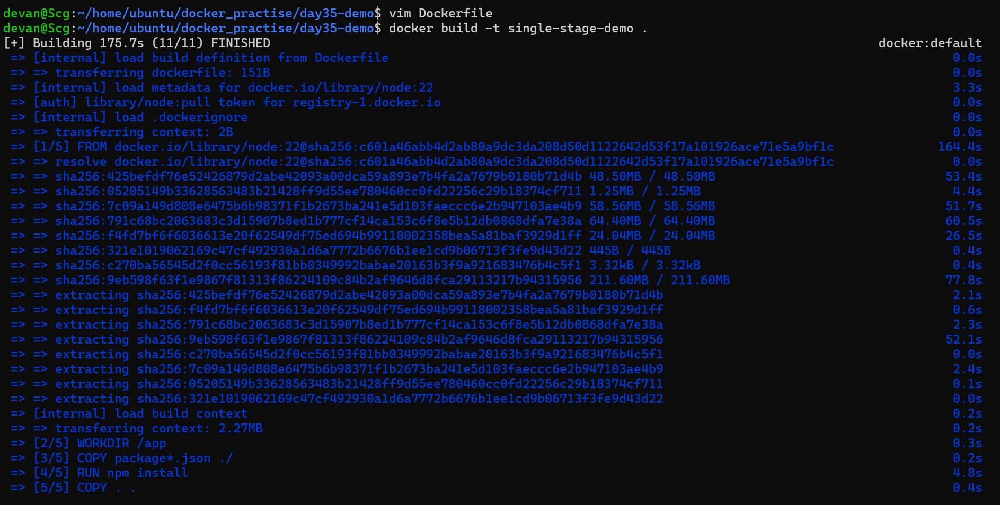
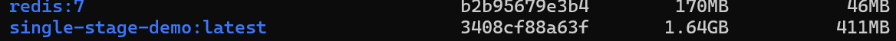
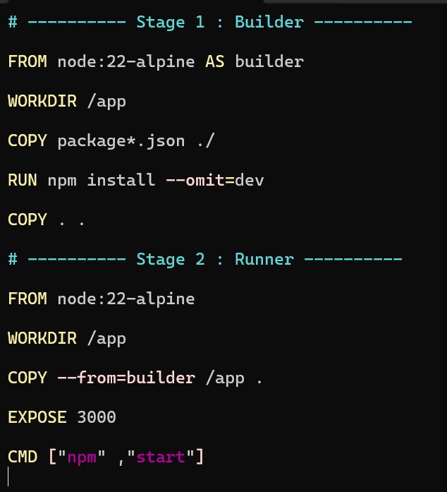
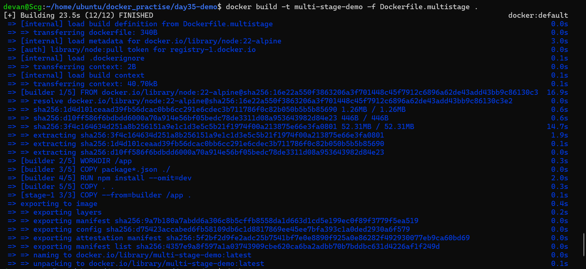
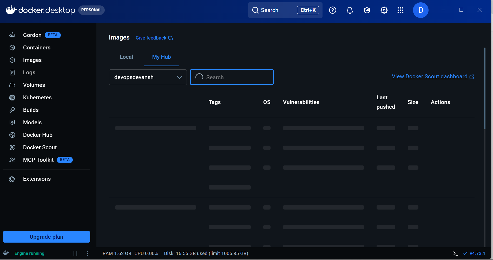

# Day 35 – Multi-Stage Builds & Docker Hub

## Objective

The goal of Day 35 was to learn how to build optimized Docker images using **Multi-Stage Builds** and publish Docker images to **Docker Hub** following industry best practices.

---

# Project Overview

A simple **Node.js Express** application was created to compare:

* Single-stage Docker build
* Multi-stage Docker build

The image sizes were compared to understand how multi-stage builds optimize production images.

---

# Project Structure

```text
day35-demo/
│
├── Dockerfile
├── package.json
├── package-lock.json
└── server.js
```

---

Server.js




# Task 1 – Single-Stage Docker Build

Created a Dockerfile using a single build stage.

```dockerfile
FROM node:22

WORKDIR /app

COPY package*.json ./

RUN npm install

COPY . .

EXPOSE 3000

CMD ["npm", "start"]
```



### Build Command

```bash
docker build -t single-stage-demo .
```




### Image Size

| Image              | Size       |
| ------------------ | ---------- |
| Single-Stage Image | **411 MB** |





### Observation

The single-stage image contained:

* Node.js Runtime
* npm
* npm Cache
* Application Source Code
* Dependencies
* Build Files
* Temporary Files

All build-related files remained inside the final image, making it significantly larger.

---

# Task 2 – Multi-Stage Docker Build

Created a Multi-Stage Dockerfile.

```dockerfile
# ---------- Stage 1 : Builder ----------
FROM node:22-alpine AS builder

WORKDIR /app

COPY package*.json ./

RUN npm install --omit=dev

COPY . .

# ---------- Stage 2 : Runtime ----------
FROM node:22-alpine

WORKDIR /app

COPY --from=builder /app .

EXPOSE 3000

CMD ["npm", "start"]
```




### Build Command

```bash
docker build -t multi-stage-demo .
```




### Image Size

| Image             | Size        |
| ----------------- | ----------- |
| Multi-Stage Image | **58.1 MB** |


---

# Image Size Comparison

| Build Type   |  Image Size |
| ------------ | ----------: |
| Single-Stage |  **411 MB** |
| Multi-Stage  | **58.1 MB** |

### Reduction

```text
411 MB → 58.1 MB
```

Approximately **86% reduction** in image size.

---

# Why is the Multi-Stage Image Smaller?

A multi-stage build separates the build environment from the runtime environment.

### Builder Stage

Contains:

* Node.js
* npm
* Build Dependencies
* Temporary Files
* npm Cache
* Source Code

After the build completes, this stage is discarded.

### Runtime Stage

Contains only:

* Node.js Runtime
* Application
* Production Dependencies

This results in:

* Smaller image size
* Faster downloads
* Faster deployments
* Reduced attack surface
* Better security

---

# Understanding `npm install --omit=dev`

Normally,

```bash
npm install
```

installs:

* dependencies
* devDependencies

Example:

```json
"dependencies": {
    "express": "^5.1.0"
},

"devDependencies": {
    "nodemon": "^3.1.0",
    "eslint": "^9.0.0",
    "jest": "^30.0.0"
}
```

Using

```bash
npm install --omit=dev
```

installs only runtime dependencies and skips development tools such as:

* Nodemon
* ESLint
* Jest
* Prettier
* TypeScript

This reduces the image size and improves security.

---

# Task 3 – Docker Hub

## Login

```bash
docker login
```




## Tag Image

```bash
docker tag multi-stage-demo <dockerhub-username>/multi-stage-demo:v1
```

## Push Image

```bash
docker push <dockerhub-username>/multi-stage-demo:v1
```

## Pull Image

```bash
docker pull <dockerhub-username>/multi-stage-demo:v1
```

Successfully uploaded and verified the image on Docker Hub.

---

# Task 4 – Docker Hub Repository

Explored:

* Repository Description
* Repository Visibility
* Image Tags
* Version Management

Understanding of tags:

```text
latest
v1
v2
v3
```

Specific versions can be pulled using:

```bash
docker pull username/image:v1
```

While:

```bash
docker pull username/image
```

downloads the `latest` tag by default.

---

# Task 5 – Docker Image Best Practices

## 1. Use Minimal Base Images

Instead of:

```dockerfile
FROM node:latest
```

Use:

```dockerfile
FROM node:22-alpine
```

Benefits:

* Smaller image
* Faster download
* Reduced attack surface

---

## 2. Avoid Running Containers as Root

Instead of running as the default root user:

```dockerfile
RUN addgroup -S appgroup && adduser -S appuser -G appgroup

USER appuser
```

Benefits:

* Improved security
* Principle of least privilege
* Reduced impact if the application is compromised

---

## 3. Combine RUN Commands

Instead of:

```dockerfile
RUN apk update
RUN apk add curl
RUN apk add git
```

Use:

```dockerfile
RUN apk update && \
    apk add --no-cache curl git
```

Benefits:

* Fewer image layers
* Smaller image
* Faster builds

---

## 4. Use Specific Image Tags

Avoid:

```dockerfile
FROM node:latest
```

Prefer:

```dockerfile
FROM node:22-alpine
```

Benefits:

* Reproducible builds
* Stable deployments
* Predictable behavior

---

# Docker Commands Practiced

Build Image

```bash
docker build -t image-name .
```

Run Container

```bash
docker run -d -p 3000:3000 image-name
```

View Images

```bash
docker images
```

Login

```bash
docker login
```

Tag Image

```bash
docker tag local-image username/repository:tag
```

Push Image

```bash
docker push username/repository:tag
```

Pull Image

```bash
docker pull username/repository:tag
```

Remove Local Image

```bash
docker rmi image-name
```

---

# Key Learnings

* Difference between Single-Stage and Multi-Stage Docker builds
* Builder Stage vs Runtime Stage
* Benefits of Alpine Linux images
* Importance of production-only dependencies
* Using `npm install --omit=dev`
* Docker image optimization
* Docker Hub workflow
* Image versioning using tags
* Container security best practices
* Running containers as a non-root user
* Reducing image layers
* Importance of using fixed image versions instead of `latest`

---

# Conclusion

Successfully created both single-stage and multi-stage Docker images for a Node.js application and compared their sizes. Reduced the image size from **411 MB** to **58.1 MB** (approximately **86% reduction**) by using a multi-stage build and a lightweight Alpine base image. Learned Docker Hub workflows, image tagging, and production best practices for building secure, optimized, and portable Docker images suitable for real-world deployments.
