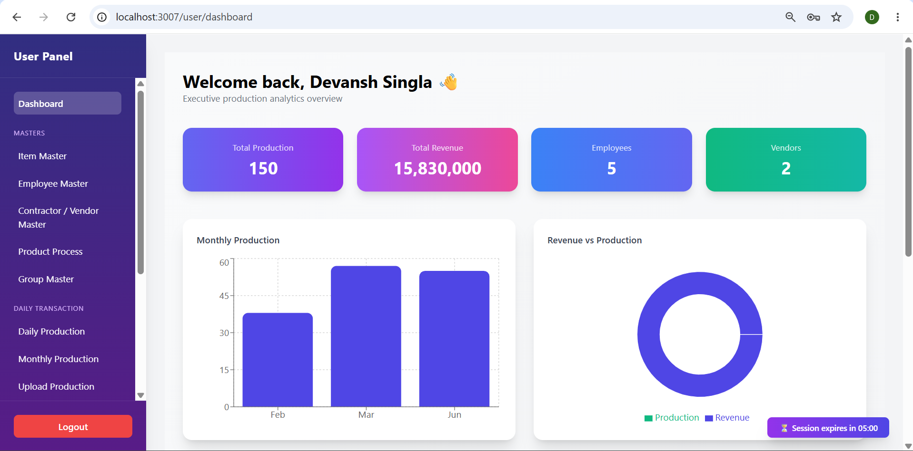
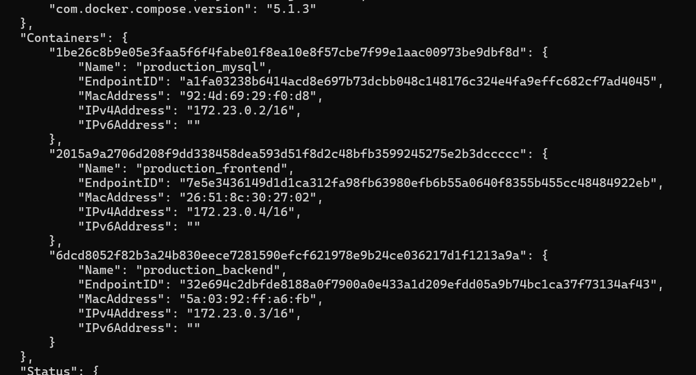
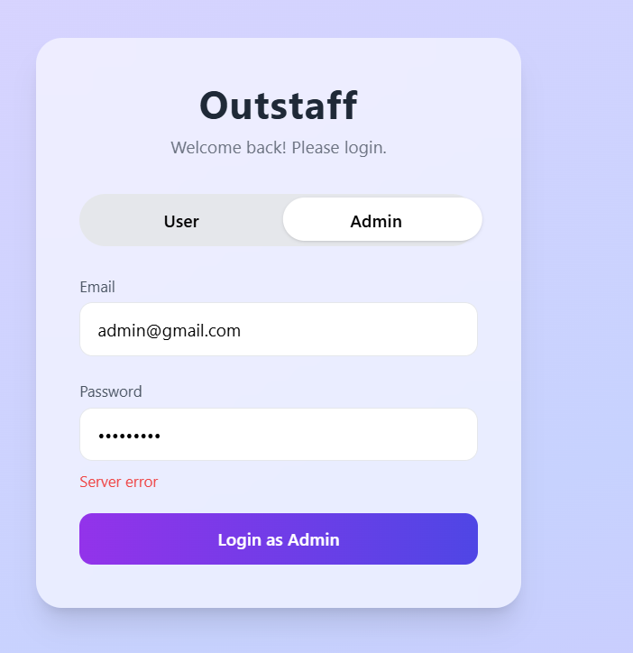
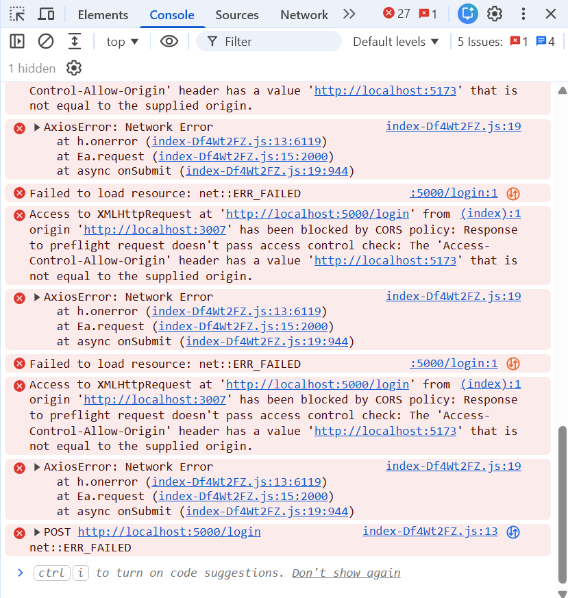
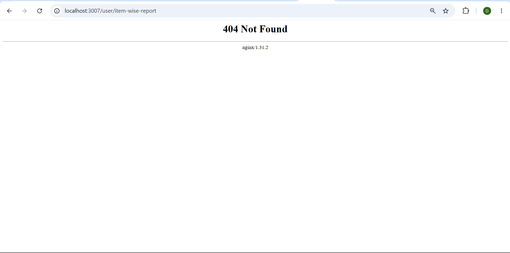
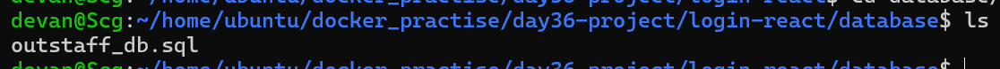
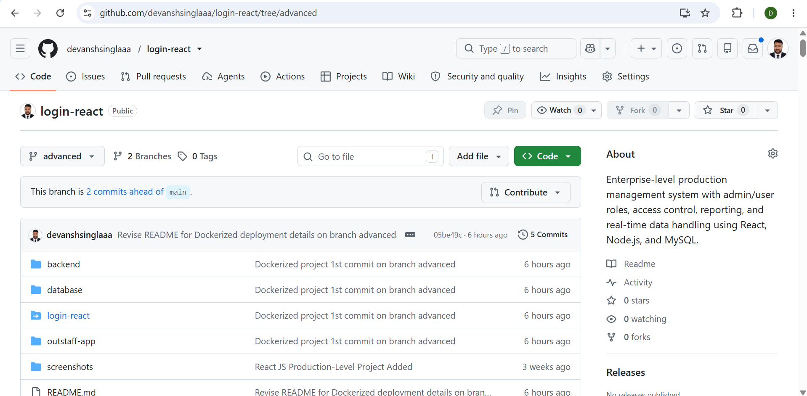

# Day 36 – Docker Project: Dockerize a Full Stack Application

## Objective

The objective of Day 36 was to deploy a **real-world full stack application** using Docker instead of building a demo application from scratch. This closely simulates the responsibilities of a DevOps Engineer, where the primary task is to containerize, deploy, troubleshoot, and maintain existing applications rather than develop them.

For this project, I selected an existing **Production Management System** built with React, Node.js, Express, and MySQL, and successfully deployed it using Docker Compose.

---

# Project Overview




The application is a Production & Workforce Management System that provides:

- User Authentication
- Role-Based Access Control
- Employee Management
- Vendor Management
- Item & Product Management
- Daily Production Entry
- Reports & Analytics
- Dashboard with Statistics
- Excel Import Functionality

Rather than modifying the application itself, the focus was on making it fully containerized and production-ready.

---

# Tech Stack

## Frontend

- React.js
- Vite
- Tailwind CSS
- Axios

## Backend

- Node.js
- Express.js
- JWT Authentication
- Bcrypt
- Multer

## Database

- MySQL 8.4

## DevOps

- Docker
- Docker Compose
- Nginx
- Docker Networks
- Docker Volumes
- Health Checks
- Environment Variables

---

# Architecture

```
                    Browser
                       │
                       ▼
                 Nginx Container
                       │
        ┌──────────────┴──────────────┐
        │                             │
        ▼                             ▼
 React Production Build         Express Backend
                                        │
                                        ▼
                                  MySQL Database
```

---

# Docker Components

The deployment consists of three containers.

| Container | Purpose |
|-----------|----------|
| Frontend | Serves React production build using Nginx |
| Backend | Runs Express API server |
| Database | Stores application data using MySQL |

All containers communicate over a custom Docker bridge network.

---

# Dockerfile – Frontend

Implemented a **multi-stage Docker build**.

### Builder Stage

- Node 22 Alpine
- Install dependencies
- Build React application

### Runtime Stage

- Nginx Alpine
- Copy production build
- Custom nginx.conf
- Serve static files

Benefits

- Smaller image
- Faster deployment
- Production optimized
- Nginx performance

---

# Dockerfile – Backend

Backend container performs

- Dependency installation
- Application startup
- Environment variable configuration

Node.js runtime serves REST APIs connected to MySQL.

---

# Docker Compose

Docker Compose manages

- Frontend
- Backend
- MySQL

Features implemented

- Named Containers
- Custom Network
- Named Volume
- Health Checks
- Restart Policies
- Environment Variables
- Automatic Database Initialization

---

# Database Deployment

Instead of manually creating tables, the existing production database was imported automatically.

Docker Compose mounts

```
database/outstaff_db.sql
```

into

```
/docker-entrypoint-initdb.d/
```

allowing MySQL to initialize the database automatically during the first startup.

---

# Environment Variables

Configured backend using

```
PORT
DB_HOST
DB_USER
DB_PASSWORD
DB_NAME
CLIENT_URL
```

This removed hardcoded configuration from the application.

---

# Nginx Configuration

Configured Nginx to

- Serve React production build
- Support React Router
- Prevent 404 errors on refresh
- Deliver static assets efficiently

Important configuration

```nginx
location / {
    try_files $uri $uri/ /index.html;
}
```

---

# Docker Network



Created a custom bridge network

```
production_network
```

This enabled communication between services using container names instead of IP addresses.

Example

```
Backend → mysql
```

instead of

```
localhost
```

---

# Persistent Storage

Created Docker volume

```
mysql_data
```

to ensure database persistence even if containers are recreated.

---

# Health Checks

Implemented MySQL health check

```yaml
healthcheck:
  test: ["CMD","mysqladmin","ping","-h","localhost","-proot123"]
```

The backend waits until the database becomes healthy before starting.

---

# Challenges Faced




## 1. Backend couldn't connect to MySQL

Problem

```
ECONNREFUSED
```

Cause

Backend attempted to connect before MySQL initialization completed.

Solution

- Added Docker Health Checks
- Used depends_on with service_healthy
- Restarted backend after MySQL initialization

---

## 2. CORS Error




Problem

Frontend

```
localhost:3007
```

Backend

```
localhost:5000
```

Different origins caused browser to block requests.

Solution

Configured

```
CLIENT_URL
```

and updated Express CORS middleware.

---

## 3. React Refresh Returned 404




Problem

Refreshing

```
/dashboard
```

or

```
/employee
```

returned

```
404 Not Found
```

Cause

Nginx attempted to locate physical files.

Solution

Configured

```nginx
try_files $uri $uri/ /index.html;
```

---

## 4. Database Import




Initially the application started without data.

Solution

Mounted

```
outstaff_db.sql
```

using

```
docker-entrypoint-initdb.d
```

allowing MySQL to initialize automatically.

---

## 5. Container Networking

Initially backend attempted to connect to

```
localhost
```

Instead Docker networking requires

```
mysql
```

(the service name)

---

# Commands Used

Build

```bash
docker compose build
```

Start

```bash
docker compose up -d
```

View Containers

```bash
docker ps
```

Logs

```bash
docker logs production_backend

docker logs production_mysql

docker logs production_frontend
```

Stop

```bash
docker compose down
```

Remove Volumes

```bash
docker compose down -v
```

---

# Skills Practiced

- Docker
- Docker Compose
- Multi-Container Deployment
- Nginx
- Docker Networks
- Docker Volumes
- Health Checks
- Environment Variables
- Production Deployment
- Database Initialization
- Container Debugging
- Log Analysis
- Docker Troubleshooting

---

# What I Learned

This project provided practical experience in deploying a real-world full stack application using Docker.

Instead of focusing on application development, I learned how to package, configure, deploy, and troubleshoot services running across multiple containers.

I also gained experience resolving common deployment issues such as database startup timing, CORS configuration, container networking, environment variable management, and React routing behind Nginx.

These are practical DevOps skills that closely resemble real deployment scenarios in production environments.

---

# Future Improvements

- Reverse proxy API requests through Nginx
- Remove hardcoded backend URLs
- Push images to Docker Hub
- GitHub Actions CI/CD
- Deploy on AWS EC2
- HTTPS using Let's Encrypt
- Monitoring with Prometheus & Grafana
- Kubernetes deployment

---

# Outcome

✅ Dockerized React Frontend

✅ Dockerized Node.js Backend

✅ Dockerized MySQL Database

✅ Configured Docker Compose

✅ Implemented Health Checks

✅ Configured Docker Networks

✅ Added Persistent Volumes

✅ Imported Existing Database

✅ Solved Container Networking Issues

✅ Fixed CORS Issues

✅ Fixed React SPA Routing

✅ Successfully Deployed Full Stack Application

---

## Repository



GitHub Repository:
> https://github.com/devanshsinglaaa/login-react.git

Docker main -> old code without dockerizing

Docker advanced -> new code with Dockerfile and docker-compose.yml.

---

**Day 36 Complete ✅**

**#90DaysOfDevOps #Docker #DockerCompose #Nginx #NodeJS #React #MySQL #DevOps #Containers #TrainWithShubham**