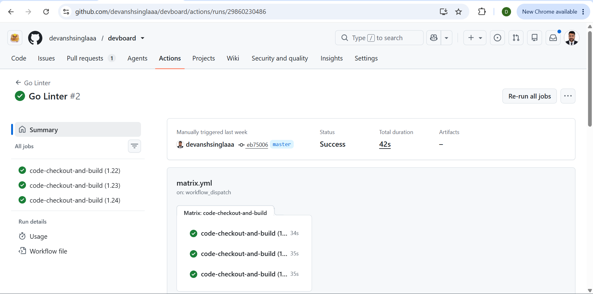
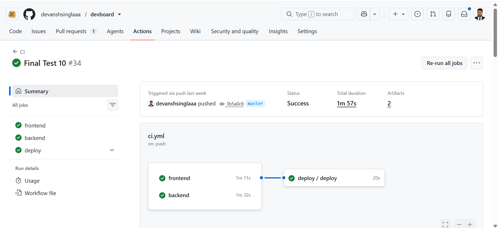
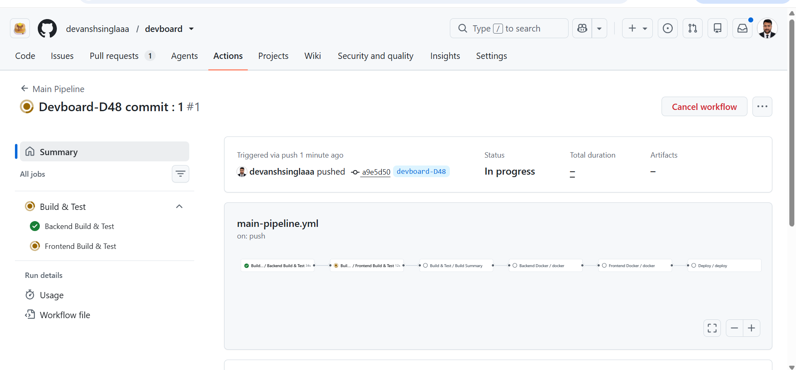
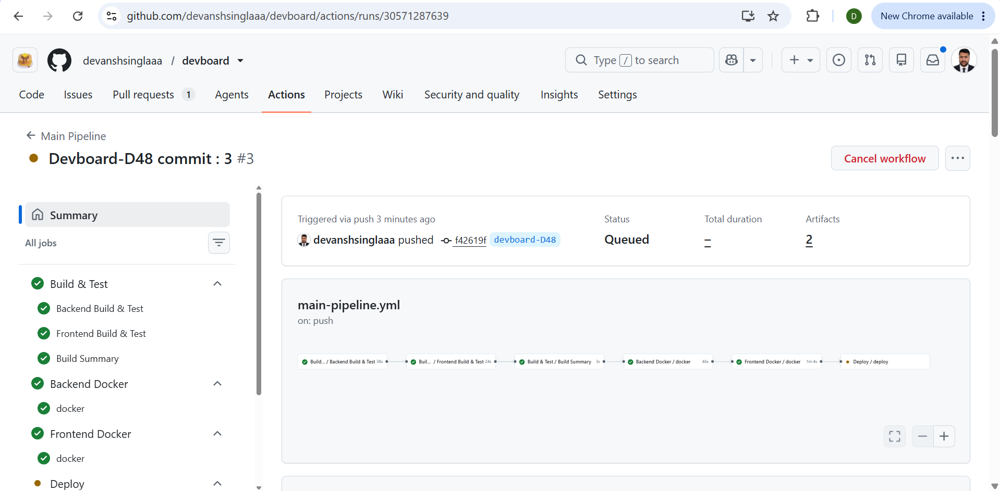

# 🚀 Day 48 - GitHub Actions Capstone Project

## 📌 Project Overview

This project demonstrates a production-style CI/CD pipeline for the **DevBoard** application using **GitHub Actions Reusable Workflows**.

Instead of creating one large workflow, the pipeline is broken into reusable components that are shared across Pull Request validation, Docker image creation, and deployment.

---

# 📂 Branch

```
devboard-D48
```

Branch URL:

https://github.com/devanshsinglaaa/devboard/tree/devboard-D48

---

# Screenshots :-









---


# 🏗️ Workflow Architecture

```
                Pull Request
                     │
                     ▼
            pr-pipeline.yml
                     │
                     ▼
        reusable-build-test.yml

──────────────────────────────────────

              Push to master
                     │
                     ▼
          main-pipeline.yml
                     │
                     ▼
      reusable-build-test.yml
                     │
                     ▼
      reusable-docker.yml
                     │
                     ▼
                cd.yml
                     │
                     ▼
          Self Hosted Deployment
```

---

# 📁 Workflow Files

## 1. Reusable Build & Test

**Workflow Name**

```
Reusable Build & Test
```

**Purpose**

- Backend Build & Test
- Frontend Build & Test
- Workflow Summary
- Returns workflow output

Repository File

```
.github/workflows/reusable-build-test.yml
```

Repository Link

https://github.com/devanshsinglaaa/devboard/blob/devboard-D48/.github/workflows/reusable-build-test.yml

---

## 2. Reusable Docker Workflow

**Workflow Name**

```
Reusable Docker Build & Push
```

Purpose

- Docker Login
- Docker Build
- Docker Push
- Build Summary

Repository File

```
.github/workflows/reusable-docker.yml
```

Repository Link

https://github.com/devanshsinglaaa/devboard/blob/devboard-D48/.github/workflows/reusable-docker.yml

---

## 3. Pull Request Pipeline

**Workflow Name**

```
Pull Request Pipeline
```

Purpose

- Runs on Pull Requests
- Calls reusable-build-test.yml
- Generates PR Summary

Repository File

```
.github/workflows/pr-pipeline.yml
```

Repository Link

https://github.com/devanshsinglaaa/devboard/blob/devboard-D48/.github/workflows/pr-pipeline.yml

---

## 4. Main Pipeline

**Workflow Name**

```
Main Pipeline
```

Purpose

- Runs on Push
- Calls reusable Build & Test
- Calls reusable Docker workflow
- Deploys application

Repository File

```
.github/workflows/main-pipeline.yml
```

Repository Link

https://github.com/devanshsinglaaa/devboard/blob/devboard-D48/.github/workflows/main-pipeline.yml

---

## 5. Continuous Deployment

**Workflow Name**

```
CD
```

Purpose

- Docker Compose Deployment
- Pull Latest Images
- Health Check
- Deployment Summary

Repository File

```
.github/workflows/cd.yml
```

Repository Link

https://github.com/devanshsinglaaa/devboard/blob/devboard-D48/.github/workflows/cd.yml

---

# ⚙️ Technologies Used

- GitHub Actions
- Reusable Workflows
- Docker
- Docker Compose
- Docker Hub
- Self Hosted Runner
- Go
- React
- Vite
- PostgreSQL

---

# 🔄 CI/CD Flow

## Pull Request Pipeline

```
Pull Request

↓

Reusable Build & Test

↓

Backend Build

↓

Backend Test

↓

Frontend Build

↓

Frontend Test

↓

PR Summary
```

---

## Production Pipeline

```
Push to master

↓

Reusable Build & Test

↓

Backend Build

↓

Backend Test

↓

Frontend Build

↓

Frontend Test

↓

Docker Build

↓

Docker Push

↓

Deployment

↓

Health Check
```

---

# ✨ Features

- Reusable Workflows
- Modular GitHub Actions
- Backend First Pipeline
- Frontend Pipeline
- Docker Buildx
- Docker Hub Integration
- Self Hosted Deployment
- GitHub Actions Summary
- Workflow Outputs
- Job Dependencies
- Production Deployment
- Health Check

---

# 📊 Pipeline Stages

| Stage | Description |
|--------|-------------|
| Build | Compile Backend & Frontend |
| Test | Run Backend & Frontend Tests |
| Docker | Build & Push Images |
| Deploy | Deploy using Docker Compose |
| Verify | Health Check |

---

# 📸 Workflow Execution

The workflow executes in the following order:

```
Backend Build & Test

↓

Frontend Build & Test

↓

Backend Docker Build

↓

Frontend Docker Build

↓

Deploy

↓

Health Check
```

---

# 📦 Repository Structure

```
.github/
└── workflows/
    ├── reusable-build-test.yml
    ├── reusable-docker.yml
    ├── pr-pipeline.yml
    ├── main-pipeline.yml
    └── cd.yml
```

---

# 🎯 Learning Outcomes

Through this capstone project, I learned:

- Creating reusable GitHub Actions workflows
- Using `workflow_call`
- Passing inputs and outputs between workflows
- Managing job dependencies with `needs`
- Building modular CI/CD pipelines
- Building and pushing Docker images automatically
- Deploying applications with Docker Compose
- Using self-hosted GitHub Actions runners
- Implementing production-style deployment pipelines
- Writing workflow summaries with `$GITHUB_STEP_SUMMARY`

---

# 🚀 Outcome

Successfully implemented a production-ready GitHub Actions CI/CD pipeline featuring:

- ✅ Reusable workflows
- ✅ PR validation pipeline
- ✅ Automated Docker image build & push
- ✅ Continuous Deployment
- ✅ Self-hosted Runner
- ✅ Health Checks
- ✅ Deployment Summaries
- ✅ Modular GitHub Actions Architecture

---

## 👨‍💻 Author

**Devansh Singla**

### #90DaysOfDevOps – Day 48

GitHub:

https://github.com/devanshsinglaaa