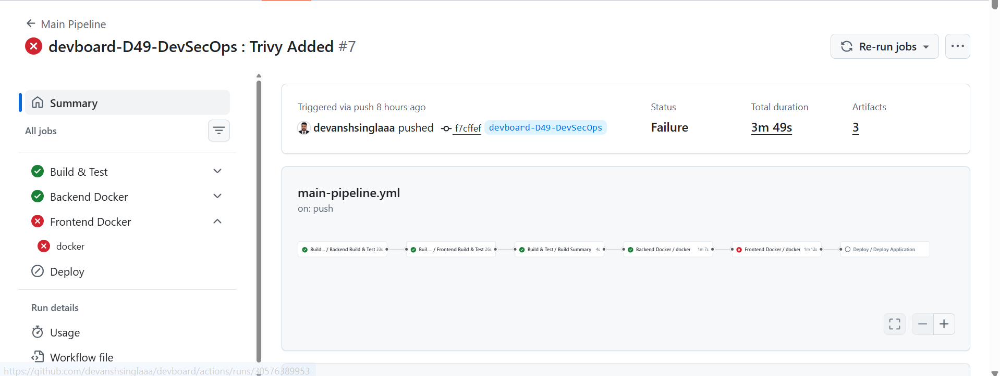
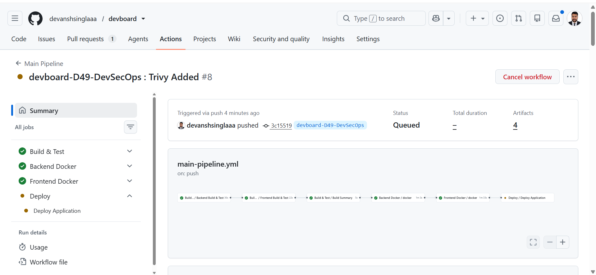
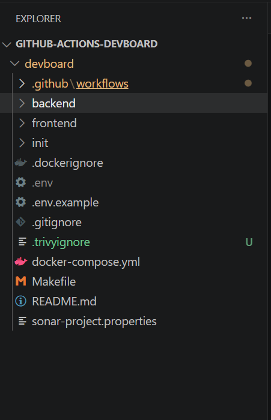

# 🚀 Day 49 – DevSecOps with GitHub Actions

## 📌 Overview

On **Day 49** of my #90DaysOfDevOps journey, I enhanced the DevBoard CI/CD pipeline by integrating **DevSecOps** practices. Instead of treating security as a separate step, I embedded automated security checks directly into the GitHub Actions workflows.

The pipeline now performs:

- ✅ Dependency Review on Pull Requests
- ✅ Docker Image Vulnerability Scanning using Trivy
- ✅ Secret Scanning & Push Protection
- ✅ Least-Privilege GitHub Actions Permissions
- ✅ Secure Docker Image Publishing

---

## Images







---

# 📂 Branch

```
devboard-D49-DevSecOps
```

Repository:

**https://github.com/devanshsinglaaa/devboard/tree/devboard-D49-DevSecOps**

---

# 🔄 DevSecOps Pipeline

```text
                Pull Request / Push
                        │
                        ▼
              Build & Test Workflow
                        │
                        ▼
              Dependency Review
                        │
                        ▼
               Docker Image Build
                        │
                        ▼
             Trivy Security Scan
                        │
                No Critical Issues?
                   │            │
                 Yes            No
                  │              │
                  ▼              ▼
          Push Docker Image    Fail Pipeline
                  │
                  ▼
          Deploy Application
```

---

# 🛠 Implemented Security Features

## 1️⃣ Trivy Docker Image Scanning

Integrated **Trivy** into the reusable Docker workflow to scan Docker images before publishing them to Docker Hub.

### Workflow

```
.github/workflows/reusable-docker.yml
```

GitHub Link:

https://github.com/devanshsinglaaa/devboard/blob/devboard-D49-DevSecOps/.github/workflows/reusable-docker.yml

### Features

- Scans Docker images
- Detects OS vulnerabilities
- Detects language package vulnerabilities
- Detects secrets
- Blocks pipeline if Critical vulnerabilities are found
- Uses `.trivyignore` for reviewed exceptions

---

## 2️⃣ Dependency Review

Every Pull Request now checks newly introduced dependencies for known vulnerabilities.

Workflow:

```
.github/workflows/pr-pipeline.yml
```

GitHub Link:

https://github.com/devanshsinglaaa/devboard/blob/devboard-D49-DevSecOps/.github/workflows/pr-pipeline.yml

Benefits:

- Prevents vulnerable dependencies from being merged
- Reviews dependency changes automatically
- Improves software supply chain security

---

## 3️⃣ GitHub Secret Scanning

Enabled:

- Secret Scanning
- Push Protection

Benefits:

- Prevents committing API Keys
- Detects exposed credentials
- Stops accidental secret leaks

---

## 4️⃣ Least Privilege Permissions

Restricted GitHub Actions permissions using:

```yaml
permissions:
  contents: read
```

Benefits:

- Reduces attack surface
- Follows Principle of Least Privilege
- Improves workflow security

---

## 5️⃣ Trivy Ignore File

Created:

```
.trivyignore
```

GitHub Link:

https://github.com/devanshsinglaaa/devboard/blob/devboard-D49-DevSecOps/.trivyignore

Used to temporarily ignore reviewed third-party vulnerabilities while waiting for upstream fixes.

---

# 📂 Workflows Used

## Build & Test

```
.github/workflows/reusable-build-test.yml
```

https://github.com/devanshsinglaaa/devboard/blob/devboard-D49-DevSecOps/.github/workflows/reusable-build-test.yml

---

## Reusable Docker

```
.github/workflows/reusable-docker.yml
```

https://github.com/devanshsinglaaa/devboard/blob/devboard-D49-DevSecOps/.github/workflows/reusable-docker.yml

---

## Pull Request Pipeline

```
.github/workflows/pr-pipeline.yml
```

https://github.com/devanshsinglaaa/devboard/blob/devboard-D49-DevSecOps/.github/workflows/pr-pipeline.yml

---

## Main Pipeline

```
.github/workflows/main-pipeline.yml
```

https://github.com/devanshsinglaaa/devboard/blob/devboard-D49-DevSecOps/.github/workflows/main-pipeline.yml

---

## CD Pipeline

```
.github/workflows/cd.yml
```

https://github.com/devanshsinglaaa/devboard/blob/devboard-D49-DevSecOps/.github/workflows/cd.yml

---

# 🏗 Repository Structure

```
devboard/
│
├── .github/
│   └── workflows/
│       ├── reusable-build-test.yml
│       ├── reusable-docker.yml
│       ├── pr-pipeline.yml
│       ├── main-pipeline.yml
│       └── cd.yml
│
├── backend/
├── frontend/
├── .trivyignore
├── docker-compose.yml
└── README.md
```

---

# 📚 Technologies Used

- GitHub Actions
- Docker
- Trivy
- GitHub Dependency Review
- GitHub Secret Scanning
- GitHub Push Protection
- Docker Hub
- React
- Go
- PostgreSQL

---

# 🎯 Learning Outcomes

Throughout this project, I learned how to:

- Integrate security into CI/CD pipelines
- Scan Docker images before deployment
- Detect vulnerabilities in dependencies
- Review dependency changes automatically
- Protect repositories from secret leaks
- Apply least-privilege permissions
- Handle third-party vulnerabilities using `.trivyignore`
- Build a practical DevSecOps workflow with GitHub Actions

---

# ✅ Conclusion

This project transformed the DevBoard CI/CD pipeline into a **DevSecOps pipeline** by embedding automated security checks into every stage of the software delivery lifecycle.

By integrating **Trivy**, **Dependency Review**, **Secret Scanning**, and **least-privilege permissions**, the pipeline now ensures that code is not only built and deployed automatically but also validated against common security risks before reaching production.

---

## 👨‍💻 Author

**Devansh Singla**

GitHub:

https://github.com/devanshsinglaaa

Repository:

https://github.com/devanshsinglaaa/devboard/tree/devboard-D49-DevSecOps