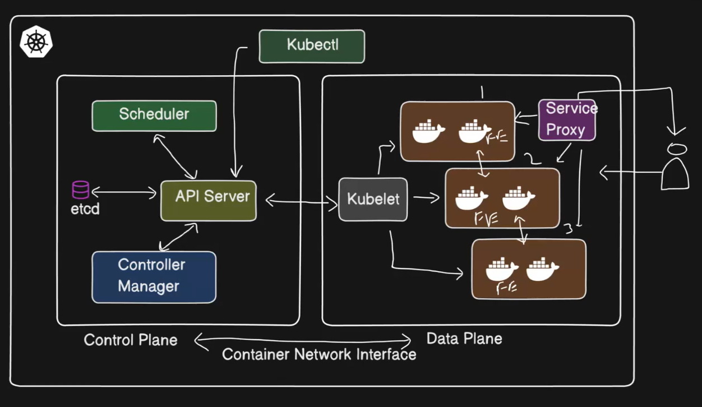
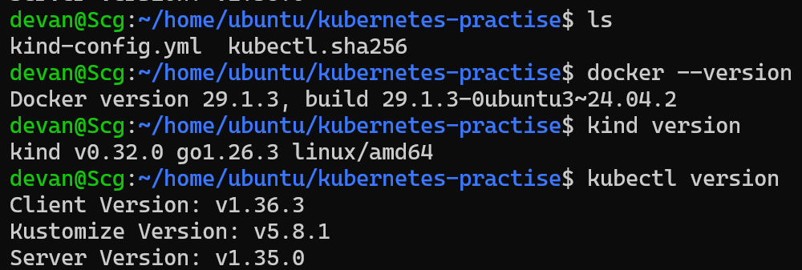
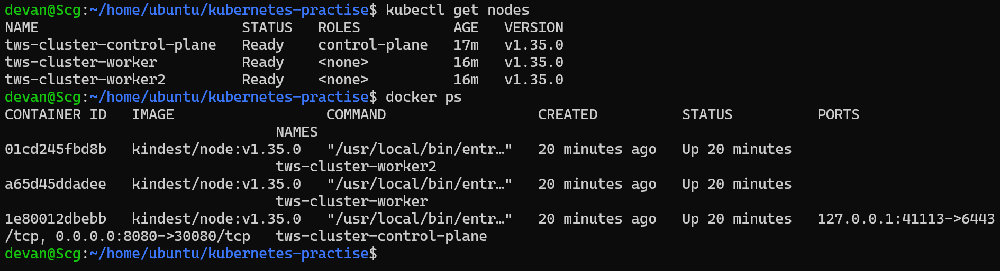
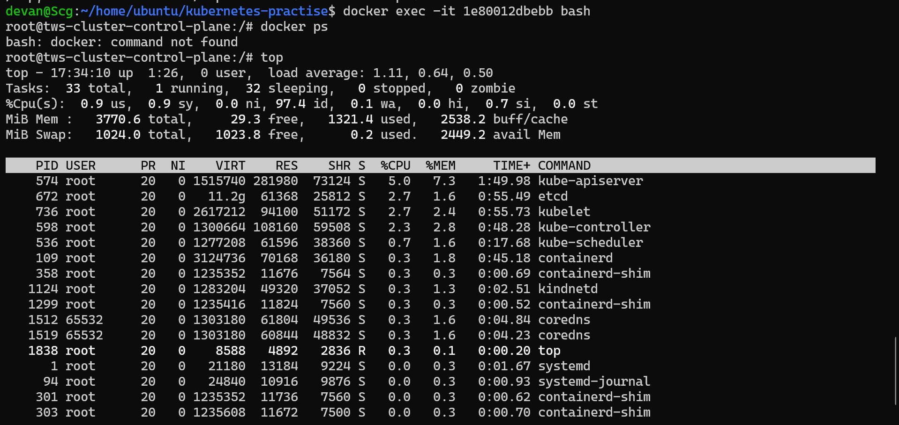
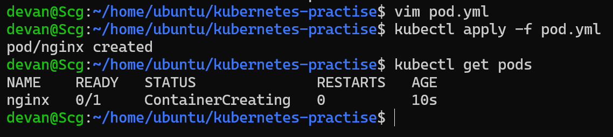
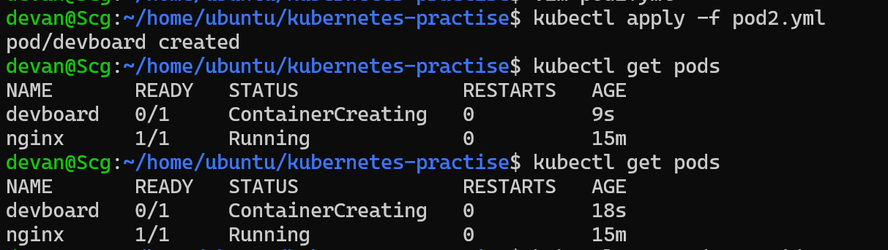
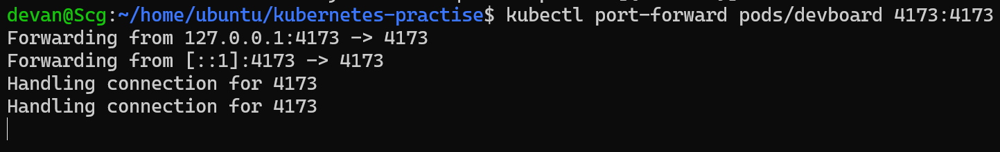
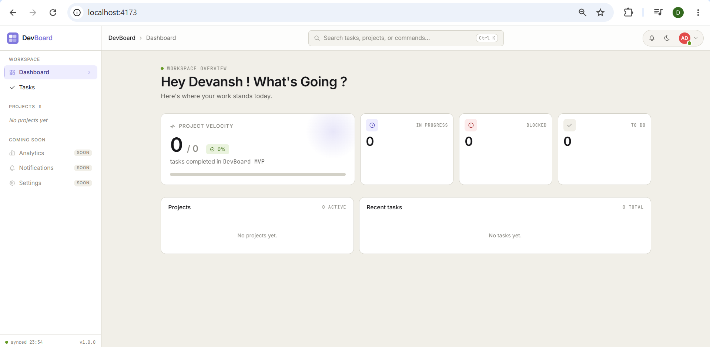

# 🚀 Day 50 – Kubernetes Architecture and Cluster Setup

## 📌 Objective

Today marks the beginning of my Kubernetes journey.

After learning how to build and ship containers using Docker, I explored why Kubernetes was created, understood its architecture, set up my first local Kubernetes cluster, and interacted with it using `kubectl`.

---

## Images

















---

# 📖 Kubernetes History

Docker made it easy to package applications into containers, but managing hundreds or thousands of containers across multiple machines became difficult. Kubernetes was created to automate container deployment, scaling, networking, self-healing, and management across clusters.

Kubernetes was originally developed by Google based on its experience running large-scale container workloads with its internal Borg system. Today, Kubernetes is maintained by the Cloud Native Computing Foundation (CNCF).

The word **Kubernetes** comes from the Greek language and means **"Helmsman"** or **"Pilot"**, representing someone who steers a ship.

---

# ❓ Why Kubernetes?

Docker solves the problem of packaging applications.

Kubernetes solves the problem of running containers at scale.

Docker alone cannot efficiently:

- Schedule containers across multiple servers
- Restart failed containers automatically
- Scale applications automatically
- Load balance traffic
- Perform rolling updates
- Self-heal failed workloads
- Manage clusters

Kubernetes provides all of these capabilities.

---

# 🏗 Kubernetes Architecture

```
                        kubectl
                           │
                           ▼
                   +-------------------+
                   |   API Server      |
                   +-------------------+
                           │
        ┌──────────────────┼──────────────────┐
        ▼                  ▼                  ▼
+---------------+  +----------------+  +--------------------+
|     etcd      |  |   Scheduler    |  | Controller Manager |
+---------------+  +----------------+  +--------------------+
                           │
                           ▼
                  Worker Node(s)
  --------------------------------------------------------
   kubelet        kube-proxy       Container Runtime
       │               │                  │
       └──────────────►Pods◄──────────────┘
```

---

# 🧠 Components Explained

## Control Plane

### API Server
- Entry point for all Kubernetes commands.
- Receives requests from kubectl.
- Validates and processes requests.

### etcd
- Distributed key-value database.
- Stores the complete state of the cluster.
- Acts as Kubernetes' source of truth.

### Scheduler
- Watches for newly created Pods.
- Chooses the most suitable worker node.
- Considers available CPU, memory, affinity, taints, and tolerations.

### Controller Manager
- Continuously watches the cluster.
- Ensures the current state matches the desired state.
- Creates or replaces Pods if they fail.

---

## Worker Node

### kubelet
- Agent running on every worker node.
- Communicates with the API Server.
- Creates and monitors Pods.

### kube-proxy
- Handles networking.
- Creates routing rules.
- Enables communication between Pods and Services.

### Container Runtime
- Actually runs containers.
- Common runtimes:
  - containerd
  - CRI-O

---

# 🔄 What Happens When You Run?

```bash
kubectl apply -f pod.yaml
```

Flow:

1. kubectl sends request to API Server.
2. API Server validates the YAML.
3. Desired state is stored inside etcd.
4. Scheduler selects the best worker node.
5. kubelet on that node receives instructions.
6. Container Runtime pulls the image.
7. Pod starts.
8. kube-proxy updates networking rules.
9. Controller Manager continuously monitors the Pod.

---

# 🚨 Failure Scenarios

## If API Server goes down

- kubectl commands stop working.
- No new workloads can be scheduled.
- Existing Pods continue running.

---

## If a Worker Node goes down

- Controller Manager detects the failure.
- Failed Pods are recreated on healthy nodes.
- Applications continue running if replicas exist.

---

# 🖥 Installing kubectl

Verified installation using:

```bash
kubectl version --client
```

---

# 🛠 Local Cluster Setup

## Selected Tool

**kind (Kubernetes IN Docker)**

### Why kind?

- Lightweight
- Fast startup
- Uses Docker containers as nodes
- Perfect for local development
- No virtual machine required

---

## Cluster Creation

```bash
kind create cluster --name devops-cluster
```

Verify cluster:

```bash
kubectl cluster-info

kubectl get nodes
```

---

# 🔍 Exploring the Cluster

Useful commands:

```bash
kubectl cluster-info

kubectl get nodes

kubectl describe node <node-name>

kubectl get namespaces

kubectl get pods -A

kubectl get pods -n kube-system
```

---

# kube-system Pods

| Pod | Purpose |
|------|----------|
| kube-apiserver | Front door of Kubernetes |
| etcd | Cluster database |
| kube-scheduler | Assigns Pods to nodes |
| kube-controller-manager | Maintains desired state |
| kube-proxy | Networking and Service routing |
| CoreDNS | Internal DNS resolution |

---

# 🔄 Cluster Lifecycle

Delete cluster

```bash
kind delete cluster --name devops-cluster
```

Create again

```bash
kind create cluster --name devops-cluster
```

Verify

```bash
kubectl get nodes
```

---

# kubeconfig

Useful commands:

```bash
kubectl config current-context

kubectl config get-contexts

kubectl config view
```

### What is kubeconfig?

A kubeconfig file stores:

- Cluster information
- User credentials
- Authentication certificates
- Current context
- Namespace information

Default location:

```
~/.kube/config
```

---

# 📷 Screenshots

## kubectl get nodes

> *(Insert Screenshot Here)*

---

## kubectl get pods -n kube-system

> *(Insert Screenshot Here)*

---

# 📚 Key Learnings

- Learned why Kubernetes is needed beyond Docker.
- Understood Kubernetes architecture.
- Explored the Control Plane and Worker Node components.
- Set up a local Kubernetes cluster using kind.
- Learned how kubectl communicates with the cluster.
- Explored namespaces, nodes, and system Pods.
- Understood kubeconfig and cluster contexts.
- Practiced creating and deleting clusters.

---

# 🏁 Conclusion

Day 50 marks the beginning of my Kubernetes journey. I learned the core architecture behind Kubernetes, successfully created a local cluster with kind, explored the control plane components, and understood how Kubernetes automates container orchestration at scale.

The orchestration chapter begins! 🚀

---

## Repository Structure

```
2026/
└── day-50/
    ├── day-50-k8s-setup.md
    ├── screenshots/
    │   ├── kubectl-get-nodes.png
    │   └── kube-system-pods.png
```

---