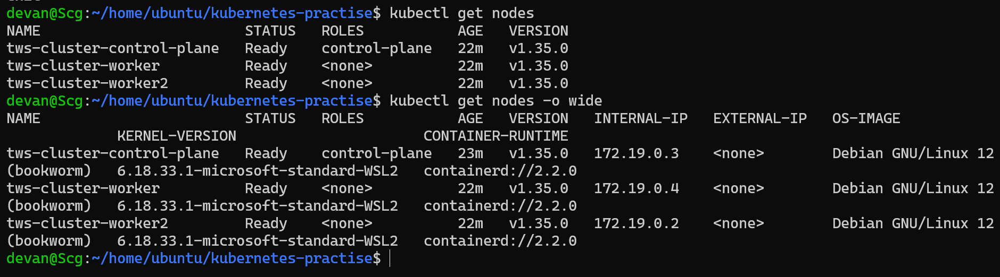
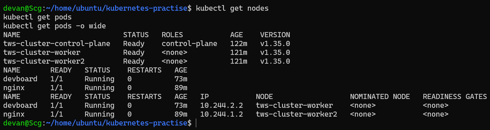
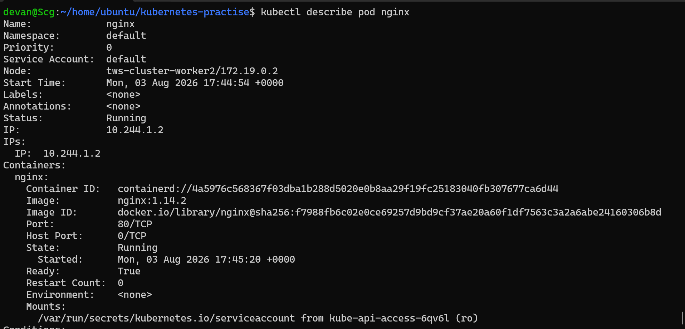
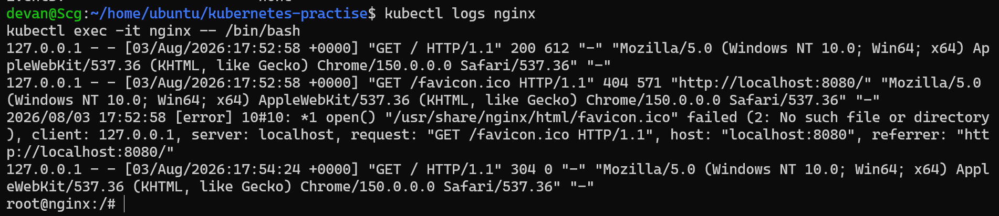
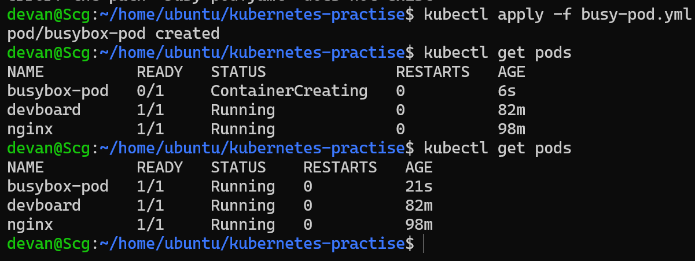
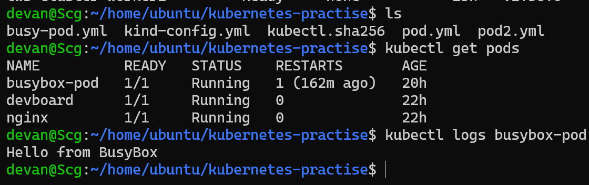
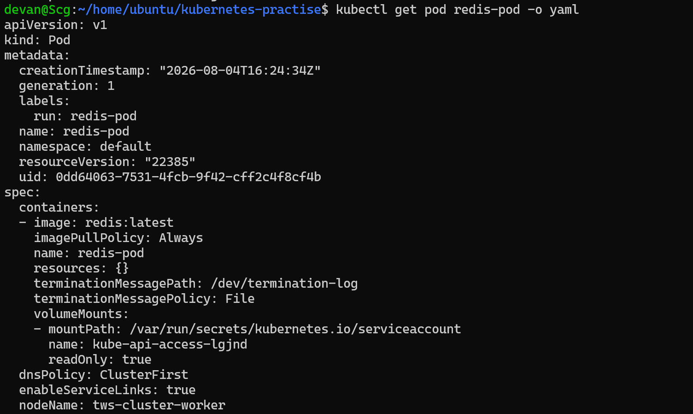
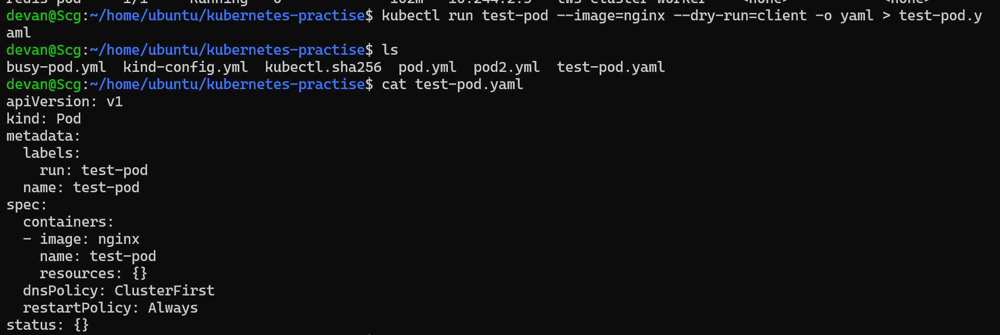
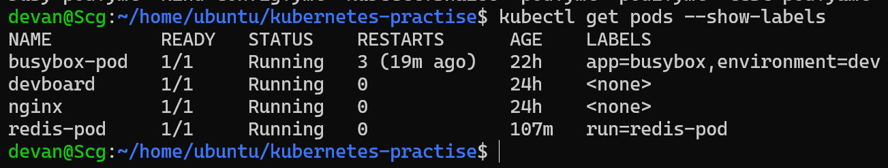
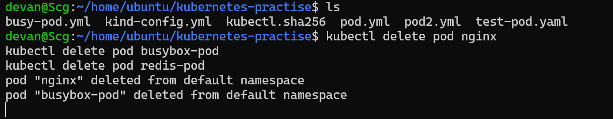

# 🚀 Day 51 – Kubernetes Manifests and Your First Pods

## 📌 Objective

Today I learned how Kubernetes uses YAML manifest files to define resources declaratively. I created multiple Pods from scratch, explored them using `kubectl`, worked with labels, compared imperative and declarative approaches, and learned how standalone Pods behave when deleted.

---

## Images :-






















---

# 📖 Understanding a Kubernetes Manifest

Every Kubernetes resource is defined using a YAML manifest. Every manifest contains four essential top-level fields.

## 1. apiVersion

Specifies which Kubernetes API version should interpret the resource.

```yaml
apiVersion: v1
```

Examples:

- Pods → `v1`
- Services → `v1`
- Deployments → `apps/v1`

---

## 2. kind

Defines the type of Kubernetes resource.

```yaml
kind: Pod
```

Examples:

- Pod
- Deployment
- Service
- ConfigMap
- Secret

---

## 3. metadata

Contains information that identifies the resource.

```yaml
metadata:
  name: nginx
  labels:
    app: nginx
```

Metadata commonly includes:

- Name
- Labels
- Namespace
- Annotations

---

## 4. spec

Defines the desired state of the resource.

```yaml
spec:
  containers:
    - name: nginx
      image: nginx:latest
```

This tells Kubernetes what container to run, which image to pull, ports to expose, environment variables, volumes, and much more.

---

# 📝 Pod Manifest 1 – Nginx

**File:** `nginx-pod.yaml`

```yaml
apiVersion: v1
kind: Pod

metadata:
  name: nginx
  labels:
    app: nginx

spec:
  containers:
    - name: nginx
      image: nginx:latest
      ports:
        - containerPort: 80
```

Created using:

```bash
kubectl apply -f nginx-pod.yaml
```

Verified using:

```bash
kubectl get pods
kubectl get pods -o wide
kubectl describe pod nginx
kubectl logs nginx
kubectl exec -it nginx -- /bin/bash
```

Inside the container:

```bash
curl localhost
```

The Nginx Welcome Page HTML confirmed that the web server was running successfully.

---

# 📝 Pod Manifest 2 – BusyBox

**File:** `busybox-pod.yaml`

```yaml
apiVersion: v1
kind: Pod

metadata:
  name: busybox-pod
  labels:
    app: busybox
    environment: dev

spec:
  containers:
    - name: busybox
      image: busybox:latest
      command:
        - sh
        - -c
        - echo Hello from BusyBox && sleep 3600
```

Create:

```bash
kubectl apply -f busybox-pod.yaml
```

View logs:

```bash
kubectl logs busybox-pod
```

Output:

```
Hello from BusyBox
```

The `command` field keeps the container running. Without it, BusyBox would exit immediately because it has no long-running process.

---

# 📝 Pod Manifest 3 – Alpine

**File:** `alpine-pod.yaml`

```yaml
apiVersion: v1
kind: Pod

metadata:
  name: alpine-pod
  labels:
    app: alpine
    environment: test
    team: devops

spec:
  containers:
    - name: alpine
      image: alpine:latest
      command:
        - sh
        - -c
        - echo Alpine Running && sleep 3600
```

Create:

```bash
kubectl apply -f alpine-pod.yaml
```

---

# 🚀 Imperative vs Declarative

## Imperative

Create resources directly using commands.

Example:

```bash
kubectl run redis-pod --image=redis:latest
```

Advantages:

- Quick testing
- Good for learning
- Fast debugging

Disadvantages:

- Difficult to reproduce
- Not version controlled

---

## Declarative

Create resources using YAML manifests.

Example:

```bash
kubectl apply -f nginx-pod.yaml
```

Advantages:

- Infrastructure as Code
- Version controlled
- Easy collaboration
- Production standard

---

# 📄 Generate YAML Without Creating a Pod

Generate a manifest:

```bash
kubectl run test-pod --image=nginx --dry-run=client -o yaml > test-pod.yaml
```

This is useful for scaffolding YAML before customization.

---

# ✅ Manifest Validation

Client-side validation:

```bash
kubectl apply -f nginx-pod.yaml --dry-run=client
```

Server-side validation:

```bash
kubectl apply -f nginx-pod.yaml --dry-run=server
```

I also tested validation by intentionally removing the `image` field from the manifest. Kubernetes returned an error indicating that the image field is required before a Pod can be created.

---

# 🏷 Working with Labels

View labels:

```bash
kubectl get pods --show-labels
```

Filter by label:

```bash
kubectl get pods -l app=nginx
kubectl get pods -l environment=dev
kubectl get pods -l team=devops
```

Add a label:

```bash
kubectl label pod nginx environment=production
```

Remove a label:

```bash
kubectl label pod nginx environment-
```

Labels help Kubernetes organize resources and are widely used by Services, Deployments, monitoring systems, and selectors.

---

# 🔍 Useful kubectl Commands

Create Pod:

```bash
kubectl apply -f nginx-pod.yaml
```

List Pods:

```bash
kubectl get pods
```

Detailed information:

```bash
kubectl describe pod nginx
```

View logs:

```bash
kubectl logs nginx
```

Execute commands inside the container:

```bash
kubectl exec -it nginx -- /bin/bash
```

Delete Pod:

```bash
kubectl delete pod nginx
```

Delete using manifest:

```bash
kubectl delete -f nginx-pod.yaml
```

---

# 📸 Screenshots

## Running Pods

> **(Insert Screenshot: `kubectl get pods`)**

---

## Pod Labels

> **(Insert Screenshot: `kubectl get pods --show-labels`)**

---

## BusyBox Logs

> **(Insert Screenshot: `kubectl logs busybox-pod`)**

---

## Inside Nginx Container

> **(Insert Screenshot: `kubectl exec -it nginx -- /bin/bash`)**

---

# ❓ What Happens When You Delete a Standalone Pod?

A standalone Pod is not managed by any controller.

When it is deleted:

- The Pod is permanently removed.
- Kubernetes does not recreate it.
- There is no controller watching its desired state.

This is why production environments use **Deployments** instead of standalone Pods. Deployments automatically recreate Pods if they are deleted or fail.

---

# 📚 Key Learnings

- Learned the structure of Kubernetes YAML manifests.
- Understood the purpose of `apiVersion`, `kind`, `metadata`, and `spec`.
- Created Pods manually using declarative manifests.
- Explored Pods using `describe`, `logs`, and `exec`.
- Learned the difference between imperative and declarative resource creation.
- Generated YAML using `kubectl run --dry-run`.
- Validated manifests before applying them.
- Worked with Kubernetes labels for organizing and filtering resources.
- Learned that standalone Pods are not self-healing.
- Practiced deleting Pods using both resource names and manifest files.

---

# 🏁 Conclusion

Day 51 focused on creating Kubernetes Pods from scratch using YAML manifests. I learned how Kubernetes interprets manifests, explored running containers, generated manifests automatically, validated resources before deployment, and understood why Deployments are preferred over standalone Pods in production. This lays the foundation for managing applications declaratively in Kubernetes.

---

## 📂 Repository Structure

```
2026/
└── day-51/
    ├── day-51-pods.md
    ├── nginx-pod.yaml
    ├── busybox-pod.yaml
    ├── alpine-pod.yaml
    └── screenshots/
        ├── kubectl-get-pods.png
        ├── pod-labels.png
        ├── busybox-logs.png
        └── nginx-exec.png
```