# 🚀 Day 52 – Kubernetes Namespaces and Deployments

## 📌 Objective

Today I learned how Kubernetes organizes resources using **Namespaces** and manages applications using **Deployments**. I explored the concept of self-healing, scaling, rolling updates, and rollbacks—the core features that make Kubernetes suitable for production environments.

---

## Images :-

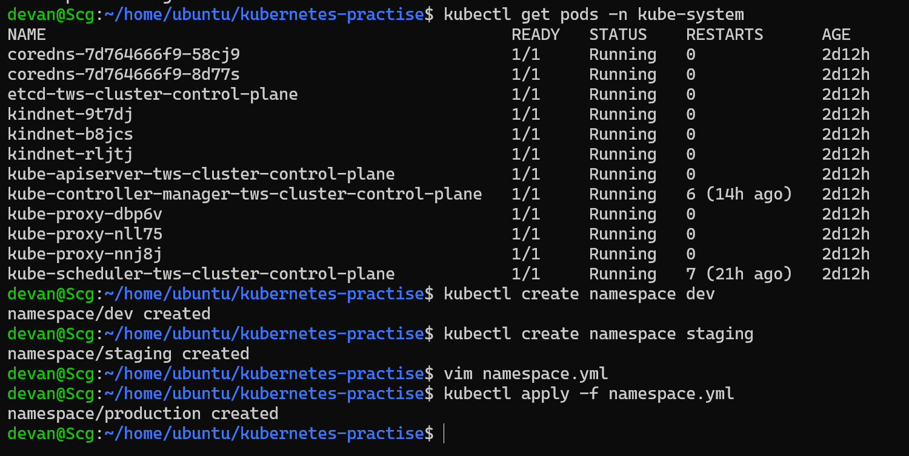

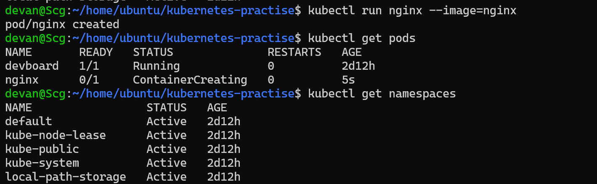

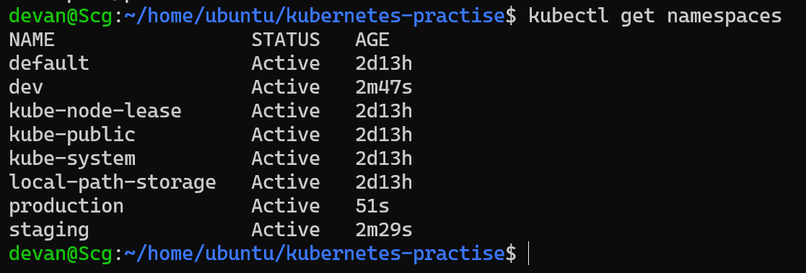

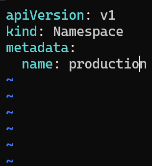

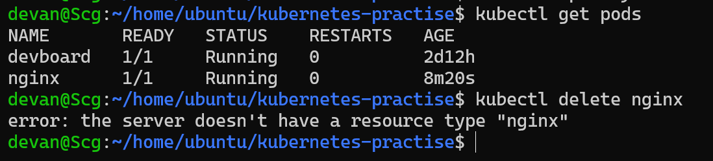

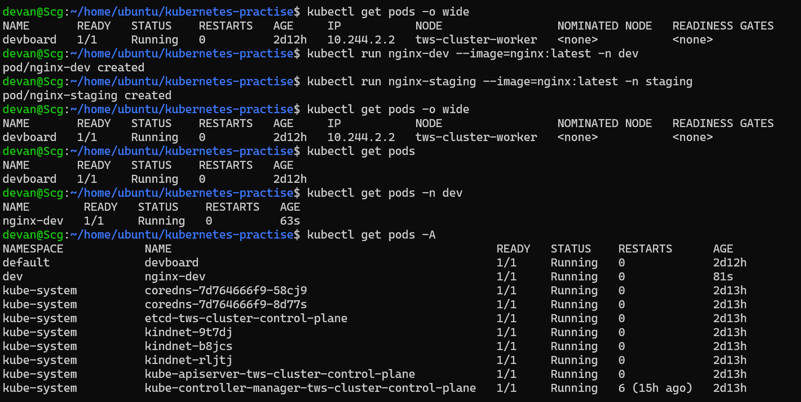

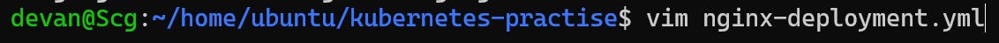

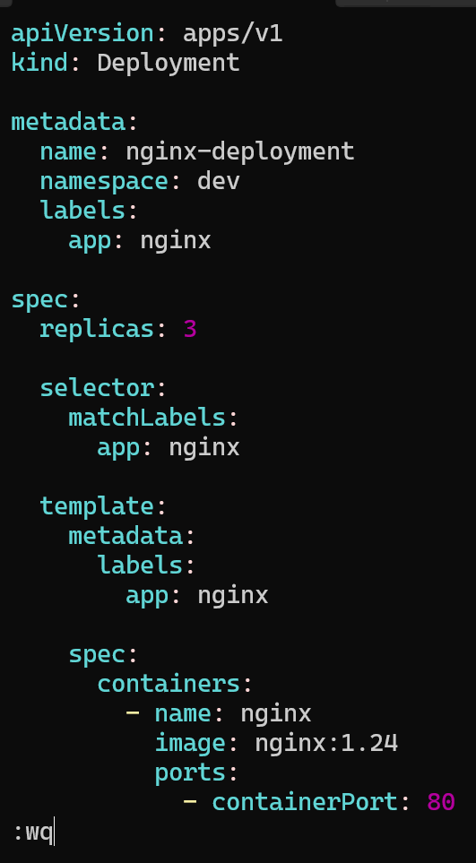

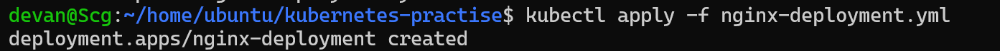

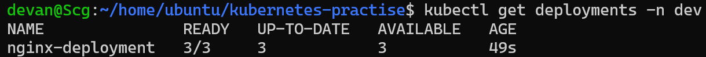

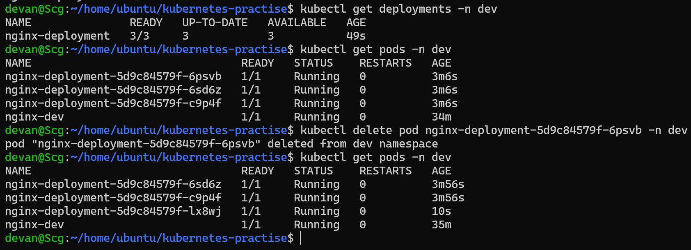

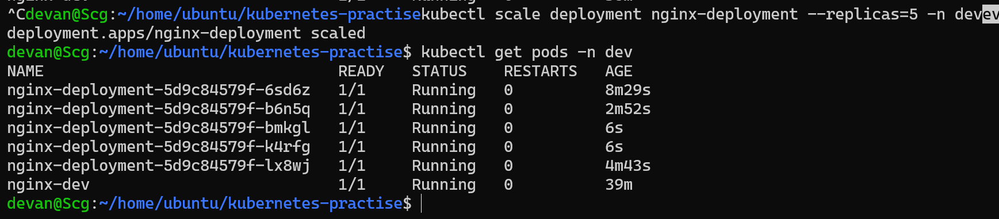

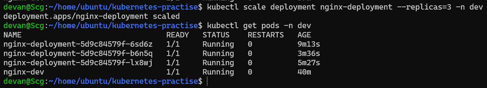

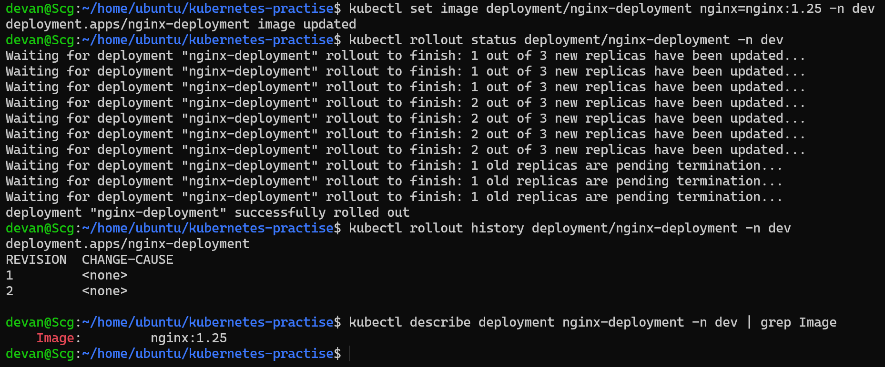

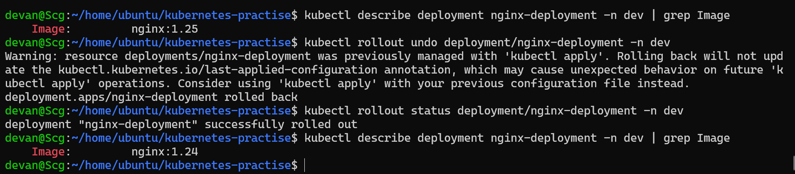


---

# 📖 What are Namespaces?

A **Namespace** is a logical partition inside a Kubernetes cluster used to organize and isolate resources.

Instead of creating every resource in a single environment, namespaces allow different teams or environments to work independently within the same cluster.

Example:

```text
Kubernetes Cluster
│
├── default
├── dev
├── staging
├── production
└── kube-system
```

Namespaces help in:

- Organizing workloads
- Environment separation (Dev, Test, Production)
- Resource isolation
- Better management of large clusters

---

# Built-in Namespaces

| Namespace | Purpose |
|------------|---------|
| default | Default namespace where resources are created if none is specified |
| kube-system | Contains Kubernetes control plane components |
| kube-public | Stores publicly accessible cluster information |
| kube-node-lease | Stores node heartbeat information |
| local-path-storage | Provides local persistent storage (created by Kind) |

---

# Exploring Cluster Namespaces

Commands used:

```bash
kubectl get namespaces
kubectl get pods -n kube-system
```

I observed Kubernetes internal components such as:

- kube-apiserver
- etcd
- kube-controller-manager
- kube-scheduler
- CoreDNS
- kube-proxy
- kindnet

These components together keep the cluster running.

---

# Creating Custom Namespaces

Created namespaces:

```bash
kubectl create namespace dev
kubectl create namespace staging
```

Created production namespace using YAML.

## namespace.yaml

```yaml
apiVersion: v1
kind: Namespace

metadata:
  name: production
```

Applied using:

```bash
kubectl apply -f namespace.yaml
```

Verified:

```bash
kubectl get namespaces
```

---

# Running Pods in Different Namespaces

Created Pods:

```bash
kubectl run nginx-dev --image=nginx:latest -n dev

kubectl run nginx-staging --image=nginx:latest -n staging
```

Useful commands:

```bash
kubectl get pods

kubectl get pods -n dev

kubectl get pods -A
```

### Observation

`kubectl get pods`

Shows Pods only from the **default** namespace.

`kubectl get pods -A`

Shows Pods from **all namespaces**.

---

# Understanding Deployments

A **Deployment** is a Kubernetes resource that manages Pods and ensures the desired number of replicas are always running.

Unlike standalone Pods, Deployments provide:

- Self-Healing
- Scaling
- Rolling Updates
- Rollbacks

---

# Deployment Manifest

## nginx-deployment.yaml

```yaml
apiVersion: apps/v1
kind: Deployment

metadata:
  name: nginx-deployment
  namespace: dev
  labels:
    app: nginx

spec:
  replicas: 3

  selector:
    matchLabels:
      app: nginx

  template:
    metadata:
      labels:
        app: nginx

    spec:
      containers:
        - name: nginx
          image: nginx:1.24
          ports:
            - containerPort: 80
```

---

# Understanding Every Section

## apiVersion

Uses the Deployment API.

```yaml
apiVersion: apps/v1
```

---

## kind

Defines the Kubernetes resource.

```yaml
kind: Deployment
```

---

## metadata

Stores Deployment identity.

```yaml
metadata:
  name: nginx-deployment
```

---

## replicas

Desired number of Pods.

```yaml
replicas: 3
```

Meaning:

> Kubernetes should always maintain **3 running Pods**.

---

## selector

Tells the Deployment which Pods it should manage.

```yaml
selector:
  matchLabels:
    app: nginx
```

---

## template

Acts as the blueprint for creating Pods.

Every Pod created by this Deployment will use this template.

```yaml
template:
```

---

## template.metadata.labels

Adds labels to every new Pod.

```yaml
labels:
  app: nginx
```

---

## template.spec

Defines the Pod specification.

```yaml
containers:
```

Contains:

- Container Name
- Image
- Ports
- Environment Variables
- Volumes

---

# Creating the Deployment

```bash
kubectl apply -f nginx-deployment.yaml
```

Verify:

```bash
kubectl get deployments -n dev

kubectl get pods -n dev
```

Observed:

- 3 Running Pods
- READY = 3/3
- AVAILABLE = 3

---

# Understanding Deployment Output

Example:

```text
READY        3/3

UP-TO-DATE   3

AVAILABLE    3
```

### READY

Healthy Pods / Desired Pods

### UP-TO-DATE

Pods running the latest Deployment specification.

### AVAILABLE

Pods ready to receive application traffic.

---

# Self-Healing

One Pod managed by the Deployment was manually deleted.

```bash
kubectl delete pod <pod-name> -n dev
```

Immediately after deletion:

```bash
kubectl get pods -n dev
```

Kubernetes automatically created a replacement Pod.

### Why?

The Deployment continuously compares:

```text
Desired State

vs

Current State
```

When the desired replicas became:

```text
Desired = 3

Current = 2
```

The Deployment Controller created a new Pod to restore the desired state.

Unlike standalone Pods, Deployment-managed Pods are automatically recreated.

---

# Scaling the Deployment

Scaled up:

```bash
kubectl scale deployment nginx-deployment --replicas=5 -n dev
```

Scaled down:

```bash
kubectl scale deployment nginx-deployment --replicas=2 -n dev
```

Scaling can also be done declaratively by modifying:

```yaml
replicas:
```

inside the Deployment manifest and applying it again.

---

# Imperative vs Declarative Scaling

## Imperative

```bash
kubectl scale deployment nginx-deployment --replicas=5
```

Quick and immediate.

---

## Declarative

Edit YAML:

```yaml
replicas: 5
```

Then:

```bash
kubectl apply -f nginx-deployment.yaml
```

Preferred approach for production because configuration is version-controlled.

---

# Rolling Update

Updated the container image:

```bash
kubectl set image deployment/nginx-deployment nginx=nginx:1.25 -n dev
```

Watched rollout:

```bash
kubectl rollout status deployment/nginx-deployment -n dev
```

Viewed revision history:

```bash
kubectl rollout history deployment/nginx-deployment -n dev
```

Verified image:

```bash
kubectl describe deployment nginx-deployment -n dev | grep Image
```

### What Happens During a Rolling Update?

Instead of replacing every Pod simultaneously, Kubernetes:

1. Creates one new Pod.
2. Waits until it becomes healthy.
3. Removes one old Pod.
4. Repeats until all Pods use the new version.

This ensures **zero or minimal downtime** during deployments.

---

# Rollback

Rolled back to the previous revision:

```bash
kubectl rollout undo deployment/nginx-deployment -n dev
```

Verified rollout:

```bash
kubectl rollout status deployment/nginx-deployment -n dev
```

Verified image:

```bash
kubectl describe deployment nginx-deployment -n dev | grep Image
```

Rollback restored the Deployment to the previous image version while keeping the application available.

---

# Useful Commands

Namespaces

```bash
kubectl get namespaces
kubectl create namespace dev
kubectl create namespace staging
```

Deployments

```bash
kubectl get deployments -n dev

kubectl describe deployment nginx-deployment -n dev

kubectl delete deployment nginx-deployment -n dev
```

Scaling

```bash
kubectl scale deployment nginx-deployment --replicas=5 -n dev
```

Rolling Update

```bash
kubectl set image deployment/nginx-deployment nginx=nginx:1.25 -n dev
```

Rollout Status

```bash
kubectl rollout status deployment/nginx-deployment -n dev
```

History

```bash
kubectl rollout history deployment/nginx-deployment -n dev
```

Rollback

```bash
kubectl rollout undo deployment/nginx-deployment -n dev
```

---

# Key Learnings

- Learned the purpose of Kubernetes Namespaces.
- Created custom namespaces for Dev, Staging, and Production.
- Understood the structure of a Deployment manifest.
- Learned the importance of selector and template labels.
- Understood the concept of desired state.
- Explored Deployment controllers and ReplicaSets.
- Observed Kubernetes self-healing by deleting Pods.
- Practiced scaling Deployments both imperatively and declaratively.
- Performed Rolling Updates with zero downtime.
- Successfully rolled back to the previous application version.
- Learned how Kubernetes keeps applications highly available during updates.

---

# Screenshots

## Cluster Namespaces

> *(Insert Screenshot: `kubectl get namespaces`)*

---

## Pods Across Namespaces

> *(Insert Screenshot: `kubectl get pods -A`)*

---

## Deployment

> *(Insert Screenshot: `kubectl get deployments -n dev`)*

---

## Self-Healing

> *(Insert Screenshot after deleting a Pod and Kubernetes recreating it.)*

---

## Scaling

> *(Insert Screenshot after scaling replicas.)*

---

## Rolling Update

> *(Insert Screenshot of rollout status.)*

---

## Rollback

> *(Insert Screenshot verifying previous image version.)*

---

# Conclusion

Day 52 introduced the core features that make Kubernetes production-ready. By using Namespaces, I learned how to organize resources within a cluster. Deployments showed how Kubernetes continuously maintains the desired state, automatically recovers from failures through self-healing, scales applications based on replica count, and performs safe rolling updates and rollbacks with minimal downtime. These concepts form the foundation of running reliable and highly available applications in Kubernetes.

---

## 📂 Repository Structure

```text
2026/
└── day-52/
    ├── day-52-namespaces-deployments.md
    ├── namespace.yaml
    ├── nginx-deployment.yaml
    └── screenshots/
        ├── namespaces.png
        ├── pods-all.png
        ├── deployments.png
        ├── self-healing.png
        ├── scaling.png
        ├── rolling-update.png
        └── rollback.png
```