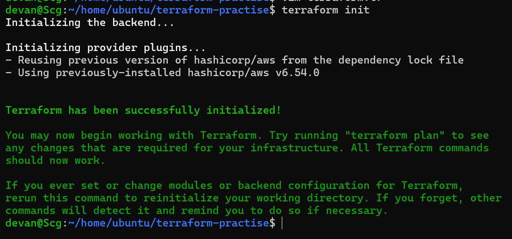
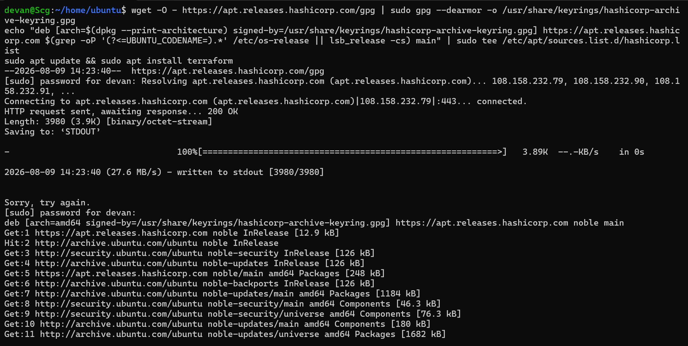
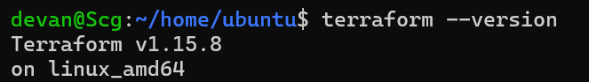
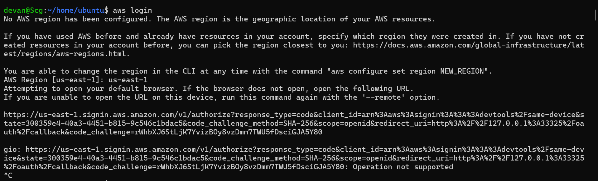
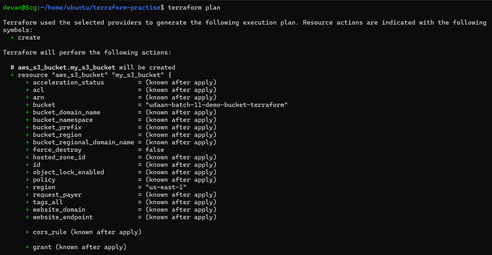
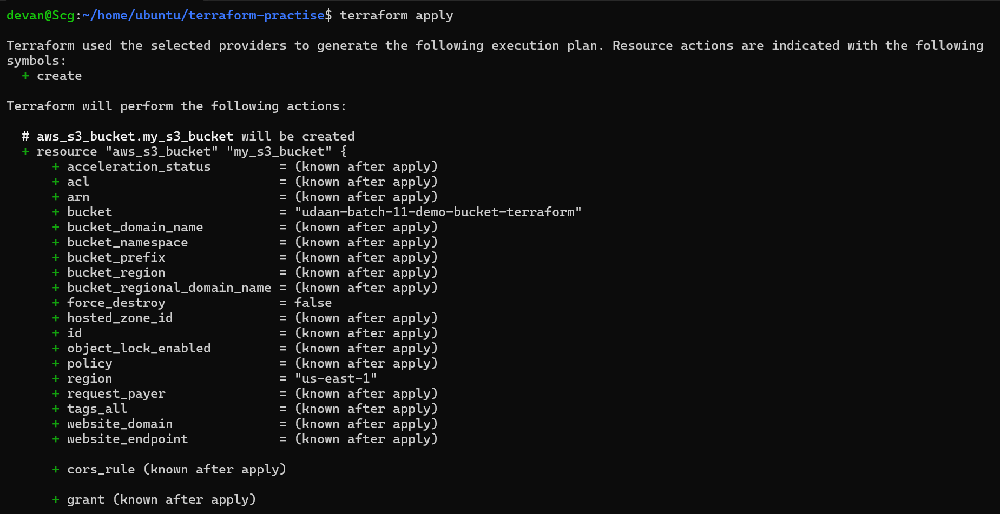
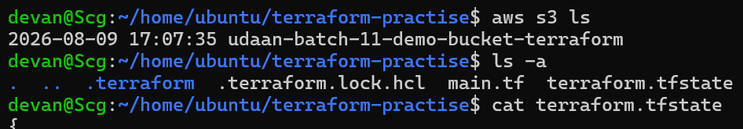

# Day 61 — Introduction to Terraform and My First AWS Infrastructure

> **90 Days of DevOps — Day 61 | TerraWeek**
>
> Today I started my Infrastructure as Code (IaC) journey with Terraform and used Terraform from the terminal to manage AWS infrastructure.

---

## 🎯 Objective

The goal of Day 61 was to understand Infrastructure as Code and get hands-on experience with Terraform by:

- Installing Terraform
- Configuring the AWS CLI
- Connecting Terraform to AWS
- Initializing a Terraform project
- Creating and managing an S3 bucket
- Working with an AWS EC2 instance and AMI selection
- Understanding Terraform plans and resource lifecycle
- Inspecting Terraform state
- Understanding Terraform resource tracking
- Applying infrastructure changes
- Cleaning up Terraform-managed resources

---

## Screenshots & Evidence
















---

# 1. Infrastructure as Code (IaC)

Infrastructure as Code means managing infrastructure through configuration files instead of creating every resource manually through a cloud console.

With IaC, infrastructure becomes repeatable and version-controlled. The same configuration can be used to recreate an environment instead of relying on manual steps. This is especially useful in DevOps because infrastructure changes can be reviewed, automated and included in CI/CD workflows.

### Problems IaC solves

Manual infrastructure creation can lead to:

- Configuration mistakes
- Inconsistent environments
- Repetitive manual work
- Difficult-to-track changes
- Poor reproducibility
- Slow environment provisioning

Terraform solves these problems by allowing infrastructure to be described as code and then comparing the desired configuration with the current infrastructure.

---

# 2. Terraform vs Other Tools

| Tool | Primary Purpose | Key Difference |
|---|---|---|
| **Terraform** | Infrastructure provisioning | Declarative IaC with providers for many platforms |
| **AWS CloudFormation** | AWS infrastructure provisioning | AWS-native IaC service |
| **Ansible** | Configuration management and automation | Primarily focuses on configuring existing machines/services |
| **Pulumi** | Infrastructure provisioning | Uses general-purpose programming languages such as Python, TypeScript, Go and C# |

Terraform and Ansible can also be used together. Terraform can create the infrastructure while Ansible can configure the operating systems and applications running on it.

---

# 3. Declarative and Cloud-Agnostic

### Declarative

Terraform is declarative because I describe **what the final infrastructure should look like**, rather than writing every individual step required to create it.

For example:

```hcl
resource "aws_s3_bucket" "my_s3_bucket" {
  bucket = "udaan-batch-11-demo-bucket-terraform"
}

Terraform determines the actions necessary to make the real AWS environment match that configuration.

Cloud-Agnostic

Terraform itself is not limited to AWS. Through providers, it can manage infrastructure on AWS, Azure, Google Cloud, Kubernetes and many other platforms.

This makes Terraform useful for managing infrastructure across different environments with a common IaC workflow.

4. Terraform Installation

I installed Terraform on Ubuntu using the HashiCorp APT repository.

I verified the installation with:

terraform --version

My installed version was:

Terraform v1.15.8
on linux_amd64

5. AWS CLI Configuration

I configured the AWS CLI and selected:

Region: us-east-1
Output format: json

The AWS console was also using US East (N. Virginia) — us-east-1 during this exercise.

I verified AWS connectivity before working with Terraform.

Security note: AWS access keys/secrets were not added to the Terraform configuration or committed to Git.

6. Terraform Project Initialization

My Terraform project was created under:

~/home/ubuntu/terraform-practise

I initialized the project with:

terraform init

Terraform successfully initialized the working directory and reused the AWS provider version recorded in the dependency lock file.

The provider shown during initialization was:

hashicorp/aws v6.54.0

What did terraform init do?

terraform init prepared the working directory for Terraform operations. It initialized the backend and installed/reused the required provider plugins.

It also created/used files such as:

.terraform/
.terraform.lock.hcl

The .terraform/ directory contains Terraform's local working files, including downloaded provider plugins.

The .terraform.lock.hcl file records provider dependency selections and checksums so Terraform can use consistent provider versions.

7. Terraform Configuration

The project used an AWS provider and Terraform-managed AWS resources.

The S3 bucket used during the exercise was:

udaan-batch-11-demo-bucket-terraform

The bucket was created in:

us-east-1

Terraform identified the bucket as:

aws_s3_bucket.my_s3_bucket
8. Terraform Plan

Before applying changes, I used:

terraform plan

Terraform displayed the actions it intended to perform.

The + symbol means:

+ create

Other important Terraform plan symbols are:

+   create a resource
~   update a resource in-place
-   destroy a resource
-/+ destroy and recreate a resource

9. S3 Bucket Created with Terraform

Terraform created the S3 bucket:

udaan-batch-11-demo-bucket-terraform

I verified it from the AWS S3 console.

I also verified the bucket from the AWS CLI:

aws s3 ls

The bucket appeared in the output:

udaan-batch-11-demo-bucket-terraform

10. AWS AMI Selection for EC2

For the EC2 part, I checked the AMI available in the AWS EC2 launch workflow instead of blindly using an AMI ID from the task.

The selected image was an Ubuntu Server image:

Ubuntu Server 26.04 LTS

The AWS console showed an amd64/x86 image and an ARM alternative.

AMI IDs are region-specific, so the correct AMI must be selected for the AWS region and architecture being used.

11. Terraform Apply

I used:

terraform apply

Terraform displayed the execution plan and then applied the configuration.

The final apply reported:

Apply complete! Resources: 8 added, 0 changed, 0 destroyed.

The Terraform plan also showed resources being created, including the AWS default VPC configuration used by the project.

12. Understanding Terraform State

Terraform created:

terraform.tfstate

The project directory contained:

.terraform/
.terraform.lock.hcl
main.tf
terraform.tfstate

I inspected the state file using:

cat terraform.tfstate

What is Terraform state?

Terraform state is Terraform's record of the infrastructure it manages.

It allows Terraform to associate resources in the configuration with real resources in AWS.

For example:

aws_s3_bucket.my_s3_bucket

can be associated with the real S3 bucket ID:

udaan-batch-11-demo-bucket-terraform

Terraform uses this information during future plan and apply operations to determine what already exists and what needs to change.

13. Important Terraform State Commands
Show the complete state
terraform show

This displays the current state in a human-readable format.

List managed resources
terraform state list

This lists the resources currently tracked by Terraform.

Inspect a specific resource
terraform state show aws_s3_bucket.my_s3_bucket

This displays detailed information about the S3 resource stored in Terraform state.

For the EC2 resource, the same pattern can be used:

terraform state show aws_instance.<resource_name>
14. Why Terraform Knows What Already Exists

Terraform does not simply look at the .tf file and blindly create everything again.

It compares:

Terraform configuration
        ↓
Terraform state
        ↓
Real AWS infrastructure

If the S3 bucket already exists and is tracked in state, Terraform knows that it does not need to create another copy.

This is one of the most important concepts I learned today:

Terraform uses state to understand the relationship between the configuration and real infrastructure.

15. Why State Should Not Be Manually Edited

The Terraform state file is managed by Terraform.

Manually modifying it can cause Terraform's understanding of the infrastructure to become inconsistent with the actual AWS environment.

State can also contain sensitive information depending on the resources being managed.

For these reasons:

Don't manually edit terraform.tfstate
Don't commit state files to Git
Don't expose state files publicly
Use a remote backend with proper access control for team/production environments
16. Terraform .gitignore

I used a .gitignore configuration similar to:

.terraform/
*.tfstate
*.tfstate.*
*.tfvars
*.tfvars.json
crash.log
crash.*.log

This prevents Terraform's local working directory, state files and variable files from accidentally being committed.

17. Terraform Lifecycle

The basic Terraform workflow I learned today is:

Write Terraform configuration
          ↓
terraform init
          ↓
terraform validate
          ↓
terraform plan
          ↓
terraform apply
          ↓
Inspect / modify infrastructure
          ↓
terraform plan
          ↓
terraform apply
          ↓
terraform destroy
Command Summary
Command	What I learned
terraform init	Initializes the Terraform project and providers
terraform fmt	Formats Terraform configuration
terraform validate	Checks Terraform configuration for errors
terraform plan	Shows what Terraform intends to change
terraform apply	Applies the planned infrastructure changes
terraform show	Displays the current state
terraform state list	Lists Terraform-managed resources
terraform state show	Shows details of one managed resource
terraform destroy	Removes resources managed by Terraform
18. Key Learnings
1. Infrastructure can be managed as code

Instead of manually clicking through AWS services, infrastructure can be described in Terraform configuration.

2. plan is extremely important

terraform plan allows me to review infrastructure changes before applying them.

3. State is central to Terraform

Terraform uses state to track resources and determine how the real environment relates to the configuration.

4. Providers connect Terraform to platforms

The AWS provider allows Terraform to communicate with AWS APIs and manage AWS resources.

5. AMIs are region-specific

An AMI ID from one AWS region should not automatically be assumed to work in another region.

6. IaC makes infrastructure repeatable

Infrastructure can be recreated from code instead of depending on a series of undocumented manual console actions.


20. Cleanup

After completing the exercise, the infrastructure created for the challenge was cleaned up using:

terraform destroy

This is important because cloud resources can continue generating charges even after the learning exercise is complete.

21. Final Takeaway

Day 61 was my first proper hands-on experience with Infrastructure as Code using Terraform.

Instead of manually creating infrastructure through the AWS Console, I defined infrastructure in code and used Terraform's:

init → plan → apply → state → destroy

workflow to manage it.

The biggest takeaway for me is that Terraform does not just create resources — it maintains a desired state and continuously helps bring the real infrastructure in line with the configuration.

This is a major step toward building reproducible, automated and production-oriented DevOps infrastructure.

🚀 Day 61 Complete

Technologies: Terraform | AWS | AWS CLI | Amazon S3 | Amazon EC2 | Infrastructure as Code

Challenge: #90DaysOfDevOps | #TerraWeek | #DevOpsKaJosh | #TrainWithShubham